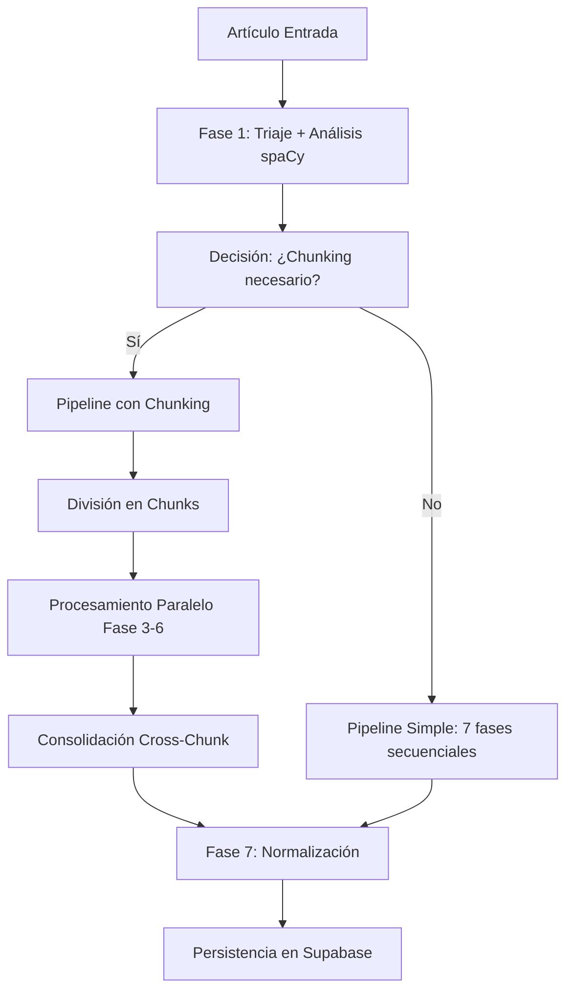

# Guía Completa del Pipeline de 7 Fases 📋

> **Guía técnica exhaustiva del nuevo sistema de procesamiento de 7 fases**  
> Desde configuración hasta optimización avanzada

## 📖 Tabla de Contenidos

1. [Introducción y Conceptos](#introducción-y-conceptos)
2. [Configuración del Sistema](#configuración-del-sistema)
3. [Fase 1: Triaje Inteligente](#fase-1-triaje-inteligente)
4. [Fase 2: Simplificación Lingüística](#fase-2-simplificación-lingüística)
5. [Fase 3: Extracción de Entidades](#fase-3-extracción-de-entidades)
6. [Fase 4: Extracción de Hechos](#fase-4-extracción-de-hechos)
7. [Fase 5: Datos Cuantitativos](#fase-5-datos-cuantitativos)
8. [Fase 6: Citas Textuales](#fase-6-citas-textuales)
9. [Fase 7: Normalización y Relaciones](#fase-7-normalización-y-relaciones)
10. [Sistema de Chunking](#sistema-de-chunking)
11. [Consolidación Cross-Chunk](#consolidación-cross-chunk)
12. [Monitoreo y Métricas](#monitoreo-y-métricas)
13. [Optimización y Rendimiento](#optimización-y-rendimiento)
14. [Troubleshooting Avanzado](#troubleshooting-avanzado)

## 🎯 Introducción y Conceptos

### Evolución del Pipeline

El pipeline ha evolucionado de **4 fases secuenciales** a **7 fases adaptativas** con las siguientes mejoras:

```
ANTES (4 fases):
Triaje → Extracción → Citas/Datos → Normalización

AHORA (7 fases):
Triaje → Simplificación → Entidades → Hechos → Datos → Citas → Normalización
```

### Conceptos Clave

#### 🧩 Chunking Adaptativo
- **Automático**: Se activa según thresholds configurables
- **Paralelo**: Procesamiento simultáneo de chunks con asyncio
- **Contextual**: Preserva información entre fragmentos

#### 🔗 Consolidación Cross-Chunk
- **Deduplicación**: Elimina entidades/hechos duplicados entre chunks
- **Inteligente**: Usa algoritmos de similitud ajustables
- **Preservación**: Mantiene la información más completa

#### ⚡ Procesamiento Adaptativo
- **Condicional**: Fases 5 y 6 solo se ejecutan si es necesario
- **Inteligente**: spaCy analiza contenido para tomar decisiones
- **Escalable**: Recursos se asignan según demanda

### Arquitectura de Alto Nivel



## ⚙️ Configuración del Sistema

### Variables de Entorno Específicas del Pipeline

```bash
# === THRESHOLDS DE CHUNKING ===
# Controlan cuándo se activa el chunking automático
PIPELINE_CHUNKING_ENTITIES_THRESHOLD=30        # Número de entidades
PIPELINE_CHUNKING_CHARS_THRESHOLD=6000         # Longitud en caracteres
PIPELINE_CHUNKING_QUOTES_THRESHOLD=30          # Número de citas
PIPELINE_CHUNKING_DATA_THRESHOLD=30            # Número de datos cuantitativos

# === CONFIGURACIÓN DE MODELOS GROQ ===
PIPELINE_GROQ_MODEL_DEFAULT="llama-3.1-8b-instant"      # Modelo por defecto
PIPELINE_GROQ_MODEL_LARGE="llama-3.1-70b-versatile"     # Modelo para contenido complejo
PIPELINE_GROQ_MODEL_TOKEN_THRESHOLD=8000                # Umbral para usar modelo grande

# === PROCESAMIENTO ===
PIPELINE_CONSOLIDATION_SIMILARITY_THRESHOLD=0.85       # Umbral de similitud (0.0-1.0)
PIPELINE_MAX_RETRIES_PER_PHASE=3                       # Reintentos por fase
PIPELINE_CHUNK_PARALLEL_ENABLED=true                   # Habilitar paralelización
PIPELINE_MAX_CONCURRENT_CHUNKS=5                       # Chunks simultáneos máximos
```

### Configuración Dinámica

```python
from src.config import get_pipeline_config, print_pipeline_config_summary

# Obtener configuración actual
config = get_pipeline_config()

# Mostrar resumen
print_pipeline_config_summary()

# Verificar si se necesita chunking
from src.config import is_chunking_needed
needs_chunking = is_chunking_needed('chars', 0, 10000)  # True si >6000 chars

# Obtener modelo apropiado
from src.config import get_model_for_content
model = get_model_for_content(15000)  # Retorna modelo grande si >8000 tokens
```

## 🔍 Fase 1: Triaje Inteligente

### Objetivo
Evaluar relevancia del contenido Y analizar características para decisiones adaptativas.

### Nuevos Procesos

#### Análisis spaCy Extendido
```python
# En fase_1_triaje.py
def analizar_contenido_con_spacy(texto: str) -> Dict[str, Any]:
    doc = nlp(texto)
    
    analisis = {
        # Conteos básicos
        "total_tokens": len(doc),
        "total_sentences": len(list(doc.sents)),
        "total_entities": len(doc.ents),
        
        # Conteos por tipo de entidad
        "entidades_por_tipo": {
            "PERSON": len([ent for ent in doc.ents if ent.label_ == "PERSON"]),
            "ORG": len([ent for ent in doc.ents if ent.label_ == "ORG"]),
            "GPE": len([ent for ent in doc.ents if ent.label_ == "GPE"]),
            # ... más tipos
        },
        
        # Análisis de complejidad
        "avg_sentence_length": statistics.mean([len(sent.text) for sent in doc.sents]),
        "quote_patterns_count": len(re.findall(r'"[^"]*"', texto)),
        "numeric_patterns_count": len(re.findall(r'\d+(?:\.\d+)?', texto)),
        
        # Decisiones para fases siguientes
        "requiere_chunking": len(doc.ents) > ENTITIES_THRESHOLD or len(texto) > CHARS_THRESHOLD,
        "ejecutar_fase_datos": len(re.findall(r'\d+', texto)) > 10,
        "ejecutar_fase_citas": '"' in texto or "declaró" in texto.lower()
    }
    
    return analisis
```

#### Decisión de Estrategia de Procesamiento
```python
class DecisionProcesamiento:
    def __init__(self, analisis_spacy: Dict[str, Any]):
        self.analisis = analisis_spacy
    
    def estrategia_chunking(self) -> str:
        if self.analisis["requiere_chunking"]:
            if self.analisis["total_entities"] > 50:
                return "chunking_paralelo_agresivo"
            else:
                return "chunking_paralelo_conservador"
        return "procesamiento_secuencial"
    
    def fases_condicionales(self) -> List[str]:
        fases = ["fase_2", "fase_3", "fase_4", "fase_7"]  # Obligatorias
        
        if self.analisis["ejecutar_fase_datos"]:
            fases.append("fase_5")
        
        if self.analisis["ejecutar_fase_citas"]:
            fases.append("fase_6")
            
        return fases
```

### Salida Extendida
```python
@dataclass
class ResultadoFase1Triaje(ProcesemientoBaseModel):
    # Campos originales
    es_relevante: bool
    decision_triaje: str
    justificacion_triaje: str
    texto_para_siguiente_fase: str
    puntuacion_triaje: int
    
    # NUEVOS: Análisis para decisiones adaptativas
    analisis_spacy: Dict[str, Any]
    estrategia_procesamiento: str
    fases_a_ejecutar: List[str]
    estimacion_tiempo_segundos: float
    
    # NUEVOS: Metadatos del análisis
    metadatos_triaje: Dict[str, Any] = field(default_factory=dict)
```

## 📝 Fase 2: Simplificación Lingüística

### Objetivo
Normalizar y simplificar texto periodístico para optimizar comprensión del LLM.

### Procesos de Simplificación

#### 1. Normalización de Siglas y Acrónimos
```python
def normalizar_siglas(texto: str) -> Tuple[str, List[str]]:
    """
    Expande siglas manteniendo la versión original entre paréntesis.
    """
    cambios = []
    
    # Diccionario de siglas comunes
    siglas_dict = {
        "PSOE": "Partido Socialista Obrero Español (PSOE)",
        "PP": "Partido Popular (PP)",
        "UE": "Unión Europea (UE)",
        "OTAN": "Organización del Tratado del Atlántico Norte (OTAN)",
        # ... más siglas
    }
    
    for sigla, expansion in siglas_dict.items():
        if sigla in texto and expansion not in texto:
            texto = texto.replace(sigla, expansion)
            cambios.append(f"Expandida sigla: {sigla} → {expansion}")
    
    return texto, cambios
```

#### 2. Resolución de Referencias Pronominales
```python
def resolver_referencias(texto: str, doc_spacy) -> Tuple[str, List[str]]:
    """
    Reemplaza pronombres y referencias vagas con nombres explícitos.
    """
    cambios = []
    
    # Detectar entidades principales
    entidades_principales = [
        ent for ent in doc_spacy.ents 
        if ent.label_ in ["PERSON", "ORG"] and len(ent.text) > 3
    ]
    
    # Patrones de referencia
    patrones_referencia = {
        "el mandatario": entidades_principales[0].text if entidades_principales else None,
        "el ministro": None,  # Se resuelve contextualmente
        "la organización": None,
        "el presidente": None
    }
    
    for patron, reemplazo in patrones_referencia.items():
        if patron in texto.lower() and reemplazo:
            texto = re.sub(
                patron, 
                f"{reemplazo} ({patron})",
                texto, 
                flags=re.IGNORECASE
            )
            cambios.append(f"Resuelta referencia: {patron} → {reemplazo}")
    
    return texto, cambios
```

#### 3. Simplificación Sintáctica
```python
def simplificar_sintaxis(texto: str) -> Tuple[str, List[str]]:
    """
    Reduce complejidad sintáctica manteniendo significado.
    """
    cambios = []
    
    # Dividir oraciones muy largas
    oraciones = sent_tokenize(texto)
    oraciones_simplificadas = []
    
    for oracion in oraciones:
        if len(oracion.split()) > 25:  # Oración muy larga
            # Buscar conectores para dividir
            conectores = [", que", ", donde", ", cuando", ", porque"]
            for conector in conectores:
                if conector in oracion:
                    partes = oracion.split(conector, 1)
                    oraciones_simplificadas.extend(partes)
                    cambios.append(f"Dividida oración larga en {conector}")
                    break
            else:
                oraciones_simplificadas.append(oracion)
        else:
            oraciones_simplificadas.append(oracion)
    
    return " ".join(oraciones_simplificadas), cambios
```

### Salida de Fase 2
```python
@dataclass
class ResultadoFase2Simplificacion(ProcesemientoBaseModel):
    id_fragmento: UUID
    texto_simplificado: str
    cambios_realizados: List[str]
    metadatos_simplificacion: Dict[str, Any]
    
    def calidad_simplificacion(self) -> float:
        """Calcula score de calidad de la simplificación."""
        original_len = self.metadatos_simplificacion.get("longitud_original", 0)
        simplified_len = len(self.texto_simplificado)
        
        if original_len == 0:
            return 1.0
            
        # Penalizar simplificación excesiva o insuficiente
        ratio = simplified_len / original_len
        if 0.8 <= ratio <= 1.2:  # Cambio razonable
            return 1.0
        elif ratio < 0.5:  # Muy simplificado
            return 0.6
        else:  # Poco simplificado
            return 0.8
```

## 👥 Fase 3: Extracción de Entidades

### Objetivo
Extraer todas las entidades mencionadas con chunking automático para textos largos.

### Chunking Automático

#### Decisión de Chunking
```python
def should_use_chunking(analisis_spacy: Dict[str, Any]) -> bool:
    """Determina si se necesita chunking basado en análisis de Fase 1."""
    
    # Múltiples criterios
    criterios = [
        analisis_spacy["total_entities"] > pipeline_config.chunking.entities_threshold,
        analisis_spacy["total_tokens"] > pipeline_config.chunking.chars_threshold // 4,  # ~4 chars/token
        len(analisis_spacy.get("texto_original", "")) > pipeline_config.chunking.chars_threshold
    ]
    
    # Se activa si cumple al menos 1 criterio
    return any(criterios)
```

#### Creación de Chunks Contextuales
```python
class ChunkingService:
    def create_chunks_with_context(self, texto: str, entidades_conocidas: List[str] = None) -> List[ContentChunk]:
        """Crea chunks preservando contexto de entidades."""
        
        # Análisis inicial
        doc = self.nlp(texto)
        sentences = list(doc.sents)
        
        chunks = []
        current_chunk = []
        current_length = 0
        chunk_id = 0
        
        for sent in sentences:
            sent_length = len(sent.text)
            
            # Si agregar esta oración excede límite, crear chunk
            if current_length + sent_length > self.max_chunk_size and current_chunk:
                chunk_text = " ".join(current_chunk)
                
                # Crear contexto
                context = self._create_context(
                    chunk_text, 
                    chunk_id, 
                    len(sentences),
                    entidades_conocidas
                )
                
                chunks.append(ContentChunk(
                    chunk_id=chunk_id,
                    text=chunk_text,
                    context=context,
                    metadata={
                        "sentence_count": len(current_chunk),
                        "entities_in_chunk": [ent.text for ent in self.nlp(chunk_text).ents]
                    }
                ))
                
                # Reset para siguiente chunk
                current_chunk = []
                current_length = 0
                chunk_id += 1
            
            current_chunk.append(sent.text)
            current_length += sent_length
        
        # Último chunk
        if current_chunk:
            chunk_text = " ".join(current_chunk)
            context = self._create_context(chunk_text, chunk_id, len(sentences), entidades_conocidas)
            chunks.append(ContentChunk(
                chunk_id=chunk_id,
                text=chunk_text,
                context=context,
                metadata={"sentence_count": len(current_chunk)}
            ))
        
        return chunks
```

### Procesamiento Paralelo
```python
async def extraer_entidades_con_chunking_paralelo(
    resultado_simplificacion: ResultadoFase2Simplificacion,
    chunks: List[ContentChunk],
    contexto_articulo: Optional[Dict[str, Any]] = None,
    groq_api_key: Optional[str] = None,
    max_concurrent_chunks: int = 5
) -> Dict[str, Any]:
    """Procesa chunks en paralelo para extracción de entidades."""
    
    # Función para procesar un chunk individual
    async def procesar_chunk(chunk: ContentChunk) -> Dict[str, Any]:
        try:
            # Construir prompt con contexto del chunk
            prompt = construir_prompt_entidades(
                texto=chunk.text,
                contexto_chunk=chunk.context,
                contexto_articulo=contexto_articulo
            )
            
            # Llamada al LLM
            groq_service = GroqService(api_key=groq_api_key)
            response = await groq_service.completar_async(prompt)
            
            # Parse y validación
            resultado_chunk = json.loads(response)
            
            # Agregar metadatos del chunk
            resultado_chunk["_chunk_metadata"] = {
                "chunk_id": chunk.chunk_id,
                "chunk_length": len(chunk.text),
                "processing_time": time.time()
            }
            
            return resultado_chunk
            
        except Exception as e:
            logger.error(f"Error procesando chunk {chunk.chunk_id}: {e}")
            return {"error": str(e), "chunk_id": chunk.chunk_id}
    
    # Procesar chunks en lotes para respetar concurrencia
    resultados_chunks = []
    
    for i in range(0, len(chunks), max_concurrent_chunks):
        lote_chunks = chunks[i:i + max_concurrent_chunks]
        
        # Procesar lote en paralelo
        tasks = [procesar_chunk(chunk) for chunk in lote_chunks]
        resultados_lote = await asyncio.gather(*tasks, return_exceptions=True)
        
        resultados_chunks.extend(resultados_lote)
    
    # Consolidar resultados
    return consolidar_entidades_cross_chunk(resultados_chunks)
```

## 📰 Fase 4: Extracción de Hechos

### Objetivo
Extraer hechos y eventos con acceso a entidades ya identificadas.

### Template con Referencias Cruzadas
```python
def construir_prompt_hechos_con_entidades(
    texto_simplificado: str,
    entidades_extraidas: List[EntidadProcesada],
    contexto_chunk: Optional[Dict[str, Any]] = None
) -> str:
    """Construye prompt de hechos con acceso a entidades de Fase 3."""
    
    # Convertir entidades a formato template
    entidades_template = []
    for ent in entidades_extraidas:
        entidades_template.append(f"{ent.id_secuencial}. {ent.nombre} ({ent.tipo}) - {ent.descripcion}")
    
    # Cargar template de prompt
    with open("docs/PipelineAmpliación/Hechos.md", "r") as f:
        template = f.read()
    
    # Reemplazar variables
    prompt = template.replace("{{TEXTO_SIMPLIFICADO}}", texto_simplificado)
    prompt = prompt.replace("{{Fase3_Entidades}}", "\n".join(entidades_template))
    
    # Agregar contexto del chunk si existe
    if contexto_chunk:
        contexto_info = f"""
        CONTEXTO DEL CHUNK:
        - Chunk {contexto_chunk['chunk_id']} de {contexto_chunk['total_chunks']}
        - Entidades en chunks anteriores: {contexto_chunk.get('previous_entities', 'Ninguna')}
        - Entidades en chunks siguientes: {contexto_chunk.get('next_entities', 'Pendientes')}
        """
        prompt = prompt.replace("{{CONTEXTO_ADICIONAL}}", contexto_info)
    
    return prompt
```

### Resolución de Referencias
```python
def resolver_referencias_entidades(
    hechos_extraidos: List[HechoProcesado],
    entidades_disponibles: List[EntidadProcesada]
) -> List[HechoProcesado]:
    """Resuelve referencias entre hechos y entidades."""
    
    # Crear índice de entidades por nombre
    indice_entidades = {}
    for ent in entidades_disponibles:
        indice_entidades[ent.nombre.lower()] = ent.id_secuencial
        # Agregar aliases
        if hasattr(ent, 'alias') and ent.alias:
            for alias in ent.alias:
                indice_entidades[alias.lower()] = ent.id_secuencial
    
    # Resolver referencias en hechos
    for hecho in hechos_extraidos:
        entidades_relacionadas = []
        
        # Buscar menciones de entidades en el texto del hecho
        texto_hecho = hecho.texto_original_del_hecho.lower()
        
        for nombre_entidad, id_entidad in indice_entidades.items():
            if nombre_entidad in texto_hecho:
                entidades_relacionadas.append(id_entidad)
        
        # Agregar referencias encontradas
        hecho.entidades_relacionadas = list(set(entidades_relacionadas))
    
    return hechos_extraidos
```

## 📊 Fase 5: Datos Cuantitativos

### Ejecución Condicional
```python
def debe_ejecutar_fase_datos(analisis_spacy: Dict[str, Any]) -> bool:
    """Determina si ejecutar Fase 5 basado en análisis de contenido."""
    
    # Criterios para ejecutar fase de datos
    criterios = [
        analisis_spacy.get("numeric_patterns_count", 0) > 10,
        any(palabra in analisis_spacy.get("texto_original", "").lower() 
            for palabra in ["presupuesto", "millones", "porcentaje", "estadística", "cifra"]),
        analisis_spacy.get("ejecutar_fase_datos", False)  # Decisión explícita de Fase 1
    ]
    
    return any(criterios)
```

### Extracción Especializada
```python
async def ejecutar_fase_5_datos(
    resultado_simplificacion: ResultadoFase2Simplificacion,
    entidades_contexto: List[EntidadProcesada],
    hechos_contexto: List[HechoProcesado],
    config: PipelineConfig
) -> Optional[Dict[str, Any]]:
    """Ejecuta Fase 5 solo si se detectan datos cuantitativos relevantes."""
    
    # Verificar si debe ejecutarse
    analisis = resultado_simplificacion.metadatos_simplificacion.get("analisis_spacy", {})
    if not debe_ejecutar_fase_datos(analisis):
        logger.info("Fase 5 omitida: no se detectaron suficientes datos cuantitativos")
        return None
    
    # Análisis previo de patrones numéricos
    texto = resultado_simplificacion.texto_simplificado
    patrones_numericos = detectar_patrones_numericos(texto)
    
    if len(patrones_numericos) < 3:
        logger.info("Fase 5 omitida: patrones numéricos insuficientes")
        return None
    
    # Procesar con chunking si es necesario
    if len(texto) > config.chunking.chars_threshold:
        return await procesar_datos_con_chunking(
            resultado_simplificacion, 
            entidades_contexto, 
            hechos_contexto,
            config
        )
    else:
        return await procesar_datos_directo(
            resultado_simplificacion,
            entidades_contexto,
            hechos_contexto
        )
```

## 💬 Fase 6: Citas Textuales

### Detección de Patrones de Citas
```python
def detectar_patrones_citas(texto: str) -> Dict[str, int]:
    """Detecta diferentes tipos de patrones de citas en el texto."""
    
    patrones = {
        "citas_directas": len(re.findall(r'"[^"]*"', texto)),
        "citas_indirectas": len(re.findall(r'\b(declaró|afirmó|comentó|expresó|indicó)\b', texto, re.IGNORECASE)),
        "atribucion_explicita": len(re.findall(r'\b(según|de acuerdo con|como indicó)\b', texto, re.IGNORECASE)),
        "discurso_reportado": len(re.findall(r'\b(dijo que|aseguró que|manifestó que)\b', texto, re.IGNORECASE))
    }
    
    return patrones

def debe_ejecutar_fase_citas(analisis_spacy: Dict[str, Any], texto: str) -> bool:
    """Determina si ejecutar Fase 6 basado en detección de citas."""
    
    patrones = detectar_patrones_citas(texto)
    
    criterios = [
        patrones["citas_directas"] > 2,
        patrones["citas_indirectas"] > 1,
        analisis_spacy.get("quote_patterns_count", 0) > 3,
        analisis_spacy.get("ejecutar_fase_citas", False)
    ]
    
    return any(criterios)
```

### Vinculación Inteligente con Entidades
```python
def vincular_citas_con_entidades(
    citas_extraidas: List[CitaTextual],
    entidades_disponibles: List[EntidadProcesada]
) -> List[CitaTextual]:
    """Vincula automáticamente citas con entidades que las pronunciaron."""
    
    # Crear índice de entidades por variaciones de nombre
    indice_entidades = {}
    for ent in entidades_disponibles:
        if ent.tipo == "PERSONA":
            # Nombre completo
            indice_entidades[ent.nombre.lower()] = ent.id_secuencial
            
            # Variaciones comunes
            partes_nombre = ent.nombre.split()
            if len(partes_nombre) >= 2:
                # Solo apellido
                indice_entidades[partes_nombre[-1].lower()] = ent.id_secuencial
                # Nombre + primer apellido
                if len(partes_nombre) >= 2:
                    indice_entidades[f"{partes_nombre[0]} {partes_nombre[-1]}".lower()] = ent.id_secuencial
    
    # Vincular citas
    for cita in citas_extraidas:
        persona_citante = cita.persona_que_cita.lower()
        
        # Buscar coincidencia exacta o parcial
        entidad_vinculada = None
        for nombre_variacion, id_entidad in indice_entidades.items():
            if nombre_variacion in persona_citante or persona_citante in nombre_variacion:
                entidad_vinculada = id_entidad
                break
        
        if entidad_vinculada:
            cita.entidad_id_vinculada = entidad_vinculada
            logger.debug(f"Cita vinculada: '{cita.persona_que_cita}' → Entidad {entidad_vinculada}")
    
    return citas_extraidas
```

## 🔗 Fase 7: Normalización y Relaciones

### Normalización con Supabase
```python
async def normalizar_entidades_con_supabase(
    entidades_extraidas: List[EntidadProcesada],
    supabase_service: SupabaseService
) -> List[EntidadProcesada]:
    """Normaliza entidades consultando base de datos para encontrar similares."""
    
    entidades_normalizadas = []
    
    for entidad in entidades_extraidas:
        try:
            # Buscar entidades similares en BD
            resultado_busqueda = await supabase_service.buscar_entidad_similar(
                nombre=entidad.nombre,
                tipo=entidad.tipo,
                descripcion=entidad.descripcion
            )
            
            if resultado_busqueda and resultado_busqueda.get("score_similitud", 0) > 0.85:
                # Entidad similar encontrada - normalizar
                entidad.entidad_id_normalizada = UUID(resultado_busqueda["id"])
                entidad.nombre_canonico = resultado_busqueda["nombre_canonico"]
                entidad.uri_wikidata = resultado_busqueda.get("uri_wikidata")
                entidad.score_similitud = resultado_busqueda["score_similitud"]
                
                logger.info(f"Entidad normalizada: {entidad.nombre} → {entidad.nombre_canonico}")
            else:
                # Entidad nueva - mantener datos originales
                entidad.entidad_id_normalizada = uuid4()
                entidad.nombre_canonico = entidad.nombre
                entidad.score_similitud = 1.0
                
                logger.info(f"Entidad nueva: {entidad.nombre}")
            
            entidades_normalizadas.append(entidad)
            
        except Exception as e:
            logger.error(f"Error normalizando entidad {entidad.nombre}: {e}")
            # En caso de error, mantener entidad original
            entidad.entidad_id_normalizada = uuid4()
            entidad.nombre_canonico = entidad.nombre
            entidades_normalizadas.append(entidad)
    
    return entidades_normalizadas
```

### Detección de Relaciones en Paralelo
```python
async def detectar_relaciones_paralelo(
    entidades_normalizadas: List[EntidadProcesada],
    hechos_extraidos: List[HechoProcesado],
    citas_extraidas: List[CitaTextual],
    datos_extraidos: List[DatosCuantitativos]
) -> Tuple[List[Dict], List[Dict]]:
    """Detecta relaciones estructurales y temporales en paralelo."""
    
    # Ejecutar ambos tipos de análisis en paralelo
    relaciones_estructurales_task = asyncio.create_task(
        detectar_relaciones_estructurales(entidades_normalizadas, hechos_extraidos)
    )
    
    relaciones_temporales_task = asyncio.create_task(
        detectar_relaciones_temporales(hechos_extraidos, citas_extraidas, datos_extraidos)
    )
    
    # Esperar a que ambas tareas completen
    relaciones_estructurales, relaciones_temporales = await asyncio.gather(
        relaciones_estructurales_task,
        relaciones_temporales_task,
        return_exceptions=True
    )
    
    # Manejar excepciones
    if isinstance(relaciones_estructurales, Exception):
        logger.error(f"Error en relaciones estructurales: {relaciones_estructurales}")
        relaciones_estructurales = []
    
    if isinstance(relaciones_temporales, Exception):
        logger.error(f"Error en relaciones temporales: {relaciones_temporales}")
        relaciones_temporales = []
    
    return relaciones_estructurales, relaciones_temporales

async def detectar_relaciones_estructurales(
    entidades: List[EntidadProcesada],
    hechos: List[HechoProcesado]
) -> List[Dict[str, Any]]:
    """Detecta relaciones jerárquicas y de membresía."""
    
    relaciones = []
    
    # Análisis con LLM para relaciones complejas
    if len(entidades) > 1:
        prompt_relaciones = construir_prompt_relaciones_estructurales(entidades, hechos)
        
        groq_service = GroqService()
        response = await groq_service.completar_async(prompt_relaciones)
        
        try:
            relaciones_detectadas = json.loads(response)
            relaciones.extend(relaciones_detectadas.get("relaciones_estructurales", []))
        except json.JSONDecodeError:
            logger.warning("Error parseando respuesta de relaciones estructurales")
    
    return relaciones

async def detectar_relaciones_temporales(
    hechos: List[HechoProcesado],
    citas: List[CitaTextual],
    datos: List[DatosCuantitativos]
) -> List[Dict[str, Any]]:
    """Detecta secuencias temporales y causalidades."""
    
    relaciones = []
    
    # Ordenar eventos por tiempo implícito o explícito
    eventos_con_tiempo = []
    for hecho in hechos:
        tiempo_evento = extraer_marcador_temporal(hecho.texto_original_del_hecho)
        eventos_con_tiempo.append((hecho, tiempo_evento))
    
    # Detectar secuencias
    eventos_ordenados = sorted(eventos_con_tiempo, key=lambda x: x[1] or datetime.min)
    
    for i in range(len(eventos_ordenados) - 1):
        evento_actual = eventos_ordenados[i][0]
        evento_siguiente = eventos_ordenados[i + 1][0]
        
        # Buscar indicadores de causalidad
        if hay_relacion_causal(evento_actual, evento_siguiente):
            relaciones.append({
                "tipo": "causa_efecto",
                "entidad_origen": evento_actual.id_secuencial,
                "entidad_destino": evento_siguiente.id_secuencial,
                "confianza": 0.7
            })
    
    return relaciones
```

## 🧩 Sistema de Chunking

### Configuración Adaptativa
```python
class ChunkingStrategy:
    def __init__(self, config: PipelineConfig):
        self.config = config
    
    def determine_strategy(self, analisis_spacy: Dict[str, Any]) -> str:
        """Determina la mejor estrategia de chunking."""
        
        entities_count = analisis_spacy.get("total_entities", 0)
        text_length = analisis_spacy.get("total_tokens", 0) * 4  # Aprox chars
        
        if entities_count > 50 and text_length > 10000:
            return "aggressive_parallel"  # Chunks pequeños, máxima paralelización
        elif entities_count > 30 or text_length > 6000:
            return "conservative_parallel"  # Chunks medianos, paralelización moderada
        else:
            return "no_chunking"  # Procesamiento directo
    
    def get_chunk_size(self, strategy: str) -> int:
        """Retorna tamaño de chunk según estrategia."""
        sizes = {
            "aggressive_parallel": 2000,
            "conservative_parallel": 4000,
            "no_chunking": float('inf')
        }
        return sizes.get(strategy, self.config.chunking.chars_threshold)
    
    def get_max_concurrent(self, strategy: str) -> int:
        """Retorna máximo de chunks concurrentes según estrategia."""
        concurrency = {
            "aggressive_parallel": self.config.processing.max_concurrent_chunks,
            "conservative_parallel": max(2, self.config.processing.max_concurrent_chunks // 2),
            "no_chunking": 1
        }
        return concurrency.get(strategy, 3)
```

### Preservación de Contexto
```python
class ContextualChunker:
    def create_contextual_chunks(
        self, 
        texto: str, 
        entidades_conocidas: List[str] = None,
        strategy: str = "conservative_parallel"
    ) -> List[ContentChunk]:
        """Crea chunks preservando contexto máximo."""
        
        doc = self.nlp(texto)
        sentences = list(doc.sents)
        
        chunk_size = self.strategy.get_chunk_size(strategy)
        chunks = []
        
        # Ventana deslizante con overlap
        overlap_size = min(chunk_size // 4, 500)  # 25% overlap máximo 500 chars
        
        i = 0
        chunk_id = 0
        
        while i < len(sentences):
            chunk_sentences = []
            chunk_length = 0
            
            # Construir chunk respetando límites
            while i < len(sentences) and chunk_length < chunk_size:
                sent = sentences[i]
                chunk_sentences.append(sent.text)
                chunk_length += len(sent.text)
                i += 1
            
            # Crear contexto enriquecido
            context = self._create_rich_context(
                chunk_sentences=chunk_sentences,
                chunk_id=chunk_id,
                total_sentences=len(sentences),
                entidades_conocidas=entidades_conocidas,
                sentences_before=sentences[max(0, i-len(chunk_sentences)-2):i-len(chunk_sentences)],
                sentences_after=sentences[i:i+2] if i < len(sentences) else []
            )
            
            chunks.append(ContentChunk(
                chunk_id=chunk_id,
                text=" ".join(chunk_sentences),
                context=context,
                metadata={
                    "sentences_count": len(chunk_sentences),
                    "overlap_with_previous": chunk_id > 0,
                    "strategy_used": strategy
                }
            ))
            
            # Retroceder para crear overlap
            if i < len(sentences):
                overlap_sentences = min(overlap_size // 100, len(chunk_sentences) // 3)
                i -= overlap_sentences
            
            chunk_id += 1
        
        return chunks
    
    def _create_rich_context(
        self,
        chunk_sentences: List[str],
        chunk_id: int,
        total_sentences: int,
        entidades_conocidas: List[str],
        sentences_before: List,
        sentences_after: List
    ) -> Dict[str, Any]:
        """Crea contexto enriquecido para el chunk."""
        
        return {
            "chunk_position": {
                "chunk_id": chunk_id,
                "is_first": chunk_id == 0,
                "is_last": chunk_id * 10 >= total_sentences * 9,  # Último 10%
                "progress_percent": min(100, (chunk_id + 1) * 100 // (total_sentences // 5))
            },
            "textual_context": {
                "previous_context": " ".join([s.text for s in sentences_before[-2:]]),
                "next_context": " ".join([s.text for s in sentences_after[:2]])
            },
            "entity_context": {
                "known_entities": entidades_conocidas[:10] if entidades_conocidas else [],
                "entities_in_chunk": [ent.text for ent in self.nlp(" ".join(chunk_sentences)).ents]
            },
            "processing_hints": {
                "focus_on_new_entities": chunk_id > 0,
                "expect_references": chunk_id > 0,
                "final_consolidation": chunk_id * 10 >= total_sentences * 9
            }
        }
```

## 🔄 Consolidación Cross-Chunk

### Algoritmos de Similitud
```python
class ConsolidationService:
    def __init__(self, similarity_threshold: float = 0.85):
        self.similarity_threshold = similarity_threshold
    
    def consolidate_entities(self, entities_by_chunk: List[List[EntidadProcesada]]) -> List[EntidadProcesada]:
        """Consolida entidades eliminando duplicados entre chunks."""
        
        todas_entidades = []
        for chunk_entities in entities_by_chunk:
            todas_entidades.extend(chunk_entities)
        
        if not todas_entidades:
            return []
        
        # Agrupación por similitud
        grupos_similares = self._group_similar_entities(todas_entidades)
        
        # Consolidar cada grupo
        entidades_consolidadas = []
        for grupo in grupos_similares:
            entidad_consolidada = self._merge_entity_group(grupo)
            entidades_consolidadas.append(entidad_consolidada)
        
        # Renumerar IDs secuencialmente
        for i, entidad in enumerate(entidades_consolidadas, 1):
            entidad.id_secuencial = i
        
        return entidades_consolidadas
    
    def _group_similar_entities(self, entidades: List[EntidadProcesada]) -> List[List[EntidadProcesada]]:
        """Agrupa entidades similares usando algoritmos de similitud."""
        
        grupos = []
        entidades_procesadas = set()
        
        for i, entidad1 in enumerate(entidades):
            if i in entidades_procesadas:
                continue
                
            grupo_actual = [entidad1]
            entidades_procesadas.add(i)
            
            # Buscar entidades similares
            for j, entidad2 in enumerate(entidades[i+1:], i+1):
                if j in entidades_procesadas:
                    continue
                
                similitud = self._calculate_entity_similarity(entidad1, entidad2)
                
                if similitud > self.similarity_threshold:
                    grupo_actual.append(entidad2)
                    entidades_procesadas.add(j)
            
            grupos.append(grupo_actual)
        
        return grupos
    
    def _calculate_entity_similarity(self, ent1: EntidadProcesada, ent2: EntidadProcesada) -> float:
        """Calcula similitud entre dos entidades."""
        
        # Deben ser del mismo tipo
        if ent1.tipo != ent2.tipo:
            return 0.0
        
        # Similitud de nombres
        name_similarity = self._text_similarity(
            self._normalize_text(ent1.nombre),
            self._normalize_text(ent2.nombre)
        )
        
        # Similitud de descripciones (opcional)
        desc_similarity = 0.0
        if ent1.descripcion and ent2.descripcion:
            desc_similarity = self._text_similarity(
                self._normalize_text(ent1.descripcion),
                self._normalize_text(ent2.descripcion)
            )
        
        # Combinar similitudes con pesos
        final_similarity = (name_similarity * 0.8) + (desc_similarity * 0.2)
        
        return final_similarity
    
    def _text_similarity(self, text1: str, text2: str) -> float:
        """Calcula similitud textual usando múltiples métricas."""
        
        # Similitud exacta
        if text1 == text2:
            return 1.0
        
        # Similitud de Jaccard (conjuntos de palabras)
        words1 = set(text1.lower().split())
        words2 = set(text2.lower().split())
        
        intersection = len(words1.intersection(words2))
        union = len(words1.union(words2))
        
        jaccard_similarity = intersection / union if union > 0 else 0
        
        # Similitud de secuencia (orden importa)
        from difflib import SequenceMatcher
        sequence_similarity = SequenceMatcher(None, text1, text2).ratio()
        
        # Combinar métricas
        combined_similarity = (jaccard_similarity * 0.6) + (sequence_similarity * 0.4)
        
        return combined_similarity
    
    def _merge_entity_group(self, grupo: List[EntidadProcesada]) -> EntidadProcesada:
        """Fusiona un grupo de entidades similares en una sola."""
        
        if len(grupo) == 1:
            return grupo[0]
        
        # Seleccionar la entidad "base" (la más completa)
        entidad_base = max(grupo, key=lambda e: len(e.descripcion or "") + len(e.nombre))
        
        # Combinar información de todas las entidades
        nombres_alternativos = []
        descripciones = []
        
        for entidad in grupo:
            if entidad.nombre != entidad_base.nombre:
                nombres_alternativos.append(entidad.nombre)
            
            if entidad.descripcion and entidad.descripcion != entidad_base.descripcion:
                descripciones.append(entidad.descripcion)
        
        # Crear entidad consolidada
        entidad_consolidada = EntidadProcesada(
            id_secuencial=entidad_base.id_secuencial,
            nombre=entidad_base.nombre,
            tipo=entidad_base.tipo,
            descripcion=self._merge_descriptions([entidad_base.descripcion] + descripciones),
            alias=nombres_alternativos,
            _consolidation_metadata={
                "merged_from_count": len(grupo),
                "merged_entities": [e.id_secuencial for e in grupo],
                "consolidation_confidence": 0.9
            }
        )
        
        return entidad_consolidada
    
    def _merge_descriptions(self, descriptions: List[str]) -> str:
        """Fusiona múltiples descripciones en una coherente."""
        
        descriptions = [d for d in descriptions if d and d.strip()]
        
        if not descriptions:
            return ""
        
        if len(descriptions) == 1:
            return descriptions[0]
        
        # Tomar la descripción más larga como base y agregar info única
        base_desc = max(descriptions, key=len)
        
        # Agregar información única de otras descripciones
        unique_info = []
        for desc in descriptions:
            if desc != base_desc:
                # Extraer información que no esté en la base
                unique_parts = self._extract_unique_info(base_desc, desc)
                unique_info.extend(unique_parts)
        
        if unique_info:
            merged_desc = f"{base_desc}. {'. '.join(unique_info)}"
        else:
            merged_desc = base_desc
        
        return merged_desc
```

## 📊 Monitoreo y Métricas

### Métricas Específicas del Pipeline de 7 Fases
```python
class SevenPhasesMetricsCollector(MetricsCollector):
    """Colector extendido para métricas del pipeline de 7 fases."""
    
    def record_chunking_metric(
        self,
        phase_name: str,
        chunks_count: int,
        parallel_processing: bool,
        consolidation_efficiency: float,
        request_id: Optional[str] = None
    ):
        """Registra métricas específicas de chunking."""
        
        timestamp = time.time()
        
        metric_data = {
            "phase_name": phase_name,
            "chunks_count": chunks_count,
            "parallel_processing": parallel_processing,
            "consolidation_efficiency": consolidation_efficiency,
            "request_id": request_id,
            "chunking_overhead_ratio": chunks_count / max(1, chunks_count - 1) if chunks_count > 1 else 1.0
        }
        
        with self._operation_lock:
            self._chunking_metrics.append((timestamp, metric_data))
    
    def record_consolidation_metric(
        self,
        items_before_consolidation: int,
        items_after_consolidation: int,
        duplicates_removed: int,
        consolidation_time_seconds: float,
        phase_name: str
    ):
        """Registra métricas de consolidación cross-chunk."""
        
        efficiency = (duplicates_removed / max(1, items_before_consolidation)) * 100
        
        metric_data = {
            "phase_name": phase_name,
            "items_before": items_before_consolidation,
            "items_after": items_after_consolidation,
            "duplicates_removed": duplicates_removed,
            "efficiency_percent": efficiency,
            "consolidation_time_seconds": consolidation_time_seconds
        }
        
        self._consolidation_metrics.append((time.time(), metric_data))
    
    def get_seven_phases_summary(self) -> Dict[str, Any]:
        """Obtiene resumen específico del pipeline de 7 fases."""
        
        base_metrics = self.get_aggregated_metrics()
        
        # Calcular métricas adicionales
        chunking_stats = self._calculate_chunking_stats()
        consolidation_stats = self._calculate_consolidation_stats()
        phase_efficiency = self._calculate_phase_efficiency()
        
        return {
            **base_metrics,
            "seven_phases_specific": {
                "chunking_statistics": chunking_stats,
                "consolidation_statistics": consolidation_stats,
                "phase_efficiency": phase_efficiency,
                "adaptive_execution_stats": self._calculate_adaptive_stats()
            }
        }
    
    def _calculate_chunking_stats(self) -> Dict[str, Any]:
        """Calcula estadísticas de chunking."""
        
        if not hasattr(self, '_chunking_metrics'):
            return {}
        
        recent_chunking = [
            (t, m) for t, m in self._chunking_metrics 
            if t > time.time() - 3600  # Última hora
        ]
        
        if not recent_chunking:
            return {"no_chunking_activity": True}
        
        total_requests = len(recent_chunking)
        parallel_requests = len([m for _, m in recent_chunking if m["parallel_processing"]])
        
        avg_chunks = statistics.mean([m["chunks_count"] for _, m in recent_chunking])
        avg_efficiency = statistics.mean([m["consolidation_efficiency"] for _, m in recent_chunking])
        
        return {
            "total_chunked_requests": total_requests,
            "parallel_processing_rate": (parallel_requests / total_requests) * 100,
            "average_chunks_per_request": round(avg_chunks, 1),
            "average_consolidation_efficiency": round(avg_efficiency, 2),
            "phases_using_chunking": list(set([m["phase_name"] for _, m in recent_chunking]))
        }
```

### Dashboard para Grafana
```python
def generate_seven_phases_dashboard() -> Dict[str, Any]:
    """Genera configuración de dashboard para Grafana específica para 7 fases."""
    
    return {
        "dashboard": {
            "title": "Pipeline 7 Fases - La Máquina de Noticias",
            "panels": [
                {
                    "title": "Fase Success Rates",
                    "type": "stat",
                    "targets": [
                        {"expr": "rate(pipeline_phase_success_total[5m])", "legendFormat": "{{phase_name}}"}
                    ]
                },
                {
                    "title": "Chunking Activity",
                    "type": "graph",
                    "targets": [
                        {"expr": "pipeline_chunking_requests_total", "legendFormat": "Requests with Chunking"},
                        {"expr": "pipeline_chunking_efficiency", "legendFormat": "Consolidation Efficiency"}
                    ]
                },
                {
                    "title": "Phase Duration Distribution",
                    "type": "heatmap",
                    "targets": [
                        {"expr": "histogram_quantile(0.95, pipeline_phase_duration_seconds)", "legendFormat": "P95 {{phase_name}}"}
                    ]
                },
                {
                    "title": "Adaptive Execution",
                    "type": "pie",
                    "targets": [
                        {"expr": "pipeline_conditional_phase_executions_total", "legendFormat": "{{phase_name}} Executions"}
                    ]
                }
            ]
        }
    }
```

## ⚡ Optimización y Rendimiento

### Configuración de Performance
```python
class PerformanceOptimizer:
    def __init__(self, config: PipelineConfig):
        self.config = config
        self.performance_cache = {}
    
    def optimize_for_workload(self, workload_profile: Dict[str, Any]) -> Dict[str, Any]:
        """Optimiza configuración basada en perfil de carga de trabajo."""
        
        optimizations = {}
        
        # Análisis de patrón de chunking
        chunking_rate = workload_profile.get("chunking_rate_percent", 0)
        
        if chunking_rate > 50:
            # Workload con mucho chunking - optimizar paralelización
            optimizations["max_concurrent_chunks"] = min(8, self.config.processing.max_concurrent_chunks * 2)
            optimizations["chunking_strategy"] = "aggressive_parallel"
        elif chunking_rate < 10:
            # Workload con poco chunking - optimizar procesamiento secuencial
            optimizations["max_concurrent_chunks"] = 2
            optimizations["chunking_strategy"] = "minimal_overhead"
        
        # Análisis de tipos de contenido
        avg_entities = workload_profile.get("avg_entities_per_article", 0)
        
        if avg_entities > 40:
            # Contenido rico en entidades - usar modelo grande más frecuentemente
            optimizations["token_threshold_for_large_model"] = self.config.groq_models.token_threshold * 0.7
        
        # Análisis de latencia
        avg_latency = workload_profile.get("avg_latency_seconds", 0)
        
        if avg_latency > 15:
            # Latencia alta - activar optimizaciones agresivas
            optimizations["enable_aggressive_caching"] = True
            optimizations["reduce_prompt_verbosity"] = True
        
        return optimizations
    
    def apply_optimizations(self, optimizations: Dict[str, Any]):
        """Aplica optimizaciones dinámicamente."""
        
        for key, value in optimizations.items():
            if key == "max_concurrent_chunks":
                self.config.processing.max_concurrent_chunks = value
            elif key == "token_threshold_for_large_model":
                self.config.groq_models.token_threshold = int(value)
            # ... más optimizaciones
        
        logger.info(f"Optimizaciones aplicadas: {optimizations}")
```

### Cache Inteligente
```python
class IntelligentCache:
    def __init__(self, ttl_minutes: int = 60):
        self.cache = {}
        self.ttl_minutes = ttl_minutes
        self.hit_stats = {"hits": 0, "misses": 0}
    
    def get_cached_entities(self, text_hash: str) -> Optional[List[EntidadProcesada]]:
        """Obtiene entidades cacheadas para texto similar."""
        
        cache_key = f"entities_{text_hash}"
        
        if cache_key in self.cache:
            cached_data, timestamp = self.cache[cache_key]
            
            # Verificar TTL
            if time.time() - timestamp < (self.ttl_minutes * 60):
                self.hit_stats["hits"] += 1
                return cached_data
            else:
                del self.cache[cache_key]
        
        self.hit_stats["misses"] += 1
        return None
    
    def cache_entities(self, text_hash: str, entities: List[EntidadProcesada]):
        """Cachea entidades extraídas."""
        
        cache_key = f"entities_{text_hash}"
        self.cache[cache_key] = (entities, time.time())
        
        # Limpiar cache si es muy grande
        if len(self.cache) > 1000:
            self._cleanup_old_entries()
    
    def get_cache_stats(self) -> Dict[str, Any]:
        """Obtiene estadísticas del cache."""
        
        total_requests = self.hit_stats["hits"] + self.hit_stats["misses"]
        hit_rate = (self.hit_stats["hits"] / total_requests * 100) if total_requests > 0 else 0
        
        return {
            "cache_size": len(self.cache),
            "hit_rate_percent": round(hit_rate, 1),
            "total_hits": self.hit_stats["hits"],
            "total_misses": self.hit_stats["misses"]
        }
```

## 🔧 Troubleshooting Avanzado

### Diagnóstico de Chunking
```python
class ChunkingDiagnostics:
    def diagnose_chunking_issues(self, article_id: str) -> Dict[str, Any]:
        """Diagnostica problemas específicos de chunking."""
        
        diagnosis = {
            "article_id": article_id,
            "issues_found": [],
            "recommendations": []
        }
        
        # Obtener métricas del artículo
        article_metrics = self.get_article_metrics(article_id)
        
        # Verificar eficiencia de consolidación
        consolidation_efficiency = article_metrics.get("consolidation_efficiency", 0)
        if consolidation_efficiency < 0.8:
            diagnosis["issues_found"].append({
                "type": "low_consolidation_efficiency",
                "value": consolidation_efficiency,
                "description": "Baja eficiencia en consolidación cross-chunk"
            })
            diagnosis["recommendations"].append(
                "Revisar threshold de similitud o mejorar algoritmos de deduplicación"
            )
        
        # Verificar overhead de chunking
        chunks_count = article_metrics.get("chunks_count", 0)
        processing_time = article_metrics.get("processing_time_seconds", 0)
        
        if chunks_count > 1:
            expected_time = self.estimate_sequential_time(article_metrics)
            overhead = ((processing_time - expected_time) / expected_time) * 100
            
            if overhead > 30:  # Más de 30% overhead
                diagnosis["issues_found"].append({
                    "type": "high_chunking_overhead",
                    "value": overhead,
                    "description": f"Overhead de chunking muy alto: {overhead:.1f}%"
                })
                diagnosis["recommendations"].append(
                    "Considerar aumentar tamaño de chunks o reducir paralelización"
                )
        
        return diagnosis
    
    def recommend_chunk_size(self, content_characteristics: Dict[str, Any]) -> int:
        """Recomienda tamaño óptimo de chunk basado en características del contenido."""
        
        entities_density = content_characteristics.get("entities_per_1000_chars", 0)
        text_complexity = content_characteristics.get("avg_sentence_length", 0)
        
        # Algoritmo adaptativo para tamaño de chunk
        base_size = 4000
        
        if entities_density > 20:  # Muy denso en entidades
            base_size = 2500  # Chunks más pequeños
        elif entities_density < 5:  # Poco denso
            base_size = 6000  # Chunks más grandes
        
        if text_complexity > 25:  # Oraciones muy largas
            base_size = int(base_size * 0.8)  # Reducir tamaño
        
        return max(1500, min(8000, base_size))  # Límites razonables
```

### Análisis de Rendimiento por Fase
```python
class PhasePerformanceAnalyzer:
    def analyze_phase_bottlenecks(self) -> Dict[str, Any]:
        """Analiza cuellos de botella por fase."""
        
        # Obtener métricas de última hora
        phase_metrics = self.get_recent_phase_metrics(hours=1)
        
        analysis = {
            "bottlenecks": [],
            "performance_summary": {},
            "recommendations": []
        }
        
        for phase_name, metrics in phase_metrics.items():
            avg_duration = statistics.mean([m["duration"] for m in metrics])
            p95_duration = statistics.quantile([m["duration"] for m in metrics], 0.95)
            success_rate = sum([1 for m in metrics if m["success"]]) / len(metrics)
            
            analysis["performance_summary"][phase_name] = {
                "avg_duration_seconds": round(avg_duration, 2),
                "p95_duration_seconds": round(p95_duration, 2),
                "success_rate_percent": round(success_rate * 100, 1),
                "total_executions": len(metrics)
            }
            
            # Detectar cuellos de botella
            if avg_duration > 10:  # Más de 10 segundos promedio
                analysis["bottlenecks"].append({
                    "phase": phase_name,
                    "issue": "high_latency",
                    "avg_duration": avg_duration,
                    "threshold": 10
                })
            
            if success_rate < 0.95:  # Menos de 95% éxito
                analysis["bottlenecks"].append({
                    "phase": phase_name,
                    "issue": "low_success_rate",
                    "success_rate": success_rate,
                    "threshold": 0.95
                })
        
        # Generar recomendaciones
        analysis["recommendations"] = self.generate_performance_recommendations(
            analysis["bottlenecks"]
        )
        
        return analysis
    
    def generate_performance_recommendations(self, bottlenecks: List[Dict]) -> List[str]:
        """Genera recomendaciones específicas basadas en cuellos de botella."""
        
        recommendations = []
        
        for bottleneck in bottlenecks:
            phase = bottleneck["phase"]
            issue = bottleneck["issue"]
            
            if issue == "high_latency":
                if "entidades" in phase.lower() or "hechos" in phase.lower():
                    recommendations.append(
                        f"{phase}: Considerar chunking más agresivo o modelo LLM más pequeño"
                    )
                elif "normalizacion" in phase.lower():
                    recommendations.append(
                        f"{phase}: Optimizar consultas a Supabase o implementar cache"
                    )
            
            elif issue == "low_success_rate":
                recommendations.append(
                    f"{phase}: Revisar prompts y manejo de errores, considerar aumentar timeouts"
                )
        
        return recommendations
```

---

Esta guía completa del pipeline de 7 fases proporciona todos los detalles técnicos necesarios para entender, configurar, monitorear y optimizar el nuevo sistema. Cada sección incluye ejemplos de código prácticos y recomendaciones específicas para maximizar el rendimiento y la eficiencia del procesamiento.