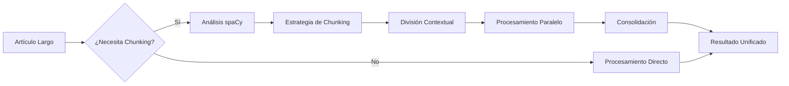

# Estrategia de Chunking Adaptativo 🧩

> **Documentación técnica completa del sistema de chunking inteligente**  
> Desde decisiones automáticas hasta optimización de rendimiento

## 📋 Tabla de Contenidos

1. [Introducción al Chunking](#introducción-al-chunking)
2. [Arquitectura del Sistema](#arquitectura-del-sistema)
3. [Algoritmos de Decisión](#algoritmos-de-decisión)
4. [Estrategias de Chunking](#estrategias-de-chunking)
5. [Preservación de Contexto](#preservación-de-contexto)
6. [Procesamiento Paralelo](#procesamiento-paralelo)
7. [Consolidación Cross-Chunk](#consolidación-cross-chunk)
8. [Configuración y Tuning](#configuración-y-tuning)
9. [Monitoreo y Métricas](#monitoreo-y-métricas)
10. [Optimización de Rendimiento](#optimización-de-rendimiento)
11. [Casos de Uso Avanzados](#casos-de-uso-avanzados)
12. [Troubleshooting](#troubleshooting)

## 🎯 Introducción al Chunking

### ¿Qué es el Chunking?

El **chunking** es la división inteligente de contenido extenso en fragmentos manejables que pueden procesarse en paralelo manteniendo coherencia contextual.

### ¿Por qué es Necesario?

```
PROBLEMAS SIN CHUNKING:
❌ Artículos largos causan timeouts
❌ LLMs tienen límites de tokens
❌ Procesamiento secuencial lento
❌ Pérdida de información en textos extensos

SOLUCIONES CON CHUNKING:
✅ Procesamiento paralelo eficiente
✅ Manejo de contenido ilimitado
✅ Mejor aprovechamiento de recursos
✅ Consolidación inteligente de resultados
```

### Evolución del Sistema



## 🏗️ Arquitectura del Sistema

### Componentes Principales

```python
# Componentes del sistema de chunking
class ChunkingSystem:
    components = {
        "decision_engine": "ChunkingDecisionEngine",
        "strategy_selector": "ChunkingStrategySelector", 
        "content_splitter": "ContextualContentSplitter",
        "parallel_processor": "ParallelChunkProcessor",
        "consolidation_service": "ConsolidationService",
        "performance_monitor": "ChunkingMetricsCollector"
    }
```

### Flujo de Datos

```
[Análisis spaCy] 
       ↓
[Decisión: ¿Chunking?] 
       ↓
[Selección de Estrategia]
       ↓
[División Contextual]
       ↓
[Procesamiento Paralelo]
       ↓
[Consolidación de Resultados]
       ↓
[Métricas y Optimización]
```

### Integración con Fases

| Fase | Uso de Chunking | Criterios Específicos |
|------|-----------------|----------------------|
| **Fase 1** | ❌ Nunca | Análisis integral necesario |
| **Fase 2** | ❌ Nunca | Simplificación global necesaria |
| **Fase 3** | ✅ Automático | Entidades > 30 OR Chars > 6000 |
| **Fase 4** | ✅ Automático | Hechos complejos OR Chars > 6000 |
| **Fase 5** | ✅ Condicional | Solo si se ejecuta + datos abundantes |
| **Fase 6** | ✅ Condicional | Solo si se ejecuta + citas abundantes |
| **Fase 7** | ❌ Nunca | Normalización global necesaria |

## 🧠 Algoritmos de Decisión

### Motor de Decisión Principal

```python
class ChunkingDecisionEngine:
    def __init__(self, config: PipelineConfig):
        self.config = config
        self.decision_cache = {}
    
    def should_use_chunking(
        self, 
        phase_name: str,
        analisis_spacy: Dict[str, Any],
        content_metrics: Dict[str, Any]
    ) -> Tuple[bool, str, Dict[str, Any]]:
        """
        Determina si usar chunking y qué estrategia aplicar.
        
        Returns:
            (should_chunk, strategy, decision_metadata)
        """
        
        # Verificar si la fase soporta chunking
        if not self._phase_supports_chunking(phase_name):
            return False, "no_chunking", {"reason": "phase_not_supported"}
        
        # Análisis multi-criterio
        decision_factors = self._analyze_chunking_factors(
            analisis_spacy, 
            content_metrics,
            phase_name
        )
        
        # Aplicar algoritmo de decisión
        should_chunk = self._apply_decision_algorithm(decision_factors)
        
        # Seleccionar estrategia si se necesita chunking
        if should_chunk:
            strategy = self._select_chunking_strategy(decision_factors)
        else:
            strategy = "no_chunking"
        
        # Metadatos de la decisión
        metadata = {
            "decision_factors": decision_factors,
            "algorithm_version": "2.0",
            "timestamp": time.time()
        }
        
        return should_chunk, strategy, metadata
    
    def _analyze_chunking_factors(
        self, 
        analisis_spacy: Dict[str, Any],
        content_metrics: Dict[str, Any],
        phase_name: str
    ) -> Dict[str, float]:
        """Analiza factores que influyen en la decisión de chunking."""
        
        factors = {}
        
        # Factor de longitud de contenido (0.0 - 1.0)
        chars_count = content_metrics.get("char_count", 0)
        chars_factor = min(1.0, chars_count / self.config.chunking.chars_threshold)
        factors["content_length"] = chars_factor
        
        # Factor de densidad de entidades
        entities_count = analisis_spacy.get("total_entities", 0)
        entities_factor = min(1.0, entities_count / self.config.chunking.entities_threshold)
        factors["entity_density"] = entities_factor
        
        # Factor de complejidad sintáctica
        avg_sentence_length = analisis_spacy.get("avg_sentence_length", 0)
        complexity_factor = min(1.0, avg_sentence_length / 30)  # 30 words = complex
        factors["syntactic_complexity"] = complexity_factor
        
        # Factor específico por fase
        phase_factor = self._calculate_phase_specific_factor(phase_name, analisis_spacy)
        factors["phase_specific"] = phase_factor
        
        # Factor de recursos disponibles
        current_load = self._get_current_system_load()
        resource_factor = max(0.1, 1.0 - current_load)  # Menos chunking si alta carga
        factors["resource_availability"] = resource_factor
        
        return factors
    
    def _apply_decision_algorithm(self, factors: Dict[str, float]) -> bool:
        """Aplica algoritmo de decisión basado en factores ponderados."""
        
        # Pesos para cada factor
        weights = {
            "content_length": 0.35,
            "entity_density": 0.25,
            "syntactic_complexity": 0.15,
            "phase_specific": 0.20,
            "resource_availability": 0.05
        }
        
        # Calcular score ponderado
        weighted_score = sum(
            factors.get(factor, 0) * weight 
            for factor, weight in weights.items()
        )
        
        # Threshold adaptativo basado en configuración
        base_threshold = 0.4
        
        # Ajustar threshold según configuración
        if self.config.processing.chunk_parallel_enabled:
            threshold = base_threshold * 0.8  # Más agresivo si paralelo habilitado
        else:
            threshold = base_threshold * 1.2  # Más conservador si no hay paralelo
        
        decision = weighted_score > threshold
        
        logger.debug(
            f"Decisión de chunking: {decision}",
            weighted_score=weighted_score,
            threshold=threshold,
            factors=factors
        )
        
        return decision
    
    def _calculate_phase_specific_factor(
        self, 
        phase_name: str, 
        analisis_spacy: Dict[str, Any]
    ) -> float:
        """Calcula factor específico según la fase."""
        
        if "entidades" in phase_name.lower():
            # Para fase de entidades, considerar densidad de entidades nombradas
            entities_per_sentence = (
                analisis_spacy.get("total_entities", 0) / 
                max(1, analisis_spacy.get("total_sentences", 1))
            )
            return min(1.0, entities_per_sentence / 3)  # 3+ entidades/oración = factor alto
        
        elif "hechos" in phase_name.lower():
            # Para fase de hechos, considerar verbos de acción y eventos
            action_verbs_count = analisis_spacy.get("action_verbs_count", 0)
            return min(1.0, action_verbs_count / 10)  # 10+ verbos de acción = factor alto
        
        elif "citas" in phase_name.lower():
            # Para fase de citas, considerar patrones de citas
            quote_patterns = analisis_spacy.get("quote_patterns_count", 0)
            return min(1.0, quote_patterns / self.config.chunking.quotes_threshold)
        
        elif "datos" in phase_name.lower():
            # Para fase de datos, considerar densidad numérica
            numeric_patterns = analisis_spacy.get("numeric_patterns_count", 0)
            return min(1.0, numeric_patterns / self.config.chunking.data_threshold)
        
        return 0.5  # Factor neutro para fases no específicas
```

### Algoritmo de Threshold Adaptativo

```python
class AdaptiveThresholdManager:
    def __init__(self):
        self.performance_history = deque(maxlen=100)
        self.threshold_adjustments = {}
    
    def adjust_thresholds_based_on_performance(
        self, 
        recent_metrics: Dict[str, Any]
    ) -> Dict[str, int]:
        """Ajusta thresholds basado en métricas de rendimiento recientes."""
        
        adjustments = {}
        
        # Analizar eficiencia de consolidación
        consolidation_efficiency = recent_metrics.get("avg_consolidation_efficiency", 0.9)
        
        if consolidation_efficiency < 0.8:
            # Baja eficiencia = chunks muy pequeños = aumentar thresholds
            adjustments["chars_threshold_multiplier"] = 1.3
            adjustments["entities_threshold_multiplier"] = 1.2
        elif consolidation_efficiency > 0.95:
            # Alta eficiencia = chunks grandes = reducir thresholds para más paralelización
            adjustments["chars_threshold_multiplier"] = 0.8
            adjustments["entities_threshold_multiplier"] = 0.9
        
        # Analizar latencia promedio
        avg_latency = recent_metrics.get("avg_processing_time_seconds", 5)
        
        if avg_latency > 20:
            # Latencia alta = necesitar más paralelización
            adjustments["chars_threshold_multiplier"] = adjustments.get("chars_threshold_multiplier", 1.0) * 0.7
        
        # Analizar tasa de error
        error_rate = recent_metrics.get("error_rate_percent", 0)
        
        if error_rate > 5:
            # Alta tasa de error = chunks muy pequeños causan problemas = aumentar thresholds
            adjustments["chars_threshold_multiplier"] = adjustments.get("chars_threshold_multiplier", 1.0) * 1.4
        
        return adjustments
```

## 🔧 Estrategias de Chunking

### Estrategias Disponibles

```python
class ChunkingStrategy(Enum):
    NO_CHUNKING = "no_chunking"
    CONSERVATIVE_PARALLEL = "conservative_parallel"
    AGGRESSIVE_PARALLEL = "aggressive_parallel"
    ADAPTIVE_OVERLAP = "adaptive_overlap"
    SEMANTIC_BOUNDARIES = "semantic_boundaries"
```

### Estrategia Conservadora

```python
class ConservativeChunkingStrategy:
    """Estrategia conservadora con chunks grandes y paralelización limitada."""
    
    def __init__(self, config: PipelineConfig):
        self.base_chunk_size = config.chunking.chars_threshold
        self.max_concurrent = min(3, config.processing.max_concurrent_chunks)
        self.overlap_ratio = 0.1  # 10% overlap
    
    def create_chunks(self, content: str, context: Dict[str, Any]) -> List[ContentChunk]:
        """Crea chunks conservadores con overlap mínimo."""
        
        # Análisis del contenido
        doc = nlp(content)
        sentences = list(doc.sents)
        
        chunks = []
        chunk_size = self.base_chunk_size
        overlap_size = int(chunk_size * self.overlap_ratio)
        
        start_idx = 0
        chunk_id = 0
        
        while start_idx < len(sentences):
            # Determinar rango de oraciones para este chunk
            chunk_sentences = []
            current_length = 0
            
            sentence_idx = start_idx
            while sentence_idx < len(sentences) and current_length < chunk_size:
                sentence = sentences[sentence_idx]
                chunk_sentences.append(sentence.text)
                current_length += len(sentence.text)
                sentence_idx += 1
            
            # Crear chunk con contexto
            chunk_text = " ".join(chunk_sentences)
            chunk_context = self._create_conservative_context(
                chunk_sentences, chunk_id, sentences, start_idx, sentence_idx
            )
            
            chunks.append(ContentChunk(
                chunk_id=chunk_id,
                text=chunk_text,
                context=chunk_context,
                metadata={
                    "strategy": "conservative",
                    "sentence_range": (start_idx, sentence_idx),
                    "overlap_sentences": overlap_size // 100  # Aprox sentences in overlap
                }
            ))
            
            # Calcular siguiente posición con overlap
            overlap_sentences = max(1, min(3, len(chunk_sentences) // 5))
            start_idx = max(start_idx + 1, sentence_idx - overlap_sentences)
            chunk_id += 1
        
        return chunks
    
    def _create_conservative_context(
        self, 
        chunk_sentences: List[str],
        chunk_id: int,
        all_sentences: List,
        start_idx: int,
        end_idx: int
    ) -> Dict[str, Any]:
        """Crea contexto conservador con información esencial."""
        
        return {
            "chunk_position": {
                "chunk_id": chunk_id,
                "sentence_start": start_idx,
                "sentence_end": end_idx,
                "is_first_chunk": chunk_id == 0,
                "is_last_chunk": end_idx >= len(all_sentences)
            },
            "context_preservation": {
                "previous_sentence": all_sentences[start_idx - 1].text if start_idx > 0 else None,
                "next_sentence": all_sentences[end_idx].text if end_idx < len(all_sentences) else None
            },
            "processing_hints": {
                "expect_entity_references": chunk_id > 0,
                "focus_on_new_content": True,
                "maintain_consistency": True
            }
        }
```

### Estrategia Agresiva

```python
class AggressiveChunkingStrategy:
    """Estrategia agresiva con chunks pequeños y alta paralelización."""
    
    def __init__(self, config: PipelineConfig):
        self.base_chunk_size = config.chunking.chars_threshold // 2  # Chunks más pequeños
        self.max_concurrent = config.processing.max_concurrent_chunks
        self.overlap_ratio = 0.25  # 25% overlap para preservar contexto
    
    def create_chunks(self, content: str, context: Dict[str, Any]) -> List[ContentChunk]:
        """Crea chunks agresivos optimizados para paralelización máxima."""
        
        doc = nlp(content)
        sentences = list(doc.sents)
        
        # Análisis semántico para mejorar división
        semantic_boundaries = self._detect_semantic_boundaries(doc)
        
        chunks = []
        chunk_size = self.base_chunk_size
        overlap_size = int(chunk_size * self.overlap_ratio)
        
        for boundary_start, boundary_end in semantic_boundaries:
            # Crear múltiples chunks pequeños dentro de cada límite semántico
            boundary_sentences = sentences[boundary_start:boundary_end]
            
            if len(" ".join([s.text for s in boundary_sentences])) <= chunk_size:
                # Límite semántico cabe en un chunk
                chunk = self._create_single_chunk(boundary_sentences, len(chunks))
                chunks.append(chunk)
            else:
                # Dividir límite semántico en múltiples chunks
                sub_chunks = self._create_overlapping_chunks(
                    boundary_sentences, chunk_size, overlap_size, len(chunks)
                )
                chunks.extend(sub_chunks)
        
        return chunks
    
    def _detect_semantic_boundaries(self, doc) -> List[Tuple[int, int]]:
        """Detecta límites semánticos naturales en el documento."""
        
        sentences = list(doc.sents)
        boundaries = []
        current_start = 0
        
        for i, sentence in enumerate(sentences):
            # Detectar cambios de tema/contexto
            if self._is_semantic_boundary(sentence, sentences, i):
                if i > current_start:
                    boundaries.append((current_start, i))
                current_start = i
        
        # Agregar último límite
        if current_start < len(sentences):
            boundaries.append((current_start, len(sentences)))
        
        return boundaries
    
    def _is_semantic_boundary(self, sentence, all_sentences: List, index: int) -> bool:
        """Determina si una oración marca un límite semántico."""
        
        # Indicadores de cambio de tema
        transition_markers = [
            "por otro lado", "en segundo lugar", "además", "sin embargo",
            "por el contrario", "mientras tanto", "posteriormente"
        ]
        
        sentence_text = sentence.text.lower()
        
        # Verificar marcadores de transición
        if any(marker in sentence_text for marker in transition_markers):
            return True
        
        # Verificar cambio en entidades principales
        if index > 0 and index < len(all_sentences) - 1:
            prev_entities = {ent.text for ent in all_sentences[index - 1].ents}
            curr_entities = {ent.text for ent in sentence.ents}
            
            # Si hay poco overlap en entidades, posible cambio de tema
            if prev_entities and curr_entities:
                overlap = len(prev_entities.intersection(curr_entities))
                overlap_ratio = overlap / max(len(prev_entities), len(curr_entities))
                
                if overlap_ratio < 0.3:  # Menos de 30% de overlap
                    return True
        
        return False
```

### Estrategia Semántica

```python
class SemanticBoundaryStrategy:
    """Estrategia basada en límites semánticos y cohesión temática."""
    
    def __init__(self, config: PipelineConfig):
        self.config = config
        self.similarity_threshold = 0.7
    
    def create_chunks(self, content: str, context: Dict[str, Any]) -> List[ContentChunk]:
        """Crea chunks respetando límites semánticos naturales."""
        
        doc = nlp(content)
        sentences = list(doc.sents)
        
        # Análisis de cohesión semántica
        cohesion_scores = self._calculate_sentence_cohesion(sentences)
        
        # Detectar puntos de división óptimos
        split_points = self._find_optimal_split_points(cohesion_scores, sentences)
        
        # Crear chunks basados en puntos de división
        chunks = []
        previous_split = 0
        
        for split_point in split_points:
            chunk_sentences = sentences[previous_split:split_point]
            
            if chunk_sentences:
                chunk = self._create_semantic_chunk(
                    chunk_sentences, len(chunks), sentences
                )
                chunks.append(chunk)
            
            previous_split = split_point
        
        # Último chunk
        if previous_split < len(sentences):
            final_sentences = sentences[previous_split:]
            chunk = self._create_semantic_chunk(
                final_sentences, len(chunks), sentences
            )
            chunks.append(chunk)
        
        return chunks
    
    def _calculate_sentence_cohesion(self, sentences: List) -> List[float]:
        """Calcula scores de cohesión entre oraciones consecutivas."""
        
        cohesion_scores = []
        
        for i in range(len(sentences) - 1):
            curr_sentence = sentences[i]
            next_sentence = sentences[i + 1]
            
            # Cohesión por entidades compartidas
            curr_entities = {ent.text.lower() for ent in curr_sentence.ents}
            next_entities = {ent.text.lower() for ent in next_sentence.ents}
            
            entity_overlap = 0
            if curr_entities and next_entities:
                shared_entities = curr_entities.intersection(next_entities)
                entity_overlap = len(shared_entities) / max(len(curr_entities), len(next_entities))
            
            # Cohesión léxica (palabras clave compartidas)
            curr_keywords = self._extract_keywords(curr_sentence.text)
            next_keywords = self._extract_keywords(next_sentence.text)
            
            lexical_overlap = 0
            if curr_keywords and next_keywords:
                shared_keywords = curr_keywords.intersection(next_keywords)
                lexical_overlap = len(shared_keywords) / max(len(curr_keywords), len(next_keywords))
            
            # Score combinado
            combined_score = (entity_overlap * 0.6) + (lexical_overlap * 0.4)
            cohesion_scores.append(combined_score)
        
        return cohesion_scores
    
    def _find_optimal_split_points(
        self, 
        cohesion_scores: List[float], 
        sentences: List
    ) -> List[int]:
        """Encuentra puntos óptimos de división basados en cohesión."""
        
        split_points = []
        current_chunk_size = 0
        min_chunk_size = self.config.chunking.chars_threshold // 3
        max_chunk_size = self.config.chunking.chars_threshold
        
        for i, score in enumerate(cohesion_scores):
            current_chunk_size += len(sentences[i].text)
            
            # Evaluar si es buen punto de división
            is_low_cohesion = score < self.similarity_threshold
            is_min_size_reached = current_chunk_size >= min_chunk_size
            is_max_size_exceeded = current_chunk_size >= max_chunk_size
            
            if (is_low_cohesion and is_min_size_reached) or is_max_size_exceeded:
                split_points.append(i + 1)
                current_chunk_size = 0
        
        return split_points
```

## 🔄 Preservación de Contexto

### Sistema de Contexto Enriquecido

```python
class ContextPreservationSystem:
    def __init__(self):
        self.context_templates = self._load_context_templates()
    
    def create_enriched_context(
        self,
        chunk: ContentChunk,
        global_context: Dict[str, Any],
        phase_context: Dict[str, Any]
    ) -> Dict[str, Any]:
        """Crea contexto enriquecido para un chunk específico."""
        
        enriched_context = {
            # Contexto posicional
            "position": {
                "chunk_id": chunk.chunk_id,
                "total_chunks": global_context.get("total_chunks", 1),
                "is_first": chunk.chunk_id == 0,
                "is_last": chunk.chunk_id == global_context.get("total_chunks", 1) - 1,
                "progress_percent": (chunk.chunk_id + 1) / global_context.get("total_chunks", 1) * 100
            },
            
            # Contexto textual
            "textual": {
                "previous_chunk_summary": self._get_previous_chunk_summary(chunk, global_context),
                "next_chunk_preview": self._get_next_chunk_preview(chunk, global_context),
                "document_title": global_context.get("document_title", ""),
                "document_theme": global_context.get("document_theme", "")
            },
            
            # Contexto de entidades
            "entities": {
                "known_entities": phase_context.get("known_entities", []),
                "chunk_entities": self._extract_chunk_entities(chunk.text),
                "entity_references": self._detect_entity_references(chunk.text, phase_context.get("known_entities", []))
            },
            
            # Contexto temporal
            "temporal": {
                "document_date": global_context.get("document_date"),
                "temporal_markers": self._extract_temporal_markers(chunk.text),
                "chronological_position": self._determine_chronological_position(chunk, global_context)
            },
            
            # Contexto de procesamiento
            "processing": {
                "phase_name": phase_context.get("phase_name", ""),
                "previous_phase_results": phase_context.get("previous_results", {}),
                "processing_hints": self._generate_processing_hints(chunk, phase_context)
            }
        }
        
        return enriched_context
    
    def _get_previous_chunk_summary(
        self, 
        current_chunk: ContentChunk, 
        global_context: Dict[str, Any]
    ) -> str:
        """Genera resumen del chunk anterior para contexto."""
        
        if current_chunk.chunk_id == 0:
            return "Este es el primer fragmento del documento."
        
        previous_results = global_context.get("chunk_results", {})
        previous_chunk_id = current_chunk.chunk_id - 1
        
        if previous_chunk_id in previous_results:
            prev_result = previous_results[previous_chunk_id]
            
            # Crear resumen automático
            summary_parts = []
            
            if "entidades_extraidas" in prev_result:
                entities = prev_result["entidades_extraidas"][:3]  # Top 3
                entity_names = [e.get("nombre", "") for e in entities]
                summary_parts.append(f"Entidades principales: {', '.join(entity_names)}")
            
            if "hechos_extraidos" in prev_result:
                facts_count = len(prev_result["hechos_extraidos"])
                summary_parts.append(f"Se extrajeron {facts_count} hechos")
            
            return " | ".join(summary_parts) if summary_parts else "Fragmento anterior procesado."
        
        return "Información del fragmento anterior no disponible."
    
    def _generate_processing_hints(
        self, 
        chunk: ContentChunk, 
        phase_context: Dict[str, Any]
    ) -> List[str]:
        """Genera sugerencias de procesamiento para el chunk."""
        
        hints = []
        
        # Hints basados en posición
        if chunk.chunk_id == 0:
            hints.append("Establecer contexto inicial del documento")
        elif chunk.metadata.get("is_last", False):
            hints.append("Incluir elementos de cierre o conclusión")
        else:
            hints.append("Mantener coherencia con fragmentos anteriores")
        
        # Hints basados en contenido
        chunk_text_lower = chunk.text.lower()
        
        if "sin embargo" in chunk_text_lower or "por el contrario" in chunk_text_lower:
            hints.append("Prestar atención a contrastes o contradicciones")
        
        if any(marker in chunk_text_lower for marker in ["finalmente", "en conclusión", "para terminar"]):
            hints.append("Posible contenido de cierre o resumen")
        
        if chunk_text_lower.count('"') > 4:
            hints.append("Fragmento rico en citas textuales")
        
        # Hints basados en fase
        phase_name = phase_context.get("phase_name", "")
        
        if "entidades" in phase_name and chunk.chunk_id > 0:
            hints.append("Resolver referencias pronominales usando entidades conocidas")
        
        if "hechos" in phase_name:
            hints.append("Vincular hechos con entidades ya identificadas")
        
        return hints
```

### Manejo de Referencias Cross-Chunk

```python
class CrossChunkReferenceResolver:
    def __init__(self):
        self.entity_index = {}
        self.pronoun_patterns = {
            "el": ["MASC", "SING"],
            "la": ["FEM", "SING"],
            "los": ["MASC", "PLUR"],
            "las": ["FEM", "PLUR"],
            "este": ["MASC", "SING", "PROX"],
            "esta": ["FEM", "SING", "PROX"],
            "estos": ["MASC", "PLUR", "PROX"],
            "estas": ["FEM", "PLUR", "PROX"]
        }
    
    def resolve_references_in_chunk(
        self,
        chunk_text: str,
        known_entities: List[EntidadProcesada],
        chunk_context: Dict[str, Any]
    ) -> Tuple[str, List[Dict[str, Any]]]:
        """Resuelve referencias pronominales en el chunk usando entidades conocidas."""
        
        # Actualizar índice de entidades
        self._update_entity_index(known_entities)
        
        doc = nlp(chunk_text)
        resolved_text = chunk_text
        resolutions = []
        
        for token in doc:
            if self._is_resolvable_reference(token):
                # Buscar antecedente apropiado
                antecedent = self._find_antecedent(token, known_entities, chunk_context)
                
                if antecedent:
                    # Reemplazar referencia con nombre explícito
                    replacement = f"{antecedent['nombre']} ({token.text})"
                    resolved_text = resolved_text.replace(token.text, replacement, 1)
                    
                    resolutions.append({
                        "original": token.text,
                        "resolved_to": antecedent['nombre'],
                        "confidence": antecedent['confidence'],
                        "position": token.idx
                    })
        
        return resolved_text, resolutions
    
    def _find_antecedent(
        self,
        reference_token,
        known_entities: List[EntidadProcesada],
        context: Dict[str, Any]
    ) -> Optional[Dict[str, Any]]:
        """Encuentra el antecedente más probable para una referencia."""
        
        candidates = []
        
        # Buscar en entidades del chunk actual
        chunk_entities = context.get("entities", {}).get("chunk_entities", [])
        for entity in chunk_entities:
            score = self._calculate_reference_score(reference_token, entity)
            if score > 0.5:
                candidates.append({
                    "nombre": entity,
                    "confidence": score,
                    "source": "current_chunk"
                })
        
        # Buscar en entidades conocidas de chunks anteriores
        for entity in known_entities:
            score = self._calculate_reference_score(reference_token, entity.nombre)
            if score > 0.3:  # Threshold más bajo para entidades distantes
                candidates.append({
                    "nombre": entity.nombre,
                    "confidence": score * 0.8,  # Penalizar distancia
                    "source": "previous_chunks"
                })
        
        # Seleccionar mejor candidato
        if candidates:
            best_candidate = max(candidates, key=lambda x: x["confidence"])
            return best_candidate
        
        return None
    
    def _calculate_reference_score(self, reference_token, entity_name: str) -> float:
        """Calcula score de probabilidad de que la referencia apunte a la entidad."""
        
        score = 0.0
        
        # Análisis morfológico básico
        ref_text = reference_token.text.lower()
        entity_lower = entity_name.lower()
        
        # Score por proximidad en el texto
        distance_score = 1.0  # Simplificado - en implementación real calcular distancia
        
        # Score por compatibilidad gramatical
        grammar_score = self._check_grammatical_compatibility(reference_token, entity_name)
        
        # Score por frecuencia de mención
        frequency_score = self.entity_index.get(entity_name, {}).get("frequency", 0) / 10
        
        # Combinar scores
        score = (distance_score * 0.4) + (grammar_score * 0.4) + (frequency_score * 0.2)
        
        return min(1.0, score)
```

## ⚡ Procesamiento Paralelo

### Coordinador de Paralelización

```python
class ParallelChunkProcessor:
    def __init__(self, config: PipelineConfig):
        self.config = config
        self.semaphore = asyncio.Semaphore(config.processing.max_concurrent_chunks)
        self.results_cache = {}
    
    async def process_chunks_parallel(
        self,
        chunks: List[ContentChunk],
        phase_processor: Callable,
        context: Dict[str, Any],
        max_retries: int = 3
    ) -> List[Dict[str, Any]]:
        """Procesa chunks en paralelo con control de concurrencia y reintentos."""
        
        # Dividir chunks en lotes para controlar concurrencia
        batch_size = self.config.processing.max_concurrent_chunks
        all_results = []
        
        for i in range(0, len(chunks), batch_size):
            batch_chunks = chunks[i:i + batch_size]
            
            # Crear tareas para el lote actual
            tasks = []
            for chunk in batch_chunks:
                task = self._process_single_chunk_with_retry(
                    chunk, phase_processor, context, max_retries
                )
                tasks.append(task)
            
            # Ejecutar lote en paralelo
            logger.info(f"Procesando lote de {len(batch_chunks)} chunks en paralelo")
            batch_results = await asyncio.gather(*tasks, return_exceptions=True)
            
            # Procesar resultados del lote
            for chunk, result in zip(batch_chunks, batch_results):
                if isinstance(result, Exception):
                    logger.error(f"Error en chunk {chunk.chunk_id}: {result}")
                    # Crear resultado de error
                    error_result = {
                        "chunk_id": chunk.chunk_id,
                        "error": str(result),
                        "status": "error",
                        "partial_results": {}
                    }
                    all_results.append(error_result)
                else:
                    # Agregar metadatos del chunk al resultado
                    result["chunk_metadata"] = {
                        "chunk_id": chunk.chunk_id,
                        "processing_timestamp": time.time(),
                        "chunk_length": len(chunk.text),
                        "status": "success"
                    }
                    all_results.append(result)
            
            # Pausa breve entre lotes para evitar saturar APIs
            if i + batch_size < len(chunks):
                await asyncio.sleep(0.1)
        
        return all_results
    
    async def _process_single_chunk_with_retry(
        self,
        chunk: ContentChunk,
        phase_processor: Callable,
        context: Dict[str, Any],
        max_retries: int
    ) -> Dict[str, Any]:
        """Procesa un chunk individual con reintentos automáticos."""
        
        async with self.semaphore:  # Controlar concurrencia
            last_exception = None
            
            for attempt in range(max_retries + 1):
                try:
                    # Agregar contexto específico del chunk
                    chunk_context = {
                        **context,
                        "chunk_id": chunk.chunk_id,
                        "chunk_context": chunk.context,
                        "attempt_number": attempt + 1
                    }
                    
                    # Procesar chunk
                    start_time = time.time()
                    result = await phase_processor(chunk.text, chunk_context)
                    processing_time = time.time() - start_time
                    
                    # Agregar métricas de procesamiento
                    result["_processing_metrics"] = {
                        "processing_time_seconds": processing_time,
                        "attempts_required": attempt + 1,
                        "chunk_id": chunk.chunk_id
                    }
                    
                    return result
                
                except Exception as e:
                    last_exception = e
                    logger.warning(
                        f"Intento {attempt + 1} falló para chunk {chunk.chunk_id}: {e}"
                    )
                    
                    if attempt < max_retries:
                        # Espera exponencial entre reintentos
                        wait_time = (2 ** attempt) * 0.5
                        await asyncio.sleep(wait_time)
            
            # Si llegamos aquí, todos los reintentos fallaron
            raise last_exception
    
    def optimize_chunk_order(
        self, 
        chunks: List[ContentChunk],
        optimization_strategy: str = "dependency_aware"
    ) -> List[ContentChunk]:
        """Optimiza el orden de procesamiento de chunks."""
        
        if optimization_strategy == "dependency_aware":
            # Chunks con menos dependencias primero
            return sorted(chunks, key=lambda c: self._calculate_dependency_score(c))
        
        elif optimization_strategy == "complexity_based":
            # Chunks más complejos primero para paralelizar mejor
            return sorted(chunks, key=lambda c: len(c.text), reverse=True)
        
        elif optimization_strategy == "balanced":
            # Intercalar chunks complejos y simples
            sorted_chunks = sorted(chunks, key=lambda c: len(c.text), reverse=True)
            balanced_order = []
            
            complex_chunks = sorted_chunks[:len(sorted_chunks)//2]
            simple_chunks = sorted_chunks[len(sorted_chunks)//2:]
            
            for i in range(max(len(complex_chunks), len(simple_chunks))):
                if i < len(complex_chunks):
                    balanced_order.append(complex_chunks[i])
                if i < len(simple_chunks):
                    balanced_order.append(simple_chunks[i])
            
            return balanced_order
        
        else:
            return chunks  # Orden original
    
    def _calculate_dependency_score(self, chunk: ContentChunk) -> float:
        """Calcula score de dependencias del chunk."""
        
        score = 0.0
        
        # Chunks iniciales tienen menos dependencias
        score += chunk.chunk_id * 0.1
        
        # Chunks con muchas referencias tienen más dependencias
        references_count = chunk.context.get("entity_context", {}).get("expected_references", 0)
        score += references_count * 0.2
        
        return score
```

### Gestión de Rate Limiting

```python
class RateLimitManager:
    def __init__(self):
        self.api_limits = {
            "groq": {"requests_per_minute": 30, "tokens_per_minute": 150000},
            "openai": {"requests_per_minute": 60, "tokens_per_minute": 200000}
        }
        self.current_usage = defaultdict(lambda: {"requests": 0, "tokens": 0, "reset_time": time.time() + 60})
    
    async def acquire_api_slot(
        self, 
        api_name: str, 
        estimated_tokens: int
    ) -> bool:
        """Adquiere slot de API respetando límites de rate limiting."""
        
        current_time = time.time()
        usage = self.current_usage[api_name]
        limits = self.api_limits.get(api_name, {"requests_per_minute": 10, "tokens_per_minute": 50000})
        
        # Reset contador si pasó el minuto
        if current_time > usage["reset_time"]:
            usage["requests"] = 0
            usage["tokens"] = 0
            usage["reset_time"] = current_time + 60
        
        # Verificar límites
        if (usage["requests"] >= limits["requests_per_minute"] or 
            usage["tokens"] + estimated_tokens > limits["tokens_per_minute"]):
            
            # Calcular tiempo de espera
            wait_time = usage["reset_time"] - current_time
            
            if wait_time > 0:
                logger.info(f"Rate limit alcanzado para {api_name}, esperando {wait_time:.1f}s")
                await asyncio.sleep(wait_time)
                
                # Reset después de esperar
                usage["requests"] = 0
                usage["tokens"] = 0
                usage["reset_time"] = time.time() + 60
        
        # Reservar slot
        usage["requests"] += 1
        usage["tokens"] += estimated_tokens
        
        return True
```

## 🔄 Consolidación Cross-Chunk

### Algoritmos de Consolidación Avanzados

```python
class AdvancedConsolidationService:
    def __init__(self, similarity_threshold: float = 0.85):
        self.similarity_threshold = similarity_threshold
        self.consolidation_cache = {}
        self.performance_metrics = {
            "consolidations_performed": 0,
            "duplicates_removed": 0,
            "processing_time_total": 0.0
        }
    
    def consolidate_entities_advanced(
        self, 
        entities_by_chunk: List[List[EntidadProcesada]],
        consolidation_strategy: str = "hierarchical_clustering"
    ) -> Tuple[List[EntidadProcesada], Dict[str, Any]]:
        """Consolidación avanzada con múltiples algoritmos."""
        
        start_time = time.time()
        
        # Aplanar todas las entidades
        all_entities = []
        for chunk_idx, chunk_entities in enumerate(entities_by_chunk):
            for entity in chunk_entities:
                # Agregar metadatos de origen
                entity._chunk_origin = chunk_idx
                all_entities.append(entity)
        
        original_count = len(all_entities)
        
        if consolidation_strategy == "hierarchical_clustering":
            consolidated = self._hierarchical_clustering_consolidation(all_entities)
        elif consolidation_strategy == "graph_based":
            consolidated = self._graph_based_consolidation(all_entities)
        elif consolidation_strategy == "fuzzy_matching":
            consolidated = self._fuzzy_matching_consolidation(all_entities)
        else:
            consolidated = self._simple_similarity_consolidation(all_entities)
        
        # Renumerar IDs secuencialmente
        for i, entity in enumerate(consolidated, 1):
            entity.id_secuencial = i
        
        # Calcular métricas
        processing_time = time.time() - start_time
        duplicates_removed = original_count - len(consolidated)
        efficiency = (duplicates_removed / original_count) * 100 if original_count > 0 else 0
        
        # Actualizar métricas globales
        self.performance_metrics["consolidations_performed"] += 1
        self.performance_metrics["duplicates_removed"] += duplicates_removed
        self.performance_metrics["processing_time_total"] += processing_time
        
        metadata = {
            "original_count": original_count,
            "consolidated_count": len(consolidated),
            "duplicates_removed": duplicates_removed,
            "efficiency_percent": round(efficiency, 2),
            "processing_time_seconds": round(processing_time, 3),
            "algorithm_used": consolidation_strategy,
            "similarity_threshold": self.similarity_threshold
        }
        
        return consolidated, metadata
    
    def _hierarchical_clustering_consolidation(
        self, 
        entities: List[EntidadProcesada]
    ) -> List[EntidadProcesada]:
        """Consolidación usando clustering jerárquico."""
        
        if len(entities) <= 1:
            return entities
        
        # Crear matriz de similitud
        similarity_matrix = self._create_similarity_matrix(entities)
        
        # Clustering jerárquico aglomerativo
        clusters = self._agglomerative_clustering(entities, similarity_matrix)
        
        # Consolidar cada cluster
        consolidated_entities = []
        for cluster in clusters:
            if len(cluster) == 1:
                consolidated_entities.append(cluster[0])
            else:
                merged_entity = self._merge_entity_cluster(cluster)
                consolidated_entities.append(merged_entity)
        
        return consolidated_entities
    
    def _create_similarity_matrix(
        self, 
        entities: List[EntidadProcesada]
    ) -> List[List[float]]:
        """Crea matriz de similitud entre entidades."""
        
        n = len(entities)
        matrix = [[0.0 for _ in range(n)] for _ in range(n)]
        
        for i in range(n):
            for j in range(i + 1, n):
                similarity = self._calculate_advanced_similarity(entities[i], entities[j])
                matrix[i][j] = similarity
                matrix[j][i] = similarity
        
        return matrix
    
    def _calculate_advanced_similarity(
        self, 
        entity1: EntidadProcesada, 
        entity2: EntidadProcesada
    ) -> float:
        """Calcula similitud avanzada entre dos entidades."""
        
        # Deben ser del mismo tipo
        if entity1.tipo != entity2.tipo:
            return 0.0
        
        # Múltiples métricas de similitud
        similarity_scores = []
        
        # 1. Similitud de nombres (Levenshtein + Jaccard)
        name_sim = self._name_similarity(entity1.nombre, entity2.nombre)
        similarity_scores.append(("name", name_sim, 0.4))
        
        # 2. Similitud de descripciones
        if entity1.descripcion and entity2.descripcion:
            desc_sim = self._text_similarity(entity1.descripcion, entity2.descripcion)
            similarity_scores.append(("description", desc_sim, 0.3))
        
        # 3. Similitud contextual (chunk de origen)
        context_sim = self._contextual_similarity(entity1, entity2)
        similarity_scores.append(("context", context_sim, 0.2))
        
        # 4. Similitud de aliases
        if hasattr(entity1, 'alias') and hasattr(entity2, 'alias'):
            alias_sim = self._alias_similarity(entity1.alias or [], entity2.alias or [])
            similarity_scores.append(("alias", alias_sim, 0.1))
        
        # Combinar scores con pesos
        weighted_score = sum(
            score * weight for _, score, weight in similarity_scores
        ) / sum(weight for _, _, weight in similarity_scores)
        
        return weighted_score
    
    def _name_similarity(self, name1: str, name2: str) -> float:
        """Calcula similitud de nombres usando múltiples métricas."""
        
        name1_norm = self._normalize_name(name1)
        name2_norm = self._normalize_name(name2)
        
        # Similitud exacta
        if name1_norm == name2_norm:
            return 1.0
        
        # Similitud de Levenshtein
        from difflib import SequenceMatcher
        levenshtein_sim = SequenceMatcher(None, name1_norm, name2_norm).ratio()
        
        # Similitud de Jaccard (tokens)
        tokens1 = set(name1_norm.split())
        tokens2 = set(name2_norm.split())
        
        if tokens1 and tokens2:
            jaccard_sim = len(tokens1.intersection(tokens2)) / len(tokens1.union(tokens2))
        else:
            jaccard_sim = 0.0
        
        # Similitud de iniciales (útil para abreviaciones)
        initials1 = "".join([token[0] for token in name1_norm.split() if token])
        initials2 = "".join([token[0] for token in name2_norm.split() if token])
        initials_sim = 1.0 if initials1 == initials2 and len(initials1) > 1 else 0.0
        
        # Combinar métricas
        combined_sim = (levenshtein_sim * 0.5) + (jaccard_sim * 0.4) + (initials_sim * 0.1)
        
        return combined_sim
    
    def _agglomerative_clustering(
        self, 
        entities: List[EntidadProcesada], 
        similarity_matrix: List[List[float]]
    ) -> List[List[EntidadProcesada]]:
        """Implementa clustering jerárquico aglomerativo."""
        
        # Inicializar: cada entidad en su propio cluster
        clusters = [[entity] for entity in entities]
        cluster_similarities = similarity_matrix.copy()
        
        while len(clusters) > 1:
            # Encontrar el par de clusters más similar
            max_similarity = -1
            merge_i, merge_j = -1, -1
            
            for i in range(len(clusters)):
                for j in range(i + 1, len(clusters)):
                    # Calcular similitud entre clusters (linkage completo)
                    cluster_sim = self._cluster_similarity(
                        clusters[i], clusters[j], cluster_similarities, entities
                    )
                    
                    if cluster_sim > max_similarity:
                        max_similarity = cluster_sim
                        merge_i, merge_j = i, j
            
            # Si la mejor similitud está por debajo del threshold, parar
            if max_similarity < self.similarity_threshold:
                break
            
            # Merge clusters
            merged_cluster = clusters[merge_i] + clusters[merge_j]
            
            # Remover clusters originales (el de mayor índice primero)
            if merge_i < merge_j:
                clusters.pop(merge_j)
                clusters.pop(merge_i)
            else:
                clusters.pop(merge_i)
                clusters.pop(merge_j)
            
            # Agregar cluster merged
            clusters.append(merged_cluster)
        
        return clusters
    
    def _cluster_similarity(
        self, 
        cluster1: List[EntidadProcesada], 
        cluster2: List[EntidadProcesada],
        similarity_matrix: List[List[float]],
        all_entities: List[EntidadProcesada]
    ) -> float:
        """Calcula similitud entre dos clusters usando linkage completo."""
        
        similarities = []
        
        for entity1 in cluster1:
            for entity2 in cluster2:
                idx1 = all_entities.index(entity1)
                idx2 = all_entities.index(entity2)
                similarities.append(similarity_matrix[idx1][idx2])
        
        # Linkage completo: similitud mínima
        return min(similarities) if similarities else 0.0
```

## 📊 Configuración y Tuning

### Sistema de Configuración Adaptativa

```python
class AdaptiveChunkingConfig:
    def __init__(self, base_config: PipelineConfig):
        self.base_config = base_config
        self.adaptation_history = deque(maxlen=50)
        self.performance_targets = {
            "consolidation_efficiency_min": 0.85,
            "processing_time_max_seconds": 30,
            "error_rate_max_percent": 5,
            "parallel_utilization_target": 0.7
        }
    
    def adapt_configuration(
        self, 
        recent_metrics: Dict[str, Any]
    ) -> Dict[str, Any]:
        """Adapta configuración basada en métricas de rendimiento."""
        
        adaptations = {}
        
        # Analizar eficiencia de consolidación
        consolidation_efficiency = recent_metrics.get("avg_consolidation_efficiency", 0.9)
        
        if consolidation_efficiency < self.performance_targets["consolidation_efficiency_min"]:
            # Baja eficiencia = chunks muy pequeños = aumentar thresholds
            adaptations["chars_threshold"] = int(self.base_config.chunking.chars_threshold * 1.2)
            adaptations["entities_threshold"] = int(self.base_config.chunking.entities_threshold * 1.1)
            logger.info("Aumentando thresholds de chunking para mejorar eficiencia de consolidación")
        
        elif consolidation_efficiency > 0.95:
            # Alta eficiencia = oportunidad para más paralelización
            adaptations["chars_threshold"] = int(self.base_config.chunking.chars_threshold * 0.9)
            adaptations["entities_threshold"] = int(self.base_config.chunking.entities_threshold * 0.95)
            logger.info("Reduciendo thresholds de chunking para aumentar paralelización")
        
        # Analizar tiempo de procesamiento
        avg_processing_time = recent_metrics.get("avg_processing_time_seconds", 10)
        
        if avg_processing_time > self.performance_targets["processing_time_max_seconds"]:
            # Tiempo excesivo = necesitar más paralelización
            current_max_concurrent = self.base_config.processing.max_concurrent_chunks
            adaptations["max_concurrent_chunks"] = min(8, current_max_concurrent + 1)
            
            # También reducir tamaño de chunks
            adaptations["chars_threshold"] = int(
                adaptations.get("chars_threshold", self.base_config.chunking.chars_threshold) * 0.8
            )
            logger.info("Aumentando paralelización y reduciendo tamaño de chunks para mejorar tiempo")
        
        # Analizar tasa de error
        error_rate = recent_metrics.get("error_rate_percent", 0)
        
        if error_rate > self.performance_targets["error_rate_max_percent"]:
            # Alta tasa de error = chunks muy pequeños o paralelización excesiva
            adaptations["chars_threshold"] = int(
                adaptations.get("chars_threshold", self.base_config.chunking.chars_threshold) * 1.3
            )
            adaptations["max_concurrent_chunks"] = max(
                2, adaptations.get("max_concurrent_chunks", self.base_config.processing.max_concurrent_chunks) - 1
            )
            logger.info("Reduciendo paralelización y aumentando tamaño de chunks para reducir errores")
        
        # Analizar utilización de paralelización
        parallel_utilization = recent_metrics.get("parallel_utilization_percent", 50) / 100
        
        if parallel_utilization < self.performance_targets["parallel_utilization_target"]:
            # Baja utilización = oportunidad para más chunks
            adaptations["chars_threshold"] = int(
                adaptations.get("chars_threshold", self.base_config.chunking.chars_threshold) * 0.85
            )
            logger.info("Reduciendo threshold para aumentar utilización de paralelización")
        
        # Guardar adaptación en historial
        self.adaptation_history.append({
            "timestamp": time.time(),
            "metrics": recent_metrics,
            "adaptations": adaptations
        })
        
        return adaptations
    
    def get_optimized_strategy(
        self, 
        content_characteristics: Dict[str, Any]
    ) -> str:
        """Selecciona estrategia óptima basada en características del contenido."""
        
        entity_density = content_characteristics.get("entities_per_1000_chars", 10)
        text_complexity = content_characteristics.get("avg_sentence_length", 15)
        content_length = content_characteristics.get("total_chars", 5000)
        
        # Análisis de patrones
        if entity_density > 30 and content_length > 10000:
            return "aggressive_parallel"  # Contenido muy denso = paralelización agresiva
        
        elif entity_density < 5 and text_complexity < 20:
            return "conservative_parallel"  # Contenido simple = paralelización conservadora
        
        elif text_complexity > 25:
            return "semantic_boundaries"  # Contenido complejo = división semántica
        
        else:
            return "adaptive_overlap"  # Caso general = overlap adaptativo
```

### Tuning Automático

```python
class AutoTuner:
    def __init__(self):
        self.tuning_experiments = []
        self.best_configurations = {}
    
    def run_tuning_experiment(
        self, 
        test_articles: List[str],
        parameter_ranges: Dict[str, List[Any]]
    ) -> Dict[str, Any]:
        """Ejecuta experimento de tuning con diferentes configuraciones."""
        
        results = []
        
        # Generar combinaciones de parámetros
        parameter_combinations = self._generate_parameter_combinations(parameter_ranges)
        
        for combination in parameter_combinations[:10]:  # Limitar a 10 experimentos
            logger.info(f"Probando configuración: {combination}")
            
            # Aplicar configuración temporal
            with self._temporary_config(combination):
                # Probar con artículos de test
                experiment_metrics = self._run_test_articles(test_articles)
                
                results.append({
                    "configuration": combination,
                    "metrics": experiment_metrics,
                    "score": self._calculate_configuration_score(experiment_metrics)
                })
        
        # Encontrar mejor configuración
        best_result = max(results, key=lambda x: x["score"])
        
        return {
            "best_configuration": best_result["configuration"],
            "best_metrics": best_result["metrics"],
            "best_score": best_result["score"],
            "all_results": results
        }
    
    def _generate_parameter_combinations(
        self, 
        parameter_ranges: Dict[str, List[Any]]
    ) -> List[Dict[str, Any]]:
        """Genera combinaciones de parámetros para probar."""
        
        import itertools
        
        keys = list(parameter_ranges.keys())
        values = list(parameter_ranges.values())
        
        combinations = []
        for combination in itertools.product(*values):
            config_dict = dict(zip(keys, combination))
            combinations.append(config_dict)
        
        return combinations
    
    def _calculate_configuration_score(self, metrics: Dict[str, Any]) -> float:
        """Calcula score de calidad para una configuración."""
        
        # Componentes del score (0-1 cada uno)
        efficiency_score = min(1.0, metrics.get("consolidation_efficiency", 0) / 0.95)
        speed_score = max(0, 1.0 - (metrics.get("avg_processing_time", 30) / 30))
        accuracy_score = max(0, 1.0 - (metrics.get("error_rate", 0) / 10))
        parallelization_score = min(1.0, metrics.get("parallel_utilization", 0) / 0.8)
        
        # Pesos para cada componente
        weights = {
            "efficiency": 0.3,
            "speed": 0.3,
            "accuracy": 0.25,
            "parallelization": 0.15
        }
        
        total_score = (
            efficiency_score * weights["efficiency"] +
            speed_score * weights["speed"] +
            accuracy_score * weights["accuracy"] +
            parallelization_score * weights["parallelization"]
        )
        
        return total_score
```

## 📈 Monitoreo y Métricas

### Dashboard de Chunking

```python
class ChunkingDashboard:
    def generate_dashboard_data(self) -> Dict[str, Any]:
        """Genera datos para dashboard de chunking."""
        
        metrics_collector = get_metrics_collector()
        recent_metrics = metrics_collector.get_chunking_metrics(hours=24)
        
        return {
            "overview": {
                "total_articles_processed": recent_metrics["total_articles"],
                "articles_requiring_chunking": recent_metrics["chunked_articles"],
                "chunking_rate_percent": (recent_metrics["chunked_articles"] / max(1, recent_metrics["total_articles"])) * 100,
                "avg_chunks_per_article": recent_metrics["avg_chunks_per_article"]
            },
            "performance": {
                "avg_processing_time_no_chunking": recent_metrics["avg_time_no_chunking"],
                "avg_processing_time_with_chunking": recent_metrics["avg_time_with_chunking"],
                "chunking_overhead_percent": recent_metrics["chunking_overhead_percent"],
                "parallel_efficiency": recent_metrics["parallel_efficiency"]
            },
            "consolidation": {
                "avg_consolidation_efficiency": recent_metrics["avg_consolidation_efficiency"],
                "total_duplicates_removed": recent_metrics["total_duplicates_removed"],
                "consolidation_accuracy": recent_metrics["consolidation_accuracy"]
            },
            "trends": {
                "hourly_chunking_rate": recent_metrics["hourly_trends"]["chunking_rate"],
                "hourly_efficiency": recent_metrics["hourly_trends"]["efficiency"],
                "performance_over_time": recent_metrics["performance_trends"]
            },
            "errors": {
                "chunking_errors_count": recent_metrics["chunking_errors"],
                "consolidation_errors_count": recent_metrics["consolidation_errors"],
                "most_common_errors": recent_metrics["common_error_types"]
            }
        }
```

---

Esta documentación completa del sistema de chunking adaptativo proporciona toda la información técnica necesaria para entender, implementar, configurar y optimizar el sistema de división inteligente de contenido en el pipeline de 7 fases.