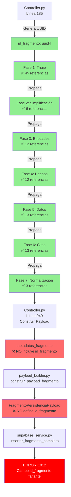

# Mapa Visual del Flujo de `id_fragmento`

## Flujo Completo del Pipeline



## Detalle del Problema

### 1. Generación (✅ CORRECTO)
```python
# controller.py, línea 185
fragmento_data = {
    "id_fragmento": str(uuid.uuid4()),  # ✅ Se genera correctamente
    "texto_original": contenido,
    "id_articulo_fuente": str(articulo_id),
}
```

### 2. Propagación por Fases (✅ CORRECTO)
Todas las fases mantienen y propagan el `id_fragmento`:
- **Fase 1**: Recibe como parámetro, retorna en resultado
- **Fases 2-6**: Toman de resultado anterior, incluyen en su resultado
- **Fase 7**: Lo toma de los hechos (posible punto débil)

### 3. Construcción del Payload (❌ PROBLEMA)
```python
# controller.py, línea 949
metadatos_fragmento = {
    # ❌ FALTA: "id_fragmento": str(fragmento.id_fragmento),
    "indice_secuencial_fragmento": fragmento.orden_en_articulo or 0,
    "titulo_seccion_fragmento": fragmento.metadata_adicional.get("titulo_seccion"),
    "contenido_texto_original_fragmento": fragmento.texto_original,
    "num_pagina_inicio_fragmento": fragmento.metadata_adicional.get("pagina_inicio"),
    "num_pagina_fin_fragmento": fragmento.metadata_adicional.get("pagina_fin")
}
```

### 4. Modelo de Persistencia (❌ PROBLEMA)
```python
# persistencia.py, línea 214
class FragmentoPersistenciaPayload(PersistenciaBaseModel):
    # ❌ NO define id_fragmento como campo
    indice_secuencial_fragmento: int
    titulo_seccion_fragmento: Optional[str]
    contenido_texto_original_fragmento: str
    # ... otros campos
```

## Puntos de Pérdida del ID

1. **Principal**: Entre el resultado del pipeline y `metadatos_fragmento`
2. **Secundario**: El modelo de persistencia no lo espera/valida

## Solución Inmediata

```python
# En controller.py, línea 949, añadir:
metadatos_fragmento = {
    "id_fragmento": str(fragmento.id_fragmento),  # ← AÑADIR ESTA LÍNEA
    "indice_secuencial_fragmento": fragmento.orden_en_articulo or 0,
    # ... resto de campos
}
```

## Verificación Post-Fix

1. El `id_fragmento` fluirá: Controller → PayloadBuilder → Supabase
2. La RPC `insertar_fragmento_completo` recibirá el ID
3. No más errores E012 de campo faltante

## Timeline del Error

```
[✅] Generación inicial del UUID
 ↓
[✅] Procesamiento Fase 1-7 (ID se mantiene)
 ↓
[❌] Construcción metadatos_fragmento (ID se pierde)
 ↓
[❌] PayloadBuilder recibe datos sin ID
 ↓
[❌] Supabase RPC falla al buscar ID
 ↓
[💥] ERROR E012
```

## Impacto

- **Fragmentos afectados**: 100% (todos fallan en persistencia)
- **Datos perdidos**: Todos los fragmentos procesados no se guardan
- **Criticidad**: ALTA - Bloquea todo el pipeline de persistencia