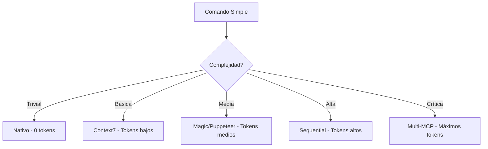

# 🚀 Guía SuperClaude - Referencia Completa

SuperClaude es un framework avanzado que potencia Claude Code con 19 comandos especializados, 9 personas cognitivas, 4 servidores MCP y sistema PRP para features complejas.

## 🏗️ Arquitectura del Sistema

```
┌─── COMANDOS (19) ──────┐    ┌─── PERSONAS (9) ─────┐    ┌─── MCP SERVERS (4) ───┐
│ • Core: analyze, build  │ ←→ │ • architect         │ ←→ │ • Context7            │
│ • Dev: test, review     │    │ • frontend/backend  │    │ • Sequential          │
│ • Ops: deploy, scan     │    │ • security, qa      │    │ • Magic, Puppeteer    │
│ • PRP: prp, generate    │    │ • performance, etc  │    │                       │
└────────────────────────┘    └─────────────────────┘    └───────────────────────┘
                ↕                        ↕                           ↕
┌────────────────── SISTEMA DE HERENCIA ──────────────────────────────────────┐
│ Flags Universales: --uc, --think-hard, --seq, --persona-X, --validate      │
│ Patrones Compartidos: @include shared/*.yml | Validación automática        │
└─────────────────────────────────────────────────────────────────────────────┘
                ↕                        ↕                           ↕
┌─── NIVEL EJECUCIÓN ────┐    ┌─── NIVEL PLANIFICACIÓN ───┐    ┌─── RESULTADOS ────┐
│ • Comandos directos    │ ←→ │ • TaskManager/TodoWrite    │ →  │ • .claudedocs/    │
│ • Validación automática│    │ • PRP Mode (complejos)     │    │ • Checkpoints     │
│ • Recuperación errores │    │ • Tracking en tiempo real  │    │ • Métricas        │
└────────────────────────┘    └───────────────────────────┘    └───────────────────┘
```

### Flujo de Comandos SuperClaude

```mermaid
graph TD
    A[Comando Usuario] --> B{Complejidad?}
    B -->|Simple| C[Comando Directo]
    B -->|Compleja| D[PRP Mode]
    
    C --> E[Seleccionar Persona]
    D --> F[/prp --init]
    F --> G[/prp --generate]
    G --> H[/prp --execute]
    
    E --> I[Aplicar Flags]
    H --> I
    
    I --> J[Ejecutar con MCP]
    J --> K[Validación]
    K --> L{¿Éxito?}
    L -->|Sí| M[Completar]
    L -->|No| N[Recuperación]
    N --> J
```

## 📋 Comandos Principales

| Comando | Función | Ejemplo Básico | Con Flags Útiles |
|---------|---------|----------------|------------------|
| `/build` | Crear código | `/build --feature "login"` | `/build --react --magic --tdd` |
| `/analyze` | Analizar | `/analyze --code` | `/analyze --architecture --seq --uc` |
| `/test` | Testing | `/test --unit` | `/test --e2e --coverage --pup` |
| `/review` | Code review | `/review --files src/` | `/review --pr --quality --evidence` |
| `/troubleshoot` | Debugging | `/troubleshoot --investigate` | `/troubleshoot --prod --five-whys --seq` |
| `/improve` | Optimizar | `/improve --quality` | `/improve --performance --threshold 95%` |
| `/deploy` | Desplegar | `/deploy --env staging` | `/deploy --env prod --canary --validate` |
| `/design` | Arquitectura | `/design --api` | `/design --ddd --microservices --seq` |
| `/explain` | Documentar | `/explain --depth beginner` | `/explain --api --visual --examples` |
| `/scan` | Seguridad | `/scan --security` | `/scan --owasp --deps --strict` |
| `/migrate` | Migraciones | `/migrate --database` | `/migrate --backup --validate --dry-run` |
| `/git` | Control versiones | `/git --commit` | `/git --checkpoint --pre-commit` |
| `/task` | Gestión tareas | `/task:create "feature X"` | `/task:resume task-id` |
| `/document` | Crear docs | `/document --user` | `/document --api --interactive` |
| `/estimate` | Estimaciones | `/estimate --rough` | `/estimate --detailed --worst-case` |
| `/cleanup` | Limpieza | `/cleanup --code` | `/cleanup --all --validate` |
| `/dev-setup` | Configurar entorno | `/dev-setup --install` | `/dev-setup --ci --monitor` |
| `/load` | Cargar contexto | `/load` | `/load --depth deep --patterns` |
| `/spawn` | Agentes paralelos | `/spawn --task "tests"` | `/spawn --parallel --sync` |
| `/prp` | Modo PRP complejo | `/prp --init "feature X"` | `/prp --generate --execute` |

## 🎯 Flags Universales (Disponibles en TODOS los comandos)

| Flag | Función | Uso de Tokens | Cuándo Usar |
|------|---------|---------------|-------------|
| `--uc` | UltraCompressed | -70% tokens | Siempre que puedas |
| `--think` | Análisis estándar | ~4K tokens | Tareas moderadas |
| `--think-hard` | Análisis profundo | ~10K tokens | Arquitectura |
| `--ultrathink` | Análisis máximo | ~32K tokens | Decisiones críticas |
| `--validate` | Verificación extra | +1K tokens | Operaciones riesgosas |
| `--dry-run` | Solo preview | 0 ejecución | Antes de cambios grandes |
| `--plan` | Mostrar plan | +500 tokens | Tareas complejas |
| `--interactive` | Paso a paso | Variable | Aprendizaje |
| `--introspect` | Auto-análisis | +2K tokens | Debug del framework |

## 🧠 Personas Cognitivas

| Persona | Especialidad | Mejor Para | Ejemplo |
|---------|--------------|------------|---------|
| `--persona-architect` | Diseño sistemas | Arquitectura, patrones | `/design --api --persona-architect` |
| `--persona-frontend` | UI/UX | Interfaces, componentes | `/build --react --persona-frontend` |
| `--persona-backend` | Servidor | APIs, bases de datos | `/build --api --persona-backend` |
| `--persona-security` | Seguridad | Auditorías, vulnerabilidades | `/scan --security --persona-security` |
| `--persona-analyzer` | Debugging | Problemas complejos | `/troubleshoot --persona-analyzer` |
| `--persona-qa` | Testing | Calidad, cobertura | `/test --coverage --persona-qa` |
| `--persona-performance` | Optimización | Velocidad, eficiencia | `/improve --performance --persona-performance` |
| `--persona-refactorer` | Limpieza código | Deuda técnica | `/improve --refactor --persona-refactorer` |
| `--persona-mentor` | Enseñanza | Documentación, explicaciones | `/explain --persona-mentor` |

## 🔌 Integración MCP - Model Context Protocol

SuperClaude integra 4 servidores MCP especializados para maximizar capacidades y optimizar tokens.

### 📡 Servidores MCP Disponibles

| Servidor | Flag | Función Principal | Especialidad | Coste Tokens |
|----------|------|------------------|--------------|--------------|
| **Context7** | `--c7` | Documentación oficial | Librerías/frameworks | Bajo-Medio |
| **Sequential** | `--seq` | Razonamiento complejo | Análisis profundo | Medio-Alto |
| **Magic** | `--magic` | Generación UI/IA | Componentes React/Vue | Medio |
| **Puppeteer** | `--pup` | Automatización browser | Testing E2E | Bajo |

### 🎯 Context7 - Documentación Oficial

**Propósito**: Obtener documentación autoritativa de librerías y frameworks

```bash
# Investigación de librerías
/analyze --deps --c7                    # Analizar dependencias con docs oficiales
/build --react --hooks --c7            # Crear hooks con patrones oficiales
/explain --api "FastAPI middleware" --c7 # Explicar con documentación oficial

# Casos ideales:
- Integrar nueva librería
- Verificar API changes
- Encontrar best practices oficiales
- Resolver problemas de compatibilidad
```

**Flujo típico**:
1. Detecta librería/framework en el código
2. Resuelve ID oficial (ej: `/vercel/next.js`)
3. Obtiene documentación específica
4. Aplica patrones oficiales

### 🧠 Sequential - Razonamiento Complejo

**Propósito**: Análisis multi-step y pensamiento arquitectónico

```bash
# Análisis complejo
/troubleshoot --prod --five-whys --seq  # Debug con razonamiento sistemático
/design --architecture --ddd --seq      # Diseño con pensamiento profundo
/analyze --performance --bottleneck --seq # Análisis de rendimiento paso a paso

# Casos ideales:
- Debugging complejo (múltiples causas)
- Decisiones arquitectónicas
- Análisis de root cause
- Planificación de migraciones
```

**Ventajas**:
- Descompone problemas complejos
- Razonamiento paso a paso documentado
- Identifica múltiples soluciones
- Reduce errores en decisiones críticas

### ✨ Magic - Generación UI/IA

**Propósito**: Crear componentes UI con IA, siguiendo design systems

```bash
# Generación de componentes
/build --react --component "dashboard" --magic  # Crear dashboard con IA
/build --vue --form "contact" --magic          # Formulario con validación
/improve --ui --accessibility --magic          # Mejorar UI con accesibilidad

# Casos ideales:
- Prototipos rápidos
- Componentes con design system
- UI responsive automática
- Optimización de UX
```

**Características**:
- Sigue patrones de design system
- Genera CSS/estilos optimizados
- Incluye estados de loading/error
- Accesibilidad integrada

### 🎭 Puppeteer - Automatización Browser

**Propósito**: Testing E2E, screenshots, performance monitoring

```bash
# Testing y automatización
/test --e2e --flow "user-signup" --pup    # Test completo de flujo
/test --performance --metrics --pup       # Métricas de performance
/analyze --ui --screenshots --pup         # Análisis visual

# Casos ideales:
- Tests end-to-end
- Performance monitoring
- Validación visual
- Automatización de workflows
```

**Capacidades**:
- Navegación completa
- Screenshots automáticos
- Métricas de rendimiento
- Interacciones reales

### 🚀 Optimización Inteligente MCP

#### Escalado por Complejidad


#### Combinaciones Efectivas

| Escenario | Servidores | Beneficio | Ejemplo |
|-----------|------------|-----------|---------|
| **Nueva API** | Context7 + Sequential | Docs oficiales + análisis | `/build --api --fastapi --c7 --seq` |
| **UI Compleja** | Magic + Puppeteer | Generación + testing | `/build --react --dashboard --magic --pup` |
| **Debug Crítico** | Sequential + Context7 | Razonamiento + referencias | `/troubleshoot --prod --seq --c7` |
| **Full Testing** | Puppeteer + Context7 | E2E + patterns | `/test --e2e --best-practices --pup --c7` |

### 💡 Estrategias de Token

#### Modo Conservador (Optimal)
```bash
# Usar solo cuando agrega valor real
/build --feature "simple-form"           # Nativo suficiente
/build --api --crud --c7                 # C7 para patrones
/test --unit                             # Nativo para tests simples
```

#### Modo Agresivo (Comprehensive)
```bash
# Máxima calidad con multi-MCP
/design --architecture --microservices --seq --c7    # Diseño + docs
/build --react --dashboard --magic --pup             # UI + testing
/troubleshoot --prod --investigation --seq --c7      # Debug profundo
```

#### Modo Emergencia (Ultra-compressed)
```bash
# Todos los comandos con --uc para minimizar tokens
/analyze --issue --uc --seq             # Análisis comprimido pero profundo
/build --hotfix --uc --c7               # Fix rápido con referencias
/test --critical --uc --pup             # Testing esencial comprimido
```

### 🎯 Guía de Selección MCP

#### Para Análisis
- **Simple**: Nativo (git log, file analysis)
- **Dependencies**: Context7 (librería docs)
- **Complex**: Sequential (multi-step reasoning)
- **Performance**: Puppeteer (metrics reales)

#### Para Desarrollo
- **Backend**: Context7 (API patterns)
- **Frontend**: Magic (UI generation)
- **Full-stack**: Context7 + Magic
- **Testing**: Puppeteer (E2E validation)

#### Para Debugging
- **Quick fix**: Nativo (conocido pattern)
- **Unknown error**: Context7 (official troubleshooting)
- **Complex issue**: Sequential (systematic approach)
- **UI problems**: Magic + Puppeteer (visual debugging)

### ⚡ Ejemplos Prácticos MCP

#### Integración Nueva Librería
```bash
# Paso 1: Investigar librería
/explain --library "Prisma ORM" --c7
# → Obtiene docs oficiales, setup, best practices

# Paso 2: Diseñar integración  
/design --integration --database --seq
# → Analiza paso a paso la integración

# Paso 3: Implementar
/build --feature --prisma --patterns --c7
# → Implementa usando patrones oficiales
```

#### Debugging Complejo
```bash
# Paso 1: Análisis sistemático
/troubleshoot --investigate --five-whys --seq
# → Descompone el problema paso a paso

# Paso 2: Verificar soluciones conocidas
/analyze --solutions "similar error" --c7  
# → Busca soluciones en docs oficiales

# Paso 3: Validar fix
/test --regression --automated --pup
# → Valida que el fix funciona end-to-end
```

#### Feature Full-Stack
```bash
# Paso 1: Arquitectura
/design --fullstack --user-dashboard --seq
# → Planifica arquitectura completa

# Paso 2: Backend con patterns
/build --api --dashboard-data --c7
# → API siguiendo best practices

# Paso 3: Frontend con IA  
/build --react --dashboard --responsive --magic
# → UI generada con design system

# Paso 4: Testing completo
/test --e2e --user-flow --dashboard --pup
# → Validación end-to-end automatizada
```

### 🚨 Troubleshooting MCP

| Error | Causa | Solución |
|-------|-------|----------|
| "Context7 timeout" | Librería no encontrada | Usar nombre exacto: `/explain "React hooks" --c7` |
| "Sequential overflow" | Problema muy complejo | Dividir: `/analyze --part1 --seq` |
| "Magic generation failed" | Requisitos poco claros | Especificar más: `--component "login form with validation"` |
| "Puppeteer connection error" | Browser no disponible | Usar `--headless` o fallback nativo |

### 📊 Métricas MCP

SuperClaude trackea automáticamente:
- **Tokens por servidor**: Optimización de costes
- **Success rate**: Calidad de outputs
- **Time to response**: Performance
- **Cache hit rate**: Eficiencia

```bash
# Ver métricas actuales
/analyze --mcp-metrics --performance
# → Muestra uso y optimizaciones sugeridas
```

## 💡 Flujos de Trabajo Comunes

### Desarrollo de Feature Completa
```bash
/design --feature --ddd                    # 1. Diseñar
/build --feature "auth" --tdd --uc        # 2. Implementar
/test --unit --coverage                    # 3. Probar
/review --quality --evidence               # 4. Revisar
/deploy --env staging --validate           # 5. Desplegar
```

### Debugging en Producción
```bash
/troubleshoot --prod --investigate --seq   # 1. Investigar
/analyze --logs --metrics                  # 2. Analizar datos
/improve --hotfix --validate               # 3. Crear fix
/test --regression --strict                # 4. Verificar
/deploy --env prod --monitor               # 5. Deploy con monitoreo
```

### Optimización de Rendimiento
```bash
/analyze --profile --deep --uc             # 1. Perfilar
/improve --performance --threshold 90%     # 2. Optimizar
/test --performance --benchmark            # 3. Medir
```

## ⚡ Combinaciones Efectivas

| Objetivo | Comando Óptimo |
|----------|----------------|
| API REST rápida | `/build --api --crud --openapi --persona-backend` |
| UI React moderna | `/build --react --magic --typescript --persona-frontend` |
| Seguridad completa | `/scan --security --owasp --deps --persona-security` |
| Migración segura | `/migrate --database --backup --validate --dry-run` |
| Debug complejo | `/troubleshoot --prod --five-whys --seq --persona-analyzer` |
| Documentación pro | `/document --api --examples --interactive --c7` |
| Code review exhaustivo | `/review --pr --quality --evidence --persona-qa` |

## 🎮 Gestión de Tareas

```bash
/task:create "Sistema de notificaciones"   # Crea y desglosa automáticamente
/task:status notification-id               # Ver progreso
/task:resume notification-id               # Continuar tras pausa
/task:update notification-id "bloqueado"   # Actualizar estado
/task:complete notification-id             # Finalizar con resumen
/task:prp notification-id                  # Convertir a PRP si es complejo
```

## 📘 Modo PRP - Features Complejas con Comandos Explícitos

PRP (Product Requirements Prompt) es un sistema avanzado de Context Engineering integrado a SuperClaude para features que requieren planificación exhaustiva, validación y comandos deterministas.

### 🎯 Filosofía PRP + SuperClaude

**REVOLUCIÓN**: Cada tarea en un PRP especifica **exactamente** qué comando SuperClaude ejecutar, con qué persona, sin interpretación.

```yaml
# Antes (genérico)
Task 1: Implementar autenticación
  # Claude decide qué herramientas usar

# Ahora (explícito y determinista)  
Task 1: Analizar sistema de autenticación actual
  SuperClaude Command: /analyze --architecture --code --dependencies src/auth/
  Persona: --persona-architect
  Validation: /test --unit --coverage src/auth/
  Expected Output: Reporte de arquitectura en .claudedocs/analysis/
```

### 🔍 Sistema de Decisión: Normal vs PRP

```mermaid
graph TD
    A[Feature Request] --> B{Evaluar Complejidad}
    B --> C{≥3 archivos?}
    B --> D{>30 minutos?}
    B --> E{Multi-sistema?}
    B --> F{Patrón desconocido?}
    B --> G{Crítico negocio?}
    
    C -->|Sí| H[→ PRP Mode]
    D -->|Sí| H
    E -->|Sí| H  
    F -->|Sí| H
    G -->|Sí| H
    
    C -->|No| I[→ Comandos Normales]
    D -->|No| I
    E -->|No| I
    F -->|No| I
    G -->|No| I
    
    H --> J[/prp --init]
    I --> K[/build, /analyze, etc.]
```

### 📊 Tabla de Decisión Detallada

| Factor | Umbral PRP | Comando Normal | Razón |
|--------|------------|----------------|-------|
| **Archivos afectados** | ≥3 | 1-2 | Coordinación multi-archivo |
| **Tiempo estimado** | >30 min | <30 min | Justifica planificación |
| **Sistemas integrados** | ≥2 | 1 | Requiere validación cruzada |
| **Stakeholders** | >1 equipo | 1 persona | Necesita documentación |
| **Riesgo técnico** | Alto | Bajo/Medio | Requiere validación exhaustiva |
| **Patrón conocido** | No | Sí | Necesita investigación |
| **Criticidad** | Producción | Dev/Test | Zero-downtime requerido |

### 🛠️ Comandos PRP Expandidos

#### `/prp --init [description]`
**Propósito**: Evaluador inteligente de complejidad

```bash
# Ejemplos de evaluación
/prp --init "Agregar botón de logout"
# → "Feature simple. Usar: /build --ui --component"

/prp --init "Sistema de pagos con Stripe + notificaciones + audit"  
# → "Feature compleja detectada. PRP recomendado:"
# → "- 3 sistemas (pagos, notif, audit)"
# → "- >5 archivos estimados" 
# → "- Lógica crítica de negocio"
# → "Continuar con: /prp --generate payments"
```

#### `/prp --generate [feature-name]`
**Propósito**: Generador determinista con comandos explícitos

**Flujo interno**:
1. **Análisis de feature** → detectar tipo y complejidad
2. **Mapeo a comandos** → usar tabla Task_Command_Mapping
3. **Asignación de personas** → basado en especialidad
4. **Generación de validaciones** → comandos ejecutables
5. **Creación de PRP** → con comandos explícitos

```bash
# Generación con diferentes enfoques
/prp --generate oauth-auth --persona-architect --research-deep
# → Enfoque arquitectónico, investigación profunda

/prp --generate payment-flow --persona-security --template=api  
# → Enfoque seguridad, plantilla API

/prp --generate user-dashboard --persona-frontend --magic
# → Enfoque UX, componentes con IA
```

#### `/prp --execute [prp-file]`
**Propósito**: Ejecutor determinista sin interpretación

**Comportamiento Garantizado**:
- ✅ Ejecuta EXACTAMENTE el comando especificado en cada tarea
- ✅ Adopta la persona indicada antes de ejecutar
- ✅ Ejecuta validaciones tal como se especifican
- ❌ NUNCA decide qué herramienta usar
- ❌ NUNCA interpreta o modifica comandos
- ❌ NUNCA se salta validaciones

```bash
# Ejecución con diferentes niveles
/prp --execute PRPs/oauth-auth.md --validation-level=strict
# → Todas las validaciones obligatorias

/prp --execute PRPs/quick-fix.md --checkpoint=After_Core  
# → Continuar desde checkpoint específico

/prp --execute PRPs/complex-feature.md --interactive
# → Pausar en cada milestone para confirmar
```

### 📋 Mapeo Tarea → Comando SuperClaude

| Tipo de Tarea | Comando SuperClaude | Persona por Defecto | Flags Comunes |
|---------------|---------------------|---------------------|---------------|
| **Análisis** | `/analyze --architecture --code` | `--persona-analyzer` | `--dependencies, --seq` |
| **Diseño** | `/design --patterns --system` | `--persona-architect` | `--ddd, --microservices` |
| **Implementación** | `/build --feature --tdd` | `--persona-backend` | `--uc, --magic` |
| **Testing** | `/test --unit --coverage` | `--persona-qa` | `--e2e, --strict` |
| **Seguridad** | `/scan --security --owasp` | `--persona-security` | `--deps, --strict` |
| **Frontend** | `/build --react --magic` | `--persona-frontend` | `--typescript, --accessibility` |
| **API** | `/build --api --openapi` | `--persona-backend` | `--crud, --validation` |
| **Base Datos** | `/migrate --backup --validate` | `--persona-backend` | `--dry-run, --rollback` |
| **Performance** | `/improve --performance --metrics` | `--persona-performance` | `--profile, --iterate` |
| **Documentación** | `/document --comprehensive --examples` | `--persona-mentor` | `--api, --interactive` |

### 🎯 Ejemplos de PRPs Reales

#### Ejemplo 1: API REST Simple
```bash
/prp --init "Crear API para gestión de productos"
# → Evaluación: "Mediana complejidad. PRP opcional pero recomendado"

/prp --generate products-api --persona-backend --template=api
# → Genera PRP con comandos como:
#   Task 1: /analyze --code src/models/ --dependencies
#   Task 2: /design --api --crud --openapi --think-hard  
#   Task 3: /build --api --crud --validation --tdd
#   Task 4: /test --integration --api --coverage
```

#### Ejemplo 2: Feature Full-Stack Compleja
```bash
/prp --init "Dashboard de analytics con tiempo real + exportación"
# → Evaluación: "Compleja. PRP fuertemente recomendado"
# → "- Frontend + Backend + WebSockets + Exportación"
# → "- 8+ archivos estimados"
# → "- Múltiples tecnologías"

/prp --generate analytics-dashboard --persona-architect --research-deep
# → Genera PRP con ~15 tareas:
#   Task 1: /analyze --architecture --performance src/
#   Task 2: /design --fullstack --websockets --data-flow --seq
#   Task 3: /build --api --analytics --performance
#   Task 4: /build --react --dashboard --magic --persona-frontend
#   Task 5: /build --websockets --realtime --persona-backend
#   ...
#   Task 15: /deploy --staging --monitoring --validate
```

#### Ejemplo 3: Migración de Sistema
```bash
/prp --init "Migrar autenticación de JWT a OAuth 2.0"
# → Evaluación: "Crítica. PRP obligatorio"
# → "- Sistema crítico (autenticación)"
# → "- Migración con zero-downtime" 
# → "- Múltiples puntos de integración"

/prp --generate auth-migration --persona-architect --persona-security
# → Genera PRP con enfoque dual:
#   Task 1: /analyze --architecture --security src/auth/ --seq
#   Task 2: /design --migration --zero-downtime --rollback --think-hard
#   Task 3: /scan --security --compliance --oauth --strict
#   ...
```

### 📈 Progreso en Tiempo Real

Cuando ejecutas un PRP, SuperClaude muestra progreso detallado:

```
═══════════════════════════════════════════════════
🚀 PRP: OAuth Authentication Implementation  
📊 Status: In Progress (67%) | Persona: --persona-backend
⏱️  Started: 14:30 | Estimated: 45 min remaining
═══════════════════════════════════════════════════
✅ Task 1: Setup OAuth configuration [COMPLETED]
   Command: /build --config --oauth --providers --uc
   Duration: 3 min | Files: 3 created | Tests: ✅
   
✅ Task 2: Implement Google provider [COMPLETED]  
   Command: /build --feature --oauth --google --tdd
   Duration: 8 min | Files: 2 created | Tests: ✅
   
⏳ Task 3: Implement token refresh [IN PROGRESS]
   Command: /build --feature --security --token-refresh
   Persona: --persona-security (adopted)
   Progress: Token encryption ✅ | Refresh logic 🔄 | Tests pending
   
□  Task 4: Add GitHub provider [PENDING]
□  Task 5: Integration testing [PENDING]

🔍 Validations:
✅ Lint checks (ESLint): All passed
✅ Type checks (TypeScript): All passed  
⏳ Unit tests: 15/18 passing (83%)
□  Security scan: Pending
□  Integration tests: Pending

🚨 Issues Found: 0 | 📝 Todos Active: 12
═══════════════════════════════════════════════════
```

### 🔧 Flags PRP Específicos

| Flag | Función | Cuándo Usar | Ejemplo |
|------|---------|-------------|---------|
| `--template=[tipo]` | Forzar plantilla | Cuando el auto-detect falla | `--template=fullstack` |
| `--research-deep` | Investigación extendida | Features con tecnología nueva | Con librerías desconocidas |
| `--validation-strict` | Todas las validaciones | Código crítico producción | Features de seguridad |
| `--context-full` | Máximo contexto | Features muy complejas | Integraciones grandes |
| `--checkpoint=[name]` | Reanudar desde punto | Después de interrupciones | `--checkpoint=After_Core` |
| `--interactive` | Confirmar cada paso | Aprendizaje o features críticas | Cuando necesitas control |

### 🎓 Mejores Prácticas PRP

#### ✅ DO (Hacer)
1. **Siempre evalúa primero**: `SIEMPRE /prp --init antes de asumir que necesitas PRP`
2. **Selecciona persona correcta**: `--persona-architect para diseño, --persona-security para seguridad`  
3. **Revisa antes de ejecutar**: `Lee el PRP generado antes de /prp --execute`
4. **Monitorea validaciones**: `No ignores tests fallidos o scans de seguridad`
5. **Usa checkpoints**: `Features largas necesitan puntos de recuperación`

#### ❌ DON'T (No Hacer)
1. **No fuerces PRP**: `Si /prp --init dice "simple", usa comandos normales`
2. **No saltes validaciones**: `Cada validación tiene una razón de ser`
3. **No ignores personas**: `Las personas especialistas mejoran la calidad`
4. **No modifiques PRPs en ejecución**: `Deja que el plan se complete`
5. **No uses para bugs simples**: `PRPs son para features nuevas, no fixes rápidos`

### 🔄 Flujo PRP Completo con Decisiones

```bash
# 🎯 PASO 1: Evaluación Inteligente
/prp --init "Implementar sistema de notificaciones push"

# Respuesta del sistema:
# ✅ Feature compleja detectada:
# • Multi-platform (web + mobile)  
# • Integración externa (Firebase/APNS)
# • Background processing requerido
# • >5 archivos estimados
# ➡️  PRP recomendado. Continuar con /prp --generate

# 🎯 PASO 2: Generación Especializada  
/prp --generate notifications-push --persona-architect --research-deep

# ✅ PRP generado: PRPs/notifications-push.md
# • 12 tareas con comandos explícitos
# • Investigación de Firebase/APNS completada
# • Validaciones de seguridad incluidas
# ➡️  Revisar PRP y ejecutar

# 🎯 PASO 3: Revisión Humana
/read PRPs/notifications-push.md

# Usuario revisa y ajusta si necesario

# 🎯 PASO 4: Ejecución Determinista
/prp --execute PRPs/notifications-push.md --validation-strict

# ✅ Ejecutando Task 1: /analyze --architecture --push --integrations
# ✅ Adoptando persona: --persona-architect  
# ✅ Ejecutando Task 2: /design --push --multi-platform --security
# ⏳ Ejecutando Task 3: /build --feature --push --firebase...

# 🎯 PASO 5: Monitoreo Continuo
/prp --status

# 📊 67% completado | 4/12 tareas | 2 validaciones pendientes
```

### 📚 Plantillas PRP Disponibles

| Plantilla | Mejor Para | Secciones Especiales | Ejemplo |
|-----------|------------|---------------------|---------|
| **prp_base.md** | Features generales | Estructura completa | Cualquier feature nueva |
| **prp_api.md** | REST/GraphQL APIs | Endpoints, schemas, auth | API de productos |
| **prp_frontend.md** | UI/UX, componentes | React, state, accessibility | Dashboard de usuario |
| **prp_fullstack.md** | Features end-to-end | All layers, deployment | Sistema de notificaciones |
| **prp_migration.md** | Migraciones sistemas | Zero-downtime, rollback | JWT → OAuth migration |
| **prp_integration.md** | APIs externas | Third-party, webhooks | Integración con Stripe |

### 🎯 PRP vs Comandos Normales: Cuándo Usar Cada Uno

```mermaid
graph TD
    A[Nueva Tarea] --> B{Tiempo Estimado}
    B -->|<10 min| C[Comando Normal]
    B -->|10-30 min| D{Archivos Afectados}
    B -->|>30 min| E[PRP Recomendado]
    
    D -->|1-2 archivos| F[Comando Normal]
    D -->|≥3 archivos| G[Considerar PRP]
    
    C --> H[/build, /analyze, etc.]
    F --> H
    G --> I{Criticidad}
    E --> J[PRP Obligatorio]
    
    I -->|Baja| H
    I -->|Media/Alta| J
    
    J --> K[/prp --init]
```

## 📊 Optimización de Tokens

| Situación | Estrategia |
|-----------|------------|
| Análisis simple | Sin flags de thinking |
| Código básico | Solo `--uc` |
| Arquitectura | `--think-hard --uc` |
| Debug crítico | `--ultrathink --seq` |
| Muchos archivos | `--uc` siempre |

## 🎓 Mejores Prácticas SuperClaude

### ✅ Patrones de Éxito

#### Desarrollo Incremental
```bash
# ✅ CORRECTO: Incrementos pequeños y validados
/build --feature "login-form" --tdd --uc
/test --unit --coverage
/review --quality --evidence
/deploy --env staging

# ❌ INCORRECTO: Todo de una vez sin validación
/build --feature "authentication-system-complete"
```

#### Uso Inteligente de Personas
```bash
# ✅ CORRECTO: Persona según fase
/design --api --persona-architect          # Diseño con arquitecto
/build --api --persona-backend             # Implementación con backend
/test --e2e --persona-qa                   # Testing con QA
/scan --security --persona-security        # Auditoría con seguridad

# ❌ INCORRECTO: Persona incorrecta
/scan --security --persona-frontend        # Seguridad con frontend
```

#### Optimización de Tokens
```bash
# ✅ CORRECTO: Escalar según necesidad
/analyze --code --uc                       # Simple: solo --uc
/design --architecture --think-hard --uc   # Medio: think-hard + uc
/troubleshoot --critical --ultrathink --seq # Complejo: máxima potencia

# ❌ INCORRECTO: Subutilizar o sobreutilizar
/build --simple-fix --ultrathink --seq     # Sobreutilizar en simple
/design --architecture                     # Subutilizar en complejo
```

### 🚫 Anti-Patrones Comunes

| Anti-Patrón | Por Qué Es Malo | Corrección |
|-------------|-----------------|------------|
| **Comando Mega** | `/build --everything --all-features` | Divide en tareas específicas |
| **Sin Validación** | Saltar tests y scans | Siempre validar antes de continuar |
| **Persona Incorrecta** | `--persona-frontend` para API | Usar persona apropiada para la tarea |
| **Flags Innecesarios** | `--ultrathink` para fix simple | Escalar flags según complejidad |
| **Ignorar PRPs** | Forzar comandos normales en complejo | Usar `/prp --init` para evaluar |

### 📊 Decisión Flow Chart

```mermaid
graph TD
    A[Nueva Tarea] --> B{¿Conoces el patrón?}
    B -->|Sí| C{¿Es simple <10min?}
    B -->|No| D[/prp --init para evaluar]
    
    C -->|Sí| E[Comando directo + --uc]
    C -->|No| F{¿Es crítica?}
    
    F -->|Sí| G[Comando + --think-hard + persona]
    F -->|No| H[Comando + persona apropiada]
    
    D --> I{¿PRP recomendado?}
    I -->|Sí| J[/prp --generate + execute]
    I -->|No| K[Comando normal con flags]
    
    E --> L[Ejecutar]
    G --> L
    H --> L
    J --> L
    K --> L
    
    L --> M[Validar resultado]
    M --> N{¿Éxito?}
    N -->|Sí| O[Completar]
    N -->|No| P[Debug y retry]
    P --> L
```

### 🎯 Cheatsheet de Comandos Frecuentes

#### Desarrollo Diario
```bash
# Morning setup
/load --context deep                       # Cargar contexto del proyecto
/analyze --git --recent                    # Ver cambios recientes
/task:status                               # Revisar tareas pendientes

# Desarrollo feature
/prp --init "feature-name"                 # Evaluar complejidad
/build --feature "specific-thing" --tdd   # Implementar con tests
/test --unit --coverage                    # Validar implementación
/review --quality --evidence               # Revisar calidad

# End of day
/git --commit --descriptive                # Commit con mensaje claro
/task:update "current-status"              # Actualizar progreso
```

#### Debugging Sistemático
```bash
# Investigación inicial
/analyze --error "error-message" --uc      # Análisis rápido
/troubleshoot --investigate --seq          # Si necesita más profundidad

# Implementar fix
/build --fix "specific-issue" --validate   # Fix con validación
/test --regression --affected              # Asegurar no romper nada

# Validación final
/scan --validate --affected-areas          # Scan focalizado
/deploy --env staging --monitor            # Deploy monitoreado
```

#### Arquitectura y Diseño
```bash
# Análisis arquitectónico
/analyze --architecture --dependencies --seq  # Análisis completo
/design --patterns --scalability --think-hard # Diseño profundo

# Documentación
/document --architecture --diagrams        # Documentar decisiones
/explain --patterns --examples --c7        # Explicar con ejemplos
```

### 🚨 Solución Rápida de Problemas

| Error | Causa Común | Solución Inmediata | Prevención |
|-------|-------------|-------------------|------------|
| **"Token limit exceeded"** | Flags muy agresivos | `--uc` en todos los comandos | Escalar flags gradualmente |
| **"MCP not available"** | Servidor MCP caído | `--no-mcp` temporal | Verificar health antes |
| **"Command not recognized"** | Contexto no cargado | `/load` primero | Siempre cargar al inicio |
| **"Validation failed"** | Tests/lint fallando | Arreglar antes de continuar | `--validate` en builds |
| **"Framework lento"** | Muchos procesos activos | `/improve --introspect --performance` | Monitoring regular |
| **"PRP stuck"** | Dependencias no claras | `/prp --status` y resolver blockers | Planificar dependencias |
| **"Persona not helping"** | Persona incorrecta | Cambiar a persona apropiada | Usar tabla de especialidades |

### 📈 Métricas de Productividad

SuperClaude trackea automáticamente:

```bash
# Ver métricas personales
/analyze --metrics --productivity
# Shows:
# • Comandos más usados
# • Success rate por comando
# • Tiempo promedio por tarea
# • Flags más efectivos
# • Personas más productivas

# Optimización sugerida
/improve --workflow --based-on-metrics
# Sugiere:
# • Comandos alternativos más eficientes
# • Combinaciones de flags optimales
# • Cuándo usar PRP vs comandos normales
```

### 🏆 Niveles de Maestría

#### Principiante (Semanas 1-2)
- **Dominar**: Comandos básicos (`/build`, `/test`, `/analyze`)
- **Usar**: `--uc` siempre, personas básicas
- **Evitar**: PRP mode, flags complejos
- **Goal**: 70% success rate en tareas simples

#### Intermedio (Semanas 3-8)
- **Dominar**: Todas las personas, flags thinking
- **Usar**: PRPs para features medianas, MCP básico
- **Evitar**: Multi-MCP sin razón, ultrathink innecesario
- **Goal**: 85% success rate, usar PRPs efectivamente

#### Avanzado (Mes 3+)
- **Dominar**: Multi-MCP, optimización tokens, PRPs complejos
- **Usar**: Introspection, workflows automáticos
- **Innovar**: Combinaciones personalizadas, métricas
- **Goal**: 95% success rate, mentor de otros

---

**Pro tip**: Comienza con comandos simples + `--uc` + persona adecuada. El 80% de tareas se resuelven así. Escala complejidad solo cuando lo necesites.