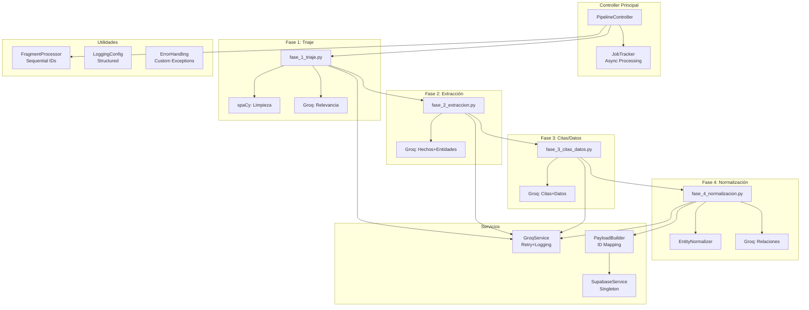

# Análisis Arquitectónico del Pipeline Actual (4 Fases)

**Fecha**: 2025-01-15
**Analista**: SuperClaude --persona-architect
**Versión Pipeline**: 1.0.0

## Resumen Ejecutivo

El pipeline actual de La Máquina de Noticias procesa artículos periodísticos a través de 4 fases secuenciales, transformando texto no estructurado en conocimiento estructurado mediante LLMs (Groq) y persistencia en Supabase.

### Estado Actual
- ✅ **Funcional**: Pipeline en producción procesando artículos
- ✅ **4 Fases Secuenciales**: Triaje → Extracción → Citas/Datos → Normalización  
- ✅ **Validación Robusta**: Pydantic en todas las fases
- ❌ **Sin Chunking**: Sistema mencionado pero no implementado
- ❌ **spaCy Subutilizado**: Solo limpieza básica, sin análisis avanzado

## Arquitectura Detallada

### Flujo de Datos Principal



### Componentes por Capa

#### 1. API Layer (FastAPI)
```
src/main.py
├── POST /procesar_articulo      # Entrada principal
├── POST /procesar_fragmento     # Procesamiento por fragmentos
├── GET /status/{job_id}         # Estado async
├── GET /health                  # Health check
├── GET /metrics                 # Prometheus metrics
└── GET /monitoring/*            # Dashboards
```

#### 2. Controller Layer
```
src/controller.py (PipelineController)
├── procesar_articulo()          # Orquesta pipeline completo
├── procesar_fragmento()         # Procesa un fragmento
├── _ejecutar_pipeline()         # Lógica core secuencial
└── _persistir_resultados()      # Guardado atómico
```

#### 3. Pipeline Phases
```
src/pipeline/
├── fase_1_triaje.py
│   ├── ejecutar_fase_1()        # Entry point
│   ├── _limpiar_texto()         # spaCy tokenization
│   ├── _detectar_idioma()       # Basic (returns model lang)
│   └── _evaluar_relevancia()    # Groq LLM scoring
│
├── fase_2_extraccion.py
│   ├── ejecutar_fase_2()        # Extract facts + entities
│   └── Uses: Prompt_2_elementos_basicos.md
│
├── fase_3_citas_datos.py
│   ├── ejecutar_fase_3()        # Extract quotes + data
│   └── Uses: Prompt_3_citas_datos.md
│
└── fase_4_normalizacion.py
    ├── ejecutar_fase_4()        # Normalize + relations
    ├── _normalizar_entidades()  # Supabase similarity
    └── _detectar_relaciones()   # Groq relations
```

#### 4. Services Layer
```
src/services/
├── groq_service.py
│   ├── GroqService              # Not singleton
│   ├── @retry_groq_api          # 3 retries, exponential backoff
│   └── completar()              # Main API call
│
├── supabase_service.py
│   ├── SupabaseService          # Singleton pattern
│   ├── insertar_articulo_completo()
│   └── buscar_entidad_similar()
│
├── entity_normalizer.py
│   └── normalizar_entidades()   # Deduplication logic
│
├── payload_builder.py
│   └── construir_payload()      # ID mapping + structure
│
└── job_tracker_service.py
    └── JobTrackerService        # Async job management
```

#### 5. Models Layer (Pydantic)
```
src/models/
├── entrada.py                   # Input models
│   ├── ArticuloInItem
│   └── FragmentoProcesableItem
│
├── procesamiento.py             # Processing models
│   ├── ResultadoFase1Triaje
│   ├── ResultadoFase2Extraccion
│   ├── ResultadoFase3CitasDatos
│   ├── ResultadoFase4Normalizacion
│   ├── HechoProcesado
│   ├── EntidadProcesada
│   ├── CitaTextual
│   └── DatosCuantitativos
│
├── metadatos.py                 # Metadata models
│   ├── MetadatosHecho
│   ├── MetadatosEntidad
│   ├── MetadatosCita
│   └── MetadatosDato
│
└── persistencia.py              # Persistence models
    ├── ArticuloPersistencia
    └── FragmentoPersistencia
```

#### 6. Utils Layer
```
src/utils/
├── fragment_processor.py        # Sequential ID management
├── logging_config.py            # Structured logging
├── error_handling.py            # Custom exceptions + retry
├── validation.py                # Input validation
├── json_parser.py              # Safe JSON parsing
└── config.py                   # Environment config
```

### Sistema de IDs

**Dual ID System**:
1. **Sequential IDs** (1, 2, 3...): Optimized for LLMs during processing
2. **UUIDs**: For database persistence

```python
# FragmentProcessor manages coherence
processor = FragmentProcessor(fragment_uuid)
hecho_id = processor.get_next_hecho_id()  # Returns 1, 2, 3...

# PayloadBuilder converts at persistence
uuid_mapping = {
    1: UUID("550e8400-..."),  # hecho_1
    2: UUID("7f8a9b0c-..."),  # hecho_2
}
```

### Configuración y Dependencias

#### Environment Variables
```bash
# Core (Required)
GROQ_API_KEY="gsk_..."
SUPABASE_URL="https://....supabase.co"
SUPABASE_ANON_KEY="eyJ..."

# Groq Config
MODEL_ID="llama-3.1-8b-instant"
API_TEMPERATURE="0.1"
API_MAX_TOKENS="6000"
API_TIMEOUT="60"

# Processing Limits
MIN_CONTENT_LENGTH="100"
MAX_CONTENT_LENGTH="50000"
ASYNC_PROCESSING_THRESHOLD="50"
```

#### Python Dependencies
- FastAPI 0.115.6
- Pydantic 2.11.5
- spaCy 3.7+
- Groq (client library)
- Supabase Python client
- httpx 0.28.1
- loguru 0.7.3

### Métricas y Monitoreo

**MetricsCollector** (Singleton):
```python
{
    "requests_per_minute": 12.5,
    "average_latency_seconds": 2.3,
    "error_rate_percent": 1.2,
    "pipeline_throughput_per_hour": 150,
    "phase_success_rates": {
        "fase1": 0.99,
        "fase2": 0.96,
        "fase3": 0.94,
        "fase4": 0.92
    }
}
```

**AlertManager**:
- ERROR_RATE: >10%
- HIGH_LATENCY: >30s
- GROQ_API_FAILURE
- SUPABASE_FAILURE

## Análisis de Funcionalidades

### ✅ Fortalezas Actuales

1. **Arquitectura Robusta**
   - Separación clara de responsabilidades
   - Patrón singleton para servicios compartidos
   - Manejo de errores comprehensivo

2. **Validación Estricta**
   - Pydantic en todas las capas
   - Tipos específicos para metadatos
   - Validación de entrada/salida

3. **Integración LLM Madura**
   - Retry automático con backoff
   - Logging detallado
   - Manejo de tokens y límites

4. **Sistema de IDs Optimizado**
   - Sequential para LLMs (eficiencia)
   - UUID para persistencia
   - FragmentProcessor mantiene coherencia

5. **Monitoreo Completo**
   - Métricas Prometheus
   - Alertas automáticas
   - Health checks detallados

### ❌ Gaps Identificados

1. **spaCy Subutilizado**
   - Solo limpieza básica de texto
   - No hay análisis lingüístico avanzado
   - "Detección" de idioma trivial
   - No se extraen métricas para decisiones

2. **Sin Sistema de Chunking**
   - Mencionado en README pero no existe
   - No hay `utils/chunking.py`
   - Limitación para textos largos (>6000 chars)

3. **Extracción Monolítica**
   - Fase 2: Hechos + Entidades juntos
   - Fase 3: Citas + Datos juntos
   - No optimizado para diferentes tipos de contenido

4. **Sin Simplificación de Texto**
   - Texto complejo directo al LLM
   - Potencial pérdida de comprensión
   - Mayor consumo de tokens

5. **Flujo Rígido**
   - No hay decisiones adaptativas
   - Todas las fases se ejecutan siempre
   - No se adapta al tipo de contenido

6. **Prompts No Optimizados**
   - Prompts generales para todo tipo de texto
   - No hay especialización por tipo de contenido
   - Sin optimización para chunking

## Puntos de Extensión Identificados

### 1. Fase 1 - Triaje Mejorado
- **Hook Point**: Después de `_limpiar_texto()`
- **Extensión**: Análisis spaCy avanzado
- **Método**: Nuevo módulo `linguistic_analyzer.py`

### 2. Nueva Fase 2 - Simplificación
- **Hook Point**: Entre Fase 1 y actual Fase 2
- **Extensión**: Nueva fase completa
- **Método**: `fase_2_simplificacion.py`

### 3. Sistema de Chunking
- **Hook Point**: En cada fase de extracción
- **Extensión**: `utils/chunking_system.py`
- **Método**: Decorador o mixin para fases

### 4. Separación de Extracciones
- **Hook Point**: Refactor Fase 2 y 3
- **Extensión**: 4 fases separadas
- **Método**: Split existing phases

### 5. Decisiones Adaptativas
- **Hook Point**: En `PipelineController._ejecutar_pipeline()`
- **Extensión**: `FlowController` class
- **Método**: Inyección de lógica condicional

## Dependencias Críticas

### Internas
```
PipelineController
    ├── FragmentProcessor (IDs)
    ├── GroqService (LLM calls)
    ├── SupabaseService (persistence)
    └── JobTracker (async)

Each Phase
    ├── Models (Pydantic validation)
    ├── Prompts (structured templates)
    └── Error Handlers (retry logic)
```

### Externas
- **Groq API**: Core para todo procesamiento
- **Supabase**: Persistencia y normalización
- **spaCy Models**: es_core_news_lg required

## Análisis de Riesgos

1. **Breaking Changes**
   - Cambio de modelos Pydantic
   - Modificación de APIs públicas
   - Alteración de flujo secuencial

2. **Performance**
   - Más fases = mayor latencia
   - Chunking = más llamadas LLM
   - Análisis spaCy = CPU intensivo

3. **Compatibilidad**
   - Tests existentes deben pasar
   - Contratos API preservados
   - Formato BD compatible

## Conclusiones

El pipeline actual es funcionalmente completo pero tiene oportunidades significativas de mejora:

1. **spaCy** está dramáticamente subutilizado
2. **Chunking** es crítico pero no está implementado
3. **Separación de fases** mejoraría precisión
4. **Simplificación** optimizaría comprensión LLM
5. **Flujo adaptativo** aumentaría eficiencia

La arquitectura actual es lo suficientemente modular para soportar estas mejoras sin breaking changes mayores.

---

*Análisis completado. Siguiente: Análisis del plan de ampliación propuesto.*