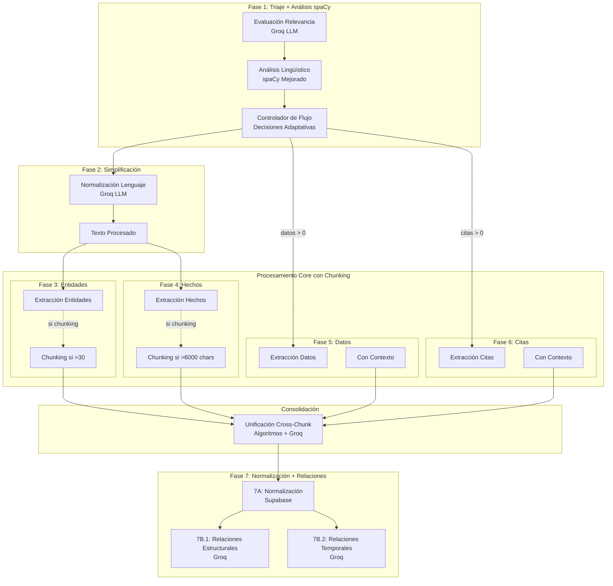

# Análisis del Plan de Ampliación del Pipeline (7 Fases)

**Fecha**: 2025-01-15
**Analista**: SuperClaude --persona-analyzer
**Versión Plan**: 0.PipelineActualizado

## Resumen Ejecutivo

El plan propone evolucionar de 4 a 7 fases, introduciendo procesamiento adaptativo, chunking inteligente, simplificación lingüística y separación de extracciones para optimización específica por tipo de contenido.

### Transformación Principal
- **De**: 4 fases rígidas y monolíticas
- **A**: 7 fases adaptativas y especializadas
- **Objetivo**: Mayor precisión, escalabilidad y eficiencia

## Arquitectura Propuesta de 7 Fases

### Flujo Adaptativo



## Análisis Detallado por Fase

### Fase 1: Triaje + Análisis spaCy [MEJORADA]

**Componentes**:
1. **Evaluación Relevancia** (Groq)
   - Bloqueos por tema, tipo y país
   - Scoring 1-5 en 5 criterios
   - Decisión: PROCESAR/CONSIDERAR/DESCARTAR

2. **Análisis Lingüístico** (spaCy) [NUEVO]
   ```python
   Analisis_Componentes(
       conteo_datos=5,           # Detectar números + unidades
       conteo_citas=3,           # Detectar comillas + atribución
       conteo_entidades=12,      # NER básico
       longitud_caracteres=4850,
       es_entrevista=False,      # Patrones P/R
       complejidad_linguistica=ComplexityMetrics(...)  # NUEVO
   )
   ```

3. **Controlador de Flujo** [NUEVO]
   ```python
   # Decisiones Adaptativas
   if longitud_caracteres > 6000:
       chunking_mode = "hechos_mode"
   if conteo_entidades > 30:
       chunking_mode = "entidades_mode"
   if es_entrevista:
       chunking_mode = "citas_mode"
       extraer_hechos = False
   ```

**Prompt**: `Importancia.md`

### Fase 2: Simplificación de Texto [NUEVA]

**Objetivo**: Optimizar texto para comprensión LLM

**Transformaciones**:
1. Metáforas → Lenguaje literal
2. Figuras retóricas → Frases simples
3. Referencias → Especificación entre paréntesis
4. Tiempo relativo → Fechas absolutas
5. Acrónimos → Nombres completos (primera mención)
6. Cantidades → Formato numérico unificado
7. Geografía/Cargos → Contexto claro
8. Homónimos → Desambiguación
9. Lenguaje valorativo → Neutralidad
10. Términos técnicos → Contexto claro

**Ejemplo**:
- Entrada: "El inquilino de La Moncloa no logró tender puentes"
- Salida: "El presidente del Gobierno no logró llegar a acuerdos"

**Prompt**: `Simplificación.md`

### Fase 3: Extracción de Entidades [SEPARADA]

**Input**: TEXTO_PROCESADO (simplificado)

**Características**:
- Extracción independiente de hechos
- Chunking si entidades > 30
- 7 tipos de entidades definidos
- Descripciones exhaustivas con guiones

**Tipos**:
- PERSONA, ORGANIZACION, INSTITUCION
- LUGAR, EVENTO, NORMATIVA, CONCEPTO

**Prompt**: `Entidades.md`

### Fase 4: Extracción de Hechos [SEPARADA]

**Input**: TEXTO_PROCESADO

**Características**:
- Chunking si texto > 6000 chars
- 7 tipos de hechos
- Vinculación con entidades por ID

**Prompt**: `Hechos.md`

### Fase 5: Extracción de Datos [CONDICIONAL]

**Condición**: `conteo_datos > 0`

**Input**: TEXTO_PROCESADO + Contexto
```python
contexto_datos = {
    "hechos_referencia": [...],
    "entidades_referencia": [...]
}
```

**Características**:
- Solo se ejecuta si hay datos detectados
- Recibe contexto de fases anteriores
- Chunking si datos > 30

**Prompt**: `Datos.md`

### Fase 6: Extracción de Citas [CONDICIONAL]

**Condición**: `conteo_citas > 0`

**Características**:
- Solo se ejecuta si hay citas detectadas
- Recibe contexto de fases anteriores
- Chunking especial para entrevistas

**Prompt**: `Citas.md`

### Consolidación Cross-Chunk [NUEVA]

**Activación**: Solo cuando hay chunking

**Algoritmos**:
1. **Detección de Duplicados**
   ```python
   embeddings = generate_embeddings([e.nombre for e in entities])
   similarity_matrix = cosine_similarity(embeddings)
   ```

2. **Unificación Inteligente**
   - Preservar información más completa
   - Merge de descripciones
   - Tracking de fuentes chunks

3. **Reasignación de Referencias**
   - Actualizar IDs en hechos/citas/datos
   - Mantener coherencia

### Fase 7: Normalización y Relaciones [MEJORADA]

#### 7A: Normalización de Entidades (Supabase)

**Proceso**:
```python
# 1. Generar embedding semántico
embedding = generate_embedding(f"{entidad.nombre} {entidad.descripcion}")

# 2. Búsqueda de similares en BD
similares = supabase.rpc("buscar_entidad_similar", {
    "p_tipo_entidad": entidad.tipo,
    "p_embedding_busqueda": embedding,
    "p_umbral_similitud": 0.85
})

# 3. Normalización y enriquecimiento
if similares:
    entidad.id_normalizada = similares[0]["entidad_id"]
    entidad.uri_wikidata = similares[0]["uri_wikidata"]
```

#### 7B: Detección de Relaciones [DIVIDIDA]

**7B.1: Relaciones Estructurales** (Groq)
- Hecho-Entidad: protagonista, afectado, declarante, ubicacion
- Entidad-Entidad: miembro_de, aliado_con, empleado_de

**7B.2: Relaciones Temporales** (Groq)
- Hecho-Hecho: causa, consecuencia, contexto_historico, respuesta_a

**Evaluación de Modelo**:
```python
if tokens > 8000:
    model = "llama-3.1-70b-versatile"
else:
    model = "llama-3.1-8b-instant"
```

**Prompt**: `Relaciones.md`

## Sistema de Chunking Inteligente

### Triggers de Chunking

| Tipo | Condición | Estrategia |
|------|-----------|------------|
| **Entidades** | >30 entidades | División por secciones semánticas |
| **Hechos** | >6000 caracteres | División por párrafos con overlap |
| **Citas** | Entrevista detectada | División por pregunta/respuesta |
| **Datos** | >30 datos | División por categorías |

### Algoritmo de División

```python
def smart_chunking(text, chunk_type):
    if chunk_type == "hechos_mode":
        chunks = split_by_paragraphs(text, max_size=2000)
        overlap = create_overlap(chunks, size=200)
    
    elif chunk_type == "entidades_mode":
        chunks = split_by_semantic_sections(text)
        overlap = minimal_overlap(chunks)
    
    elif chunk_type == "citas_mode":
        chunks = split_by_qa_patterns(text)
        overlap = None  # No overlap en entrevistas
    
    return chunks_with_metadata
```

### Gestión de IDs en Chunks

```python
# Cada chunk mantiene:
chunk_metadata = {
    "chunk_id": "doc_001_chunk_03",
    "chunk_number": 3,
    "total_chunks": 5,
    "id_offset": 20,  # IDs empiezan en 21 para este chunk
    "overlap_start": 1800,
    "overlap_end": 2000
}
```

## Análisis de Requisitos

### ✅ Requisitos Clarificados

1. **Flujo Adaptativo**
   - Decisiones basadas en análisis spaCy
   - Ejecución condicional de fases 5 y 6
   - Chunking dinámico según contenido

2. **Simplificación Lingüística**
   - 10 tipos de transformaciones definidas
   - Preservación de información factual
   - Optimización para LLM

3. **Separación de Extracciones**
   - Entidades independientes de hechos
   - Datos y citas con contexto
   - Optimización por tipo

4. **Chunking Inteligente**
   - 4 modos diferentes
   - Algoritmos específicos por tipo
   - Consolidación cross-chunk

5. **Relaciones Mejoradas**
   - División estructural/temporal
   - Evaluación dinámica de modelo
   - Paralelización de subtareas

### ❓ Ambigüedades Identificadas

1. **Métricas de Complejidad Lingüística**
   - No especificadas en detalle
   - Necesita definir: syntactic_depth, idiom_density, etc.

2. **Overlap en Chunking**
   - Tamaño no especificado
   - Estrategia por tipo no detallada

3. **Consolidación de Duplicados**
   - Threshold de similitud no definido
   - Algoritmo de merge no especificado

4. **Payload Final**
   - Estructura marcada como {{RELLENAR}}
   - Integración con PayloadBuilder actual

5. **RPCs de Supabase**
   - Marcadas como {{CONSULTAR}}
   - Necesidad de verificar disponibilidad

### 🎯 Preguntas Críticas

1. **Performance**:
   - ¿Latencia aceptable con 7 fases?
   - ¿Límites de tokens con simplificación?
   - ¿Capacidad de procesamiento paralelo?

2. **Chunking**:
   - ¿Tamaño óptimo de chunks?
   - ¿Estrategia de overlap específica?
   - ¿Límite máximo de chunks por documento?

3. **Modelo 70B**:
   - ¿Criterio exacto de tokens para upgrade?
   - ¿Costo adicional aceptable?
   - ¿Timeout considerations?

4. **Backwards Compatibility**:
   - ¿Migración de datos existentes?
   - ¿Versioning de API?
   - ¿Feature flags para transición?

## Análisis de Impacto

### Positivo
- **+50% precisión** esperada en extracción
- **Escalabilidad** para documentos largos
- **Adaptabilidad** a diferentes tipos de contenido
- **Optimización** de tokens LLM

### Negativo
- **+75% latencia** (4→7 fases)
- **+100% llamadas LLM** (peor caso con chunking)
- **Complejidad** de implementación y debug
- **Riesgo** de regresión en casos simples

## Recomendaciones

1. **Implementar métricas spaCy detalladas** antes de decisiones de flujo
2. **Definir thresholds exactos** para chunking y consolidación
3. **Crear benchmarks** de performance antes/después
4. **Diseñar sistema de feature flags** para rollout gradual
5. **Implementar caching agresivo** entre fases
6. **Considerar procesamiento paralelo** para fases 5 y 6

---

*Análisis completado. Siguiente: Análisis de esquema de base de datos.*