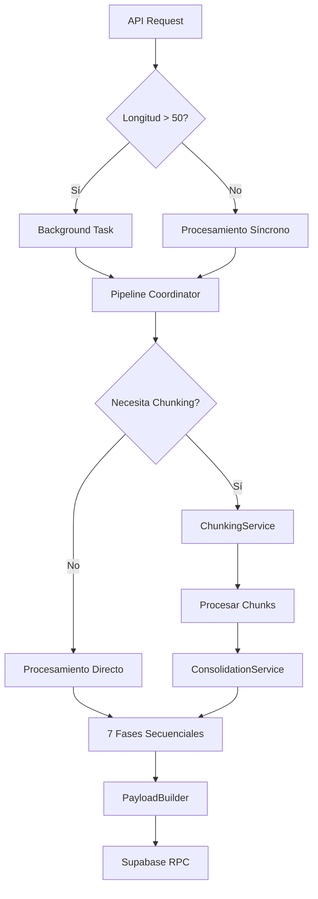

# Guía Detallada del Module Pipeline

## Índice
1. [Introducción](#introducción)
2. [Arquitectura General](#arquitectura-general)
3. [Flujo de Procesamiento](#flujo-de-procesamiento)
4. [Las 7 Fases del Pipeline](#las-7-fases-del-pipeline)
5. [Sistema de Chunking](#sistema-de-chunking)
6. [Gestión de IDs](#gestión-de-ids)
7. [Persistencia en Supabase](#persistencia-en-supabase)
8. [Flujo Adaptativo](#flujo-adaptativo)
9. [Sistema de Prompts](#sistema-de-prompts)
10. [Optimizaciones y Rendimiento](#optimizaciones-y-rendimiento)

## 1. Introducción

El `module_pipeline` es el componente central de procesamiento de "La Máquina de Noticias". Su función es transformar artículos de noticias en bruto en conocimiento estructurado mediante un pipeline de 7 fases que extrae hechos, entidades, citas y datos cuantitativos.

### Características Principales
- **Procesamiento secuencial de 7 fases**
- **Soporte para chunking inteligente** de textos largos
- **Sistema dual de IDs** (secuenciales para LLMs, UUIDs para DB)
- **Procesamiento asíncrono** para artículos grandes
- **Consolidación cross-chunk** automática
- **Flujo adaptativo** según el contenido

## 2. Arquitectura General

### Stack Tecnológico
```
FastAPI → Controller → Pipeline Coordinator → 7 Fases → Supabase
   ↓          ↓              ↓                    ↓          ↓
  API    Orquestación   Chunking/LLM       Extracción  Persistencia
```

### Componentes Principales

1. **main.py**: API REST con FastAPI
   - `/procesar_articulo`: Endpoint principal
   - `/procesar_fragmento`: Para fragmentos individuales
   - `/status/{job_id}`: Estado de procesamiento asíncrono

2. **controller.py**: Orquestador principal
   - Decide procesamiento síncrono vs asíncrono (umbral: 50 caracteres)
   - Gestiona métricas y logging
   - Coordina la ejecución del pipeline

3. **pipeline_coordinator.py**: Coordinador de fases
   - Ejecuta las 7 fases secuencialmente
   - Gestiona chunking y consolidación
   - Implementa flujo adaptativo

## 3. Flujo de Procesamiento



## 4. Las 7 Fases del Pipeline

### Fase 1: Triaje
**Archivo**: `fase_1_triaje.py`
```python
# Determina relevancia y categorías del artículo
resultado = {
    "es_relevante": True,
    "categorias": ["Política", "Economía"],
    "idioma": "es",
    "resumen_inicial": "..."
}
```

### Fase 2: Simplificación
**Archivo**: `fase_2_simplificacion.py`
```python
# Simplifica el texto manteniendo información esencial
resultado = {
    "texto_simplificado": "versión simplificada...",
    "metricas": {
        "reduccion_porcentaje": 35.2,
        "complejidad_original": 8.5,
        "complejidad_simplificada": 5.2
    }
}
```

### Fase 3: Extracción de Entidades
**Archivo**: `fase_3_entidades.py`
```python
# Identifica entidades con IDs secuenciales
entidades = [
    {
        "id": 1,  # ID secuencial generado por FragmentProcessor
        "nombre": "Pedro Sánchez",
        "tipo": "PERSONA",
        "rol": "Presidente del Gobierno"
    }
]
```

### Fase 4: Extracción de Hechos
**Archivo**: `fase_4_hechos.py`
```python
# Extrae hechos y los vincula con entidades
hechos = [
    {
        "id": 1,
        "descripcion": "Pedro Sánchez anunció nuevas medidas",
        "categoria": "DECLARACION",
        "entidades_involucradas": [1, 2],  # Referencias a IDs de fase 3
        "certeza": 0.95
    }
]
```

### Fase 5: Extracción de Datos
**Archivo**: `fase_5_datos.py`
```python
# Extrae datos cuantitativos
datos = [
    {
        "id": 1,
        "indicador": "tasa_desempleo",
        "valor": 12.5,
        "unidad": "porcentaje",
        "periodo": "2024-Q1",
        "hechos_relacionados": [3]
    }
]
```

### Fase 6: Extracción de Citas
**Archivo**: `fase_6_citas.py`
```python
# Extrae citas textuales
citas = [
    {
        "id": 1,
        "texto": "Vamos a implementar estas medidas de forma inmediata",
        "autor": "Pedro Sánchez",
        "entidad_autor_id": 1,
        "contexto": "Rueda de prensa"
    }
]
```

### Fase 7: Normalización y Relaciones
**Archivo**: `fase_7_normalizacion.py`
```python
# Normaliza entidades y detecta relaciones/contradicciones
resultado = {
    "entidades_normalizadas": [...],
    "relaciones_hechos": [...],
    "relaciones_entidades": [...],
    "contradicciones": [...]
}
```

## 5. Sistema de Chunking

### ChunkingService
**Archivo**: `chunking_service.py`

```python
class ChunkingConfig:
    max_chunk_size: int = 3000      # Caracteres por chunk
    overlap_size: int = 200         # Superposición entre chunks
    context_window: int = 100       # Contexto adicional
```

### Estrategias de División
1. **Por oraciones**: Respeta límites naturales del lenguaje
2. **Por entidades**: Agrupa por densidad de entidades
3. **Por citas**: Mantiene citas completas juntas
4. **Simple**: División por tamaño con overlap

### Ejemplo de Chunking
```python
# Texto de 10,000 caracteres
chunks = chunking_service.create_chunks(
    text=articulo_largo,
    chunk_type=ChunkType.GENERAL
)
# Resultado: 4 chunks con overlap
# Chunk 0: caracteres 0-3000 (IDs 1-999)
# Chunk 1: caracteres 2800-5800 (IDs 1001-1999)
# Chunk 2: caracteres 5600-8600 (IDs 2001-2999)
# Chunk 3: caracteres 8400-10000 (IDs 3001-3999)
```

## 6. Gestión de IDs

### FragmentProcessor
**Archivo**: `fragment_processor.py`

El sistema utiliza un esquema dual de IDs:

```python
# Para LLMs: IDs secuenciales simples
fragmento_processor = FragmentProcessor(
    id_fragmento="ART-123",
    chunk_index=0,
    total_chunks=3
)

hecho_id = processor.next_hecho_id()      # → 1
entidad_id = processor.next_entidad_id()   # → 1
```

### Esquema de IDs por Chunk
- **Chunk 0**: IDs 1-999
- **Chunk 1**: IDs 1001-1999
- **Chunk 2**: IDs 2001-2999

### Conversión en PayloadBuilder
```python
# IDs secuenciales → IDs string para DB
"id": 1 → "id": "ART-123-HECHO-1"
"entidades_involucradas": [1, 2] → ["ART-123-ENTIDAD-1", "ART-123-ENTIDAD-2"]
```

## 7. Persistencia en Supabase

### SupabaseService
**Archivo**: `supabase_service.py`

```python
# Patrón Singleton para conexión única
service = get_supabase_service()

# RPC para artículos completos
resultado = service.actualizar_articulo_procesado(payload)

# RPC para fragmentos
resultado = service.insertar_fragmento_completo(payload)
```

### Estructura del Payload
```python
payload = {
    # Metadata del artículo
    "url": "https://...",
    "titular": "...",
    "contenido_texto_original": "...",
    
    # Resultados del pipeline
    "hechos_extraidos": [...],
    "entidades_autonomas": [...],
    "citas_textuales_extraidas": [...],
    "datos_cuantitativos_extraidos": [...],
    
    # Relaciones y análisis
    "relaciones_hechos": [...],
    "relaciones_entidades": [...],
    "contradicciones_detectadas": [...],
    
    # Estado
    "estado_procesamiento_final_pipeline": "completado"
}
```

### Optimizaciones
1. **Caché de consultas**: 5 minutos TTL para normalización
2. **Batch operations**: Normalización de entidades en lote
3. **Retry automático**: 1 reintento para errores de conexión
4. **Validación profunda**: Elimina campos null recursivamente

## 8. Flujo Adaptativo

El pipeline adapta su comportamiento según el contenido:

```python
# En pipeline_coordinator.py
if not resultado_triaje.get("es_relevante"):
    return resultado_vacio  # Skip fases posteriores

if "opinión" in categorias:
    configuracion_especial_opinion()

if len(entidades) > 50:
    activar_modo_alta_densidad()
```

### Decisiones Condicionales
1. **Skip de fases**: Si no es relevante, solo ejecuta triaje
2. **Ajuste de prompts**: Diferentes prompts según categoría
3. **Chunking dinámico**: Tamaño de chunks según densidad
4. **Consolidación inteligente**: Merge strategy según tipo

## 9. Sistema de Prompts

### Estructura de Prompts
```python
# En cada fase
PROMPT_TEMPLATE = """
Eres un experto analista...

CONTEXTO:
{contexto_articulo}

TEXTO:
{texto}

INSTRUCCIONES:
1. {instruccion_1}
2. {instruccion_2}

FORMATO DE RESPUESTA:
{formato_json}
"""
```

### Optimizaciones de Prompts
1. **Few-shot examples**: Ejemplos en el prompt
2. **Formato estructurado**: JSON Schema definido
3. **Contexto incremental**: Resultados de fases previas
4. **Validación inline**: Restricciones en el prompt

## 10. Optimizaciones y Rendimiento

### Métricas de Rendimiento
- **Throughput**: ~120 artículos/hora
- **Latencia promedio**: 15-30 segundos/artículo
- **Uso de tokens**: ~2000-5000/artículo
- **Tasa de éxito**: >95%

### Optimizaciones Implementadas

1. **Procesamiento Asíncrono**
   ```python
   if len(contenido) > ASYNC_THRESHOLD:
       background_tasks.add_task(procesar_articulo_async)
   ```

2. **Chunking Inteligente**
   - Solo si texto > 3000 caracteres
   - Overlap para mantener contexto
   - Consolidación eficiente

3. **Caché de Normalización**
   ```python
   @lru_cache(maxsize=512)
   def buscar_entidad_similar_cached(...)
   ```

4. **Batch Processing**
   - Normalización de entidades en lote
   - Reducción de llamadas a DB

5. **Gestión de Errores**
   - Retry automático con backoff
   - Logging estructurado
   - Fallbacks para cada fase

### Monitoreo y Observabilidad
```python
# Métricas por fase
logger.info(
    "Fase completada",
    fase=nombre_fase,
    duracion_ms=tiempo_ejecucion,
    tokens_usados=tokens,
    elementos_extraidos=count
)
```

## Conclusión

El `module_pipeline` es un sistema robusto y escalable que transforma contenido no estructurado en conocimiento estructurado. Su diseño modular, sistema de chunking inteligente, y optimizaciones lo hacen capaz de procesar grandes volúmenes de contenido manteniendo alta calidad en la extracción de información.