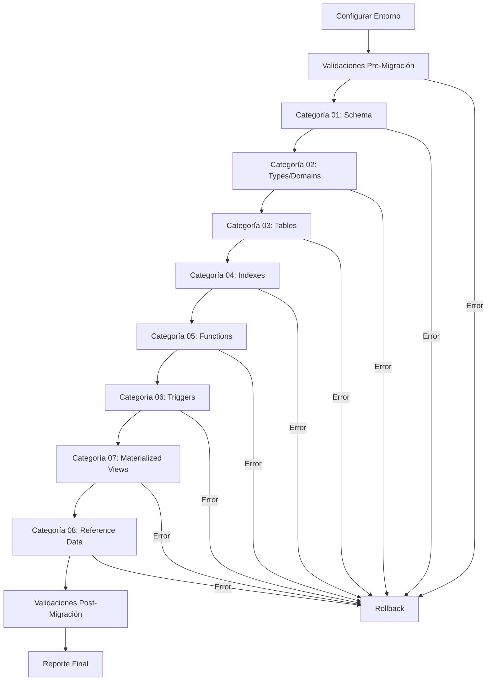

# Guía Completa de Migración - Máquina de Noticias

## 📖 Tabla de Contenidos

1. [Introducción](#introducción)
2. [Arquitectura del Sistema](#arquitectura-del-sistema)
3. [Instalación y Configuración](#instalación-y-configuración)
4. [Guía de Uso Paso a Paso](#guía-de-uso-paso-a-paso)
5. [Creación de Nuevos Scripts](#creación-de-nuevos-scripts)
6. [Entornos y Configuraciones](#entornos-y-configuraciones)
7. [Troubleshooting](#troubleshooting)
8. [Mejores Prácticas](#mejores-prácticas)
9. [Referencias y APIs](#referencias-y-apis)

## 📋 Introducción

El sistema de migración de la Máquina de Noticias es una solución completa e idempotente para gestionar la evolución de la base de datos PostgreSQL. Proporciona herramientas robustas para migración, rollback, validación y monitoreo.

### Características Principales

- ✅ **Migración Idempotente**: Scripts ejecutables múltiples veces sin efectos secundarios
- ✅ **Rollback Completo**: Capacidad de revertir cambios de manera segura
- ✅ **Validaciones Automáticas**: Verificaciones pre y post migración
- ✅ **Múltiples Entornos**: Soporte para desarrollo, staging, producción y Supabase
- ✅ **Testing Integrado**: Sistema completo de testing y validación
- ✅ **Orquestación Avanzada**: Control granular de ejecución
- ✅ **Monitoreo en Tiempo Real**: Logging detallado y métricas

## 🏗️ Arquitectura del Sistema

### Estructura de Directorios

```
migrations/
├── 00_000_migration_control.sql    # Control de migración
├── deploy.sh                       # Script principal de orquestación
├── rollback.sh                     # Script de rollback
├── test_migration.sh               # Sistema de testing
├── migration_utils.sh              # Utilidades de soporte
├── verify_structure.sh             # Verificación de estructura
├── README.md                       # Documentación principal
├── README_orchestration.md         # Guía de orquestación
│
├── config/                         # Configuraciones
│   ├── migration_config.sql        # Configuración SQL global
│   ├── environments.conf           # Configuraciones por entorno
│   ├── idempotent_template.sql     # Plantilla de idempotencia
│   └── idempotency_best_practices.md
│
├── 01_schema/                      # Extensiones y esquemas
│   └── 01_001_create_extensions_schemas.sql
│
├── 02_types_domains/               # Tipos y dominios personalizados
│   └── 02_001_create_types_domains.sql
│
├── 03_tables/                      # Tablas principales
├── 04_indexes/                     # Índices optimizados
├── 05_functions/                   # Funciones PL/pgSQL
├── 06_triggers/                    # Triggers automáticos
├── 07_materialized_views/          # Vistas materializadas
├── 08_reference_data/              # Datos de referencia
│
├── rollbacks/                      # Scripts de rollback
│   ├── README.md                   # Guía de rollbacks
│   ├── rollback_template.sql       # Plantilla de rollback
│   ├── rollback_01_001_create_extensions_schemas.sql
│   └── rollback_02_001_create_types_domains.sql
│
├── validations/                    # Scripts de validación
│   ├── README.md                   # Guía de validaciones
│   ├── validate_pre_migration.sql  # Validaciones preliminares
│   ├── validate_post_migration.sql # Validaciones posteriores
│   ├── automated_validation_system.sql
│   └── validate_rollback_procedures.sql
│
└── logs/                          # Logs automáticos (generados)
    ├── deployment_YYYYMMDD_HHMMSS.log
    ├── test_migration_YYYYMMDD_HHMMSS.log
    └── rollback_YYYYMMDD.log
```

### Flujo de Ejecución



## ⚙️ Instalación y Configuración

### Prerrequisitos

#### Software Requerido
- **PostgreSQL 14+** con extensiones:
  - `vector` (para embeddings vectoriales)
  - `pg_trgm` (para similitud de texto)
  - `pg_cron` (opcional, para trabajos programados)
- **Bash 4.0+** (para scripts de orquestación)
- **Cliente PostgreSQL** (`psql`, `pg_dump`, `createdb`, `dropdb`)

#### Variables de Entorno Mínimas
```bash
export PGHOST=localhost          # Host PostgreSQL
export PGPORT=5432              # Puerto PostgreSQL
export PGDATABASE=maquina_noticias # Nombre de BD
export PGUSER=postgres           # Usuario PostgreSQL
export PGPASSWORD=tu_password    # Password PostgreSQL
```

### Instalación Paso a Paso

#### 1. Clonar/Extraer Sistema de Migración
```bash
# Si es un repositorio git
git clone <repository_url>
cd maquina-noticias-migration

# O extraer desde zip
unzip migration-system.zip
cd migration-system
```

#### 2. Configurar Permisos
```bash
# Hacer ejecutables los scripts principales
chmod +x *.sh

# Verificar estructura
./migration_utils.sh validate
```

#### 3. Configurar Entorno
```bash
# Cargar configuraciones
source config/environments.conf

# Configurar entorno específico
set_environment development    # o staging, production, etc.

# Verificar configuración
show_current_config
```

#### 4. Verificar Conexión
```bash
# Test de conexión
./migration_utils.sh check-deps

# Ver estado actual
./migration_utils.sh status
```

## 📋 Guía de Uso Paso a Paso

### Escenario 1: Primera Migración (Base de Datos Limpia)

```bash
# 1. Configurar entorno de desarrollo
source config/environments.conf
set_environment development initial

# 2. Verificar que todo está listo
./migration_utils.sh validate --deep
./migration_utils.sh check-deps

# 3. Ejecutar dry-run completo
./deploy.sh --dry-run --verbose

# 4. Ejecutar testing exhaustivo
./test_migration.sh --mode full --create-test-db --cleanup

# 5. Ejecutar migración real
./deploy.sh --backup --verbose

# 6. Verificar resultado
./migration_utils.sh status
./migration_utils.sh generate-report
```

### Escenario 2: Migración Incremental

```bash
# 1. Configurar para migración incremental
source config/environments.conf
set_environment staging incremental

# 2. Ejecutar solo la categoría necesaria
./deploy.sh --category 05_functions --backup --verbose

# 3. Validar resultado
./deploy.sh --dry-run  # Verificar que no hay cambios pendientes
```

### Escenario 3: Despliegue en Producción

```bash
# 1. Configurar producción (DRY_RUN=true por defecto)
source config/environments.conf
set_environment production

# 2. OBLIGATORIO: Dry-run en producción
./deploy.sh --verbose  # Esto ejecuta en modo dry-run

# 3. Testing exhaustivo
./test_migration.sh --mode stress
./test_migration.sh --mode idempotency --iterations 3

# 4. Solo después de dry-run exitoso, habilitar ejecución real
enable_real_execution  # Requiere confirmación explícita

# 5. Ejecución real con máxima seguridad
./deploy.sh --backup --stop-on-error --verbose

# 6. Monitoreo post-despliegue
./migration_utils.sh status
./migration_utils.sh generate-report --format text
```

### Escenario 4: Rollback de Emergencia

```bash
# 1. Ver rollbacks disponibles
./rollback.sh --list

# 2. Dry-run del rollback
./rollback.sh --dry-run

# 3. Rollback hasta punto específico
./rollback.sh --to 03_001_create_tables.sql --confirm

# 4. Rollback completo (solo si es necesario)
./rollback.sh --confirm  # Requiere confirmación manual
```

## 🛠️ Creación de Nuevos Scripts

### Convenciones de Nomenclatura

```
[CATEGORIA]_[NUMERO]_[DESCRIPCION].sql

Ejemplos:
- 03_004_create_user_tables.sql
- 05_003_add_search_functions.sql
- 06_002_update_cache_triggers.sql
```

### Plantilla para Nuevo Script

```sql
-- =====================================================
-- [TÍTULO DESCRIPTIVO DEL SCRIPT]
-- =====================================================
/*
Script: [CATEGORIA]_[NUMERO]_[DESCRIPCION].sql
Categoría: [categoria]
Descripción: [Descripción detallada del propósito]
Dependencias: [Scripts previos requeridos]
Rollback: Disponible en rollbacks/rollback_[SCRIPT_NAME].sql
Idempotente: SÍ
Autor: [Tu nombre]
Fecha: $(date +%Y-%m-%d)
*/

BEGIN;

DO $$
DECLARE
    script_name CONSTANT VARCHAR(255) := '[SCRIPT_NAME].sql';
    script_category CONSTANT VARCHAR(50) := '[CATEGORIA]';
    start_time TIMESTAMP := clock_timestamp();
    execution_time INTEGER;
BEGIN
    -- Verificar si ya fue ejecutado
    IF is_script_executed(script_name) THEN
        RAISE NOTICE 'Script % ya fue ejecutado anteriormente. Saltando...', script_name;
        RETURN;
    END IF;
    
    RAISE NOTICE 'Iniciando ejecución de script: %', script_name;
    
    -- =====================================================
    -- LÓGICA ESPECÍFICA DEL SCRIPT AQUÍ
    -- =====================================================
    
    -- [INSERTAR CÓDIGO AQUÍ]
    
    -- =====================================================
    -- VALIDACIONES POST-EJECUCIÓN
    -- =====================================================
    
    -- [INSERTAR VALIDACIONES AQUÍ]
    
    -- =====================================================
    -- REGISTRO DE EJECUCIÓN EXITOSA
    -- =====================================================
    
    execution_time := EXTRACT(epoch FROM (clock_timestamp() - start_time)) * 1000;
    
    PERFORM register_migration_execution(
        script_name,
        script_category,
        execution_time,
        'SUCCESS',
        'Script ejecutado exitosamente',
        NULL
    );
    
    RAISE NOTICE '✅ Script % completado en % ms', script_name, execution_time;
    
EXCEPTION WHEN OTHERS THEN
    execution_time := EXTRACT(epoch FROM (clock_timestamp() - start_time)) * 1000;
    
    PERFORM register_migration_execution(
        script_name,
        script_category,
        execution_time,
        'FAILED',
        SQLERRM,
        NULL
    );
    
    RAISE EXCEPTION 'Error en script %: %', script_name, SQLERRM;
END
$$;

COMMIT;

\echo '✅ [DESCRIPCIÓN] completado exitosamente'
```

### Proceso para Agregar Nuevo Script

#### 1. Crear el Script Principal
```bash
# Crear en la categoría apropiada
cp config/idempotent_template.sql 03_tables/03_005_add_new_table.sql

# Editar y personalizar
nano 03_tables/03_005_add_new_table.sql
```

#### 2. Crear Script de Rollback
```bash
# Usar plantilla de rollback
cp rollbacks/rollback_template.sql rollbacks/rollback_03_005_add_new_table.sql

# Personalizar con lógica de rollback específica
nano rollbacks/rollback_03_005_add_new_table.sql
```

#### 3. Testing del Nuevo Script
```bash
# Test en entorno de desarrollo
set_environment development

# Test del script específico
./deploy.sh --category 03_tables --dry-run
./deploy.sh --category 03_tables

# Test del rollback
./rollback.sh --single 03_005_add_new_table.sql --dry-run
```

#### 4. Documentar el Cambio
```bash
# Agregar al changelog
echo "$(date +%Y-%m-%d) - Agregada tabla nueva para [funcionalidad]" >> CHANGELOG.md

# Actualizar documentación si es necesario
```

### Tipos de Scripts Comunes

#### Crear Nueva Tabla
```sql
-- Ejemplo de creación de tabla idempotente
CREATE TABLE IF NOT EXISTS nueva_tabla (
    id SERIAL PRIMARY KEY,
    nombre VARCHAR(255) NOT NULL,
    created_at TIMESTAMP DEFAULT NOW()
);

-- Agregar índices
CREATE INDEX IF NOT EXISTS idx_nueva_tabla_nombre 
ON nueva_tabla(nombre);

-- Agregar constraints
ALTER TABLE nueva_tabla 
ADD CONSTRAINT IF NOT EXISTS check_nombre_not_empty 
CHECK (LENGTH(nombre) > 0);
```

#### Agregar Nueva Columna
```sql
-- Verificar si la columna ya existe
DO $$
BEGIN
    IF NOT EXISTS (
        SELECT 1 FROM information_schema.columns 
        WHERE table_name = 'tabla_existente' 
        AND column_name = 'nueva_columna'
    ) THEN
        ALTER TABLE tabla_existente 
        ADD COLUMN nueva_columna TEXT;
    END IF;
END
$$;
```

#### Crear Nueva Función
```sql
-- Función idempotente con CREATE OR REPLACE
CREATE OR REPLACE FUNCTION mi_nueva_funcion(p_param TEXT)
RETURNS TEXT AS $$
BEGIN
    -- Lógica de la función
    RETURN 'resultado: ' || p_param;
END;
$$ LANGUAGE plpgsql;
```

## 🌍 Entornos y Configuraciones

### Entornos Soportados

| Entorno | Descripción | Configuración Principal |
|---------|-------------|------------------------|
| `development` | Desarrollo local | Permisivo, verbose, sin backup |
| `staging` | Staging/QA | Backup automático, validaciones completas |
| `production` | Producción | DRY_RUN default, backup obligatorio, confirmaciones |
| `testing` | Testing automatizado | Optimizado para CI/CD, timeouts cortos |
| `supabase` | Supabase Cloud | Configuración específica para Supabase |

### Configurar Entorno Personalizado

```bash
# En environments.conf, agregar nueva función
setup_mi_entorno() {
    export MIGRATION_ENV="mi_entorno"
    export PGHOST="mi-servidor.com"
    export PGPORT="5432"
    export PGDATABASE="mi_bd"
    export PGUSER="mi_usuario"
    
    # Configuraciones específicas
    export MIGRATION_TIMEOUT=180
    export STOP_ON_ERROR=true
    export BACKUP_BEFORE_DEPLOY=true
    export VERBOSE=true
    
    echo "🏢 Entorno MI_ENTORNO configurado"
}

# Agregar a la función set_environment
case "$environment" in
    # ... otros casos ...
    "mi_entorno")
        setup_mi_entorno
        ;;
esac
```

### Variables de Configuración Avanzada

```bash
# Timeouts y rendimiento
export MIGRATION_TIMEOUT=300        # Timeout por script (segundos)
export STATEMENT_TIMEOUT=120        # Timeout por statement SQL
export LOCK_TIMEOUT=30              # Timeout para locks

# Comportamiento de errores
export STOP_ON_ERROR=true           # Parar en primer error
export FORCE_CONTINUE=false         # Forzar continuación
export STRICT_MODE=true             # Modo estricto para validaciones

# Logging y debugging
export VERBOSE=true                 # Output detallado
export DEBUG_MODE=false             # Debugging avanzado
export LOG_RETENTION_DAYS=30        # Retención de logs

# Backup y seguridad
export BACKUP_BEFORE_DEPLOY=true    # Backup automático
export COMPRESS_BACKUPS=true        # Comprimir backups
export BACKUP_RETENTION_DAYS=7      # Retención de backups

# Validaciones
export SKIP_VALIDATIONS=false       # Omitir validaciones
export DEEP_VALIDATION=false        # Validaciones profundas
export PARALLEL_VALIDATION=false    # Validaciones en paralelo
```

### Configuración para Supabase

```bash
# Variables específicas de Supabase
export SUPABASE_PROJECT_REF="your-project-ref"
export SUPABASE_DB_HOST="db.your-project-ref.supabase.co"
export SUPABASE_DB_PORT="5432"
export SUPABASE_DB_NAME="postgres"
export SUPABASE_DB_USER="postgres"
export SUPABASE_DB_PASSWORD="your-secure-password"

# Configurar entorno Supabase
source config/environments.conf
set_environment supabase

# Verificar configuración
show_current_config
validate_environment supabase
```

## 🚨 Troubleshooting

### Problemas Comunes y Soluciones

#### Error de Conexión a Base de Datos

**Síntoma:**
```
[ERROR] No se puede conectar a la base de datos
Host: localhost:5432, DB: maquina_noticias, Usuario: postgres
```

**Soluciones:**
```bash
# 1. Verificar que PostgreSQL esté ejecutándose
sudo systemctl status postgresql
# o en macOS
brew services list | grep postgresql

# 2. Verificar variables de entorno
echo $PGHOST $PGPORT $PGDATABASE $PGUSER

# 3. Test de conexión manual
psql -h $PGHOST -p $PGPORT -U $PGUSER -d $PGDATABASE -c "SELECT version();"

# 4. Verificar permisos en pg_hba.conf
sudo cat /etc/postgresql/*/main/pg_hba.conf | grep -E "local|host"
```

#### Script Falla en Ejecución

**Síntoma:**
```
[ERROR] ❌ 03_001_create_tables.sql falló después de 45s
```

**Diagnóstico y Solución:**
```bash
# 1. Ver log detallado
tail -f logs/deployment_$(date +%Y%m%d)*.log

# 2. Ejecutar script individual manualmente
psql -f 03_tables/03_001_create_tables.sql

# 3. Verificar dependencias
./migration_utils.sh history --limit 10

# 4. Ejecutar solo hasta el script problemático
./deploy.sh --stop-at 02_types_domains

# 5. Verificar estado de objetos en BD
psql -c "SELECT tablename FROM pg_tables WHERE schemaname = 'public';"
```

#### Validaciones Pre-Migración Fallan

**Síntoma:**
```
[ERROR] ❌ Validaciones pre-migración fallaron
```

**Soluciones:**
```bash
# 1. Ver detalles específicos de validaciones
psql -c "SELECT * FROM execute_pre_migration_validations();"

# 2. Verificar extensiones requeridas
psql -c "SELECT name, installed_version FROM pg_available_extensions WHERE name IN ('vector', 'pg_trgm');"

# 3. Verificar permisos de usuario
psql -c "SELECT has_database_privilege(current_user, current_database(), 'CREATE');"

# 4. Forzar continuación (solo en desarrollo)
./deploy.sh --force --continue-on-error
```

#### Problema con Rollback

**Síntoma:**
```
[ERROR] Error en rollback: función no existe
```

**Soluciones:**
```bash
# 1. Verificar rollbacks disponibles
./rollback.sh --list

# 2. Ver estado de scripts ejecutados
psql -c "SELECT script_name, status, rollback_available FROM migration_history ORDER BY executed_at DESC;"

# 3. Ejecutar rollback manual específico
psql -f rollbacks/rollback_03_001_create_tables.sql

# 4. Rollback parcial hasta punto específico
./rollback.sh --to 02_001_create_types_domains.sql --dry-run
```

#### Problemas de Rendimiento

**Síntoma:**
```
Scripts muy lentos o timeouts frecuentes
```

**Optimizaciones:**
```bash
# 1. Aumentar timeouts
export MIGRATION_TIMEOUT=600
export STATEMENT_TIMEOUT=300

# 2. Verificar estadísticas de rendimiento
psql -c "SELECT * FROM pg_stat_activity WHERE state = 'active';"

# 3. Analizar queries lentas
psql -c "SELECT query, state, query_start FROM pg_stat_activity WHERE query_start < NOW() - INTERVAL '1 minute';"

# 4. Ejecutar VACUUM si es necesario
psql -c "VACUUM ANALYZE;"
```

### Logs y Debugging

#### Ubicación de Logs
```bash
logs/
├── deployment_20250524_143022.log    # Log de migración
├── test_migration_20250524_142015.log # Log de testing
├── rollback_20250524.log             # Log de rollback
└── backup_manual_20250524_141500.sql # Backup manual
```

#### Comandos Útiles para Debugging
```bash
# Ver logs en tiempo real
tail -f logs/deployment_$(date +%Y%m%d)*.log

# Buscar errores en logs
grep -i error logs/*.log

# Ver último deployment
ls -la logs/deployment_*.log | tail -1 | xargs cat

# Generar reporte de estado
./migration_utils.sh generate-report --output debug_report.txt
```

#### Debugging Avanzado
```bash
# Activar modo debug en script
export DEBUG_MODE=true
./deploy.sh --verbose

# Ejecutar con tracing
set -x
./deploy.sh --category 03_tables
set +x

# Verificar estado de base de datos paso a paso
psql -c "SELECT * FROM migration_history ORDER BY executed_at DESC LIMIT 5;"
```

## 🎯 Mejores Prácticas

### Antes de Migración

#### ✅ Checklist Pre-Migración
- [ ] **Backup completo** de base de datos de producción
- [ ] **Testing exhaustivo** en entorno idéntico a producción
- [ ] **Dry-run exitoso** múltiples veces
- [ ] **Validar rollbacks** disponibles y funcionales
- [ ] **Coordinar con equipo** y comunicar timeline
- [ ] **Verificar dependencias** de aplicación
- [ ] **Confirmar ventana de mantenimiento**

#### Comandos Recomendados
```bash
# 1. Backup manual antes de migración crítica
./migration_utils.sh backup --name pre_migration_$(date +%Y%m%d) --compress

# 2. Testing completo
./test_migration.sh --mode full --create-test-db --cleanup
./test_migration.sh --mode idempotency --iterations 3

# 3. Validación exhaustiva
./migration_utils.sh validate --deep
./deploy.sh --dry-run --verbose

# 4. Verificar rollbacks
./rollback.sh --list
./rollback.sh --dry-run
```

### Durante Migración

#### ✅ Monitoreo Activo
- [ ] **Monitorear logs** en tiempo real
- [ ] **Verificar métricas** de base de datos
- [ ] **Mantener comunicación** con equipo
- [ ] **Tener rollback listo** para ejecutar inmediatamente
- [ ] **Documentar problemas** encontrados

#### Comandos de Monitoreo
```bash
# Terminal 1: Ejecución de migración
./deploy.sh --backup --verbose

# Terminal 2: Monitoreo de logs
tail -f logs/deployment_$(date +%Y%m%d)*.log

# Terminal 3: Monitoreo de BD
watch 'psql -c "SELECT state, count(*) FROM pg_stat_activity GROUP BY state;"'

# Terminal 4: Estado de migración
watch './migration_utils.sh status'
```

### Después de Migración

#### ✅ Validación Post-Migración
- [ ] **Ejecutar validaciones completas** automáticas
- [ ] **Testing funcional** de aplicación
- [ ] **Verificar métricas** de rendimiento
- [ ] **Confirmar integridad** de datos
- [ ] **Actualizar documentación**
- [ ] **Comunicar éxito** al equipo

#### Comandos Post-Migración
```bash
# 1. Validaciones automáticas
psql -c "SELECT * FROM execute_post_migration_validations(NULL, true);"

# 2. Generar reporte final
./migration_utils.sh generate-report --format text --output post_migration_report.txt

# 3. Verificar estado general
./migration_utils.sh status

# 4. Cleanup de archivos temporales
./migration_utils.sh cleanup --days 1
```

### Desarrollo de Scripts

#### ✅ Estándares de Código
- [ ] **Usar plantillas** proporcionadas
- [ ] **Implementar idempotencia** completa
- [ ] **Agregar validaciones** apropiadas
- [ ] **Crear rollback correspondiente**
- [ ] **Testing exhaustivo** antes de merge
- [ ] **Documentar cambios** en changelog

#### ✅ Revisión de Código
- [ ] **Verificar idempotencia** (ejecutar múltiples veces)
- [ ] **Validar rollback** funcional
- [ ] **Comprobar nomenclatura** de archivos
- [ ] **Revisar transacciones** y manejo de errores
- [ ] **Confirmar logging** apropiado

### Gestión de Entornos

#### Flujo Recomendado: Dev → Staging → Production

```bash
# DESARROLLO
set_environment development
./test_migration.sh --mode quick
./deploy.sh --verbose

# STAGING
set_environment staging incremental
./test_migration.sh --mode full --create-test-db --cleanup
./deploy.sh --backup --verbose

# PRE-PRODUCCIÓN
set_environment production
./deploy.sh --dry-run --verbose              # OBLIGATORIO
./test_migration.sh --mode stress

# PRODUCCIÓN
enable_real_execution                        # Con confirmación manual
./deploy.sh --backup --stop-on-error --verbose
```

## 📚 Referencias y APIs

### APIs de Base de Datos

#### Funciones de Control de Migración
```sql
-- Registrar ejecución de script
SELECT register_migration_execution(
    'mi_script.sql',
    'tables',
    1250,  -- tiempo en ms
    'SUCCESS',
    'Script ejecutado correctamente',
    NULL
);

-- Verificar si script fue ejecutado
SELECT is_script_executed('mi_script.sql');

-- Obtener último script por categoría
SELECT get_last_executed_script('tables');

-- Estadísticas de migración
SELECT * FROM get_migration_stats();
```

#### Funciones de Validación
```sql
-- Validaciones pre-migración
SELECT * FROM execute_pre_migration_validations();
SELECT * FROM execute_pre_migration_validations('tables', true);

-- Validaciones post-migración
SELECT * FROM execute_post_migration_validations();
SELECT * FROM execute_post_migration_validations('indexes', true);

-- Validaciones automáticas integradas
SELECT * FROM execute_automated_validations('pre', 'tables');
SELECT * FROM execute_automated_validations('post', NULL, false, true);
```

#### Funciones de Rollback
```sql
-- Listar rollbacks disponibles
SELECT * FROM list_available_rollbacks();

-- Verificar seguridad de rollback
SELECT * FROM is_rollback_safe('03_001_create_tables.sql');

-- Ejecutar rollback maestro (en scripts, no manual)
SELECT * FROM execute_master_rollback();
SELECT * FROM execute_master_rollback('02_001_create_types_domains.sql');
```

### Scripts de Shell

#### deploy.sh - Script Principal
```bash
# Opciones principales
./deploy.sh --help                     # Ayuda completa
./deploy.sh --dry-run                  # Modo simulación
./deploy.sh --verbose                  # Output detallado
./deploy.sh --backup                   # Backup automático

# Control granular
./deploy.sh --category 03_tables       # Solo una categoría
./deploy.sh --start-from 04_indexes    # Desde categoría específica
./deploy.sh --stop-at 06_triggers      # Hasta categoría específica

# Manejo de errores
./deploy.sh --stop-on-error           # Parar en primer error (default)
./deploy.sh --continue-on-error       # Continuar en errores menores
./deploy.sh --force                   # Forzar continuación en advertencias

# Validaciones
./deploy.sh --skip-validations        # Omitir validaciones (no recomendado)
```

#### test_migration.sh - Sistema de Testing
```bash
# Modos de testing
./test_migration.sh --mode full                    # Testing completo
./test_migration.sh --mode quick                   # Testing rápido
./test_migration.sh --mode rollback                # Testing de rollbacks
./test_migration.sh --mode stress                  # Testing de stress
./test_migration.sh --mode idempotency --iterations 3

# Base de datos temporal
./test_migration.sh --create-test-db --cleanup     # BD temporal con cleanup
./test_migration.sh --test-db-name mi_test_db      # BD específica
```

#### rollback.sh - Sistema de Rollback
```bash
# Información y dry-run
./rollback.sh --list                               # Listar rollbacks disponibles
./rollback.sh --dry-run                           # Dry-run de rollback completo

# Rollback específico
./rollback.sh --to 03_001_create_tables.sql --confirm
./rollback.sh --single 05_002_add_functions.sql --confirm

# Rollback con opciones avanzadas
./rollback.sh --force --confirm                    # Forzar rollback
./rollback.sh --verbose                           # Output detallado
```

#### migration_utils.sh - Utilidades
```bash
# Información del sistema
./migration_utils.sh status                        # Estado actual completo
./migration_utils.sh history --limit 10            # Historial de migraciones
./migration_utils.sh check-deps                    # Verificar dependencias

# Validación y mantenimiento
./migration_utils.sh validate --deep               # Validación profunda
./migration_utils.sh cleanup --days 30             # Limpieza de archivos
./migration_utils.sh generate-report               # Generar reporte

# Backup y utilidades
./migration_utils.sh backup --name manual_backup   # Backup manual
```

### Vistas y Tablas del Sistema

#### migration_history
```sql
-- Tabla principal de tracking
SELECT 
    script_name,
    category,
    status,
    executed_at,
    execution_time_ms,
    error_message
FROM migration_history 
ORDER BY executed_at DESC;
```

#### validation_history
```sql
-- Historial de validaciones
SELECT 
    validation_type,
    category,
    overall_status,
    total_validations,
    passed,
    failed,
    warnings,
    executed_at
FROM validation_history
ORDER BY executed_at DESC;
```

#### Vistas de Resumen
```sql
-- Resumen por categoría
SELECT * FROM validation_summary_by_category;

-- Dashboard de rollbacks
SELECT * FROM rollback_dashboard;
```

### Archivos de Configuración

#### environments.conf
```bash
# Cargar configuraciones
source config/environments.conf

# Funciones disponibles
set_environment <env> [migration_type]    # Configurar entorno
show_current_config                       # Mostrar configuración actual
validate_environment [env]                # Validar configuración
enable_real_execution                     # Habilitar ejecución real (prod)
```

#### migration_config.sql
```sql
-- Configuración SQL global
\i config/migration_config.sql

-- Variables disponibles después de cargar:
-- :PROJECT_NAME, :MIGRATION_VERSION, :MIGRATION_DATE
-- :VECTOR_DIMENSION, :IVFFLAT_LISTS_DEFAULT
```

### Códigos de Error y Estados

#### Estados de Scripts
- `SUCCESS` - Script ejecutado exitosamente
- `FAILED` - Script falló durante ejecución
- `ROLLBACK` - Script fue revertido

#### Estados de Validación
- `PASS` - Validación exitosa
- `FAIL` - Validación fallida
- `WARNING` - Validación con advertencias
- `INFO` - Información general

#### Códigos de Salida
- `0` - Ejecución exitosa
- `1` - Error general
- `2` - Error de configuración
- `3` - Error de validación
- `4` - Error de rollback

---

**💡 Nota Final**: Esta guía es un documento vivo que debe actualizarse conforme evoluciona el sistema. Para contribuciones o preguntas, consultar el equipo de desarrollo de la Máquina de Noticias.
