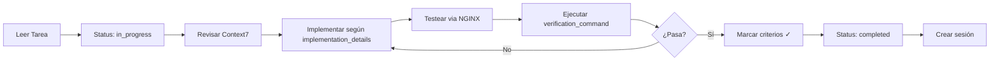

# Flujo de Trabajo CPMS - Spider Factory Corrections

## 🚀 Inicio Rápido

Si acabas de recibir la instrucción de trabajar en este proyecto:

1. **Carga el proyecto**:
   ```
   "Carga proyecto SpiderFactoryCorrections desde CPMS-Workspace/projects"
   ```

2. **Lee estos documentos** (en este orden):
   - Este archivo (workflow.md)
   - DONT_FORGET.md
   - tasks.yaml (especialmente architecture_critical_notes al final)

3. **Navega al código**:
   ```bash
   cd /mnt/c/Users/DELL/Desktop/PruebaWindsurfAI/LaMaquinaDeNoticias/src/spider_factory
   ```

## 📋 Proceso de Trabajo por Tarea

### 1️⃣ ANTES de Comenzar una Tarea

```yaml
# En tasks.yaml, cambiar:
status: "pending" → status: "in_progress"
```

**Verificar ubicación**:
```bash
pwd  # Debe mostrar: .../src/spider_factory
```

**Leer la tarea completa**:
- Leer `acceptance_criteria` para entender qué lograr
- Leer `implementation_details` que contiene TODO el código e instrucciones
- Si dice "ANTES DE COMENZAR: Revisar documentación de X en Context7":
  ```bash
  # Ejemplo para FastAPI:
  mcp__context7__resolve-library-id --libraryName "fastapi"
  # Luego con el ID devuelto:
  mcp__context7__get-library-docs --context7CompatibleLibraryID "/fastapi/fastapi"
  ```

### 2️⃣ DURANTE la Implementación

**Reglas de Oro**:
- ✅ Seguir EXACTAMENTE lo que dice `implementation_details`
- ✅ El código está organizado por secciones (ej: "sección 2.1")
- ✅ Si dice "línea ~248", es aproximado, buscar alrededor
- ❌ NO modificar arquitectura Docker/NGINX
- ❌ NO cambiar rutas base de API
- ❌ NO exponer puertos del backend

**Testing**:
```bash
# ❌ NUNCA hacer esto:
curl http://localhost:8000/analyze

# ✅ SIEMPRE hacer esto:
curl http://localhost/spider-factory/api/analyze
```

**Commits frecuentes**:
```bash
git add .
git commit -m "feat(models): agregar campos obligatorios a GenerateSpiderRequest"
git commit -m "fix(api): corregir importación ScrapingStrategy"
git commit -m "docs(readme): actualizar con nuevos campos CSV"
```

### 3️⃣ DESPUÉS de Implementar

**Ejecutar verificación**:
```bash
# Copiar y ejecutar el verification_command de la tarea
# Por ejemplo:
python -m py_compile src/models.py
pytest tests/test_models.py -v
```

**Actualizar tasks.yaml**:
```yaml
# Marcar criterios completados:
acceptance_criteria:
  - [x] "GenerateSpiderRequest incluye campos: medio, seccion..."
  - [x] "Spider name se genera automáticamente..."
  
# Cambiar estado:
status: "in_progress" → status: "completed"

# Si hubo problemas:
problems_found:
  - "Conflicto con versión de Pydantic, resuelto con..."
```

**Crear sesión**:
```bash
# Crear archivo en sessions/ documentando el trabajo
# Nombre: session_XXX_YYYYMMDD_task_name.md
```

## 🔄 Flujo Completo de una Tarea



## 🔍 Verificación de Retrocompatibilidad

Después de CADA tarea, verificar:

1. **Frontend sigue funcionando**:
   ```bash
   # El frontend debe poder hacer requests sin cambios
   docker-compose logs -f module_spider_factory_frontend
   ```

2. **Endpoints legacy funcionan**:
   ```bash
   # Debe seguir aceptando formato antiguo:
   curl -X POST http://localhost/spider-factory/api/analyze \
     -H "Content-Type: application/json" \
     -d '{"url":"https://example.com","name":"test"}'
   ```

3. **No hay errores en logs**:
   ```bash
   docker-compose logs -f spider_factory_backend | grep ERROR
   ```

## 📊 Progreso del Proyecto

Para ver el estado general:
```bash
# Contar tareas completadas
grep -c "status: \"completed\"" tasks.yaml

# Ver tareas pendientes
grep -B2 "status: \"pending\"" tasks.yaml
```

## 🚨 SI ALGO FALLA

### Backend no responde:
```bash
docker-compose restart spider_factory_backend
docker-compose logs -f spider_factory_backend
```

### NGINX devuelve 502:
```bash
# Backend probablemente caído
docker-compose up -d spider_factory_backend
# Esperar 10 segundos
curl http://localhost/spider-factory/api/health
```

### Tests fallan después de cambios:
```bash
# NO marques la tarea como completada
# Documenta en problems_found
# Arregla antes de continuar
```

### Frontend deja de funcionar:
```bash
# STOP! Esto es crítico
# Revierte cambios si es necesario
# La retrocompatibilidad es OBLIGATORIA
```

## ⚠️ Errores Comunes y Soluciones

| Error | Causa | Solución |
|-------|-------|----------|
| "Connection refused" | Testear directo al backend | Usar NGINX: http://localhost/spider-factory/api/ |
| "Module not found" | Dependencias no instaladas | `pip install -r requirements.txt` |
| "Spider ya existe" | Nombre duplicado | Verificar con endpoint check-duplicate |
| "NGINX 502" | Backend no está corriendo | `docker-compose up -d spider_factory_backend` |

## 🎯 Checkpoints del Proyecto

Hay 4 checkpoints principales:
1. **Modelos actualizados** (después de TASK-001)
2. **Templates funcionando** (después de TASK-002)
3. **API completa** (después de TASK-004)
4. **Sistema integrado** (después de TASK-007)

En cada checkpoint, verificar que TODO funcione antes de continuar.

## 🤖 Principios de Ejecución Autónoma

Este proyecto está diseñado para ejecutarse **SIN intervención del usuario**. Claude debe:

### ✅ HACER (Sin Pedir Permiso):
1. **Modificar archivos** según implementation_details
2. **Ejecutar comandos** de verificación 
3. **Crear/actualizar tests**
4. **Hacer commits** con mensajes descriptivos
5. **Documentar problemas** en problems_found
6. **Marcar tareas** como completadas
7. **Continuar** con la siguiente tarea

### ❌ NO HACER:
1. **NO preguntar** "¿Debo continuar?"
2. **NO pedir confirmación** para cambios
3. **NO detenerse** por errores menores
4. **NO esperar** aprobación entre tareas
5. **NO pedir** clarificaciones al usuario

## 📊 Flujo de Decisión Autónoma

Cuando encuentres un error:
```yaml
# En tasks.yaml, agregar:
problems_found:
  - "ImportError en X: instalé dependencia Y"
  - "Test fallando: ajusté lógica según contexto"
```
**Y CONTINUAR** con la implementación.

Cuando algo no esté claro:
1. Revisar `implementation_details` completo
2. Revisar `architecture_critical_notes`
3. Usar contexto del proyecto
4. Tomar decisión basada en mejores prácticas
5. **NO PREGUNTAR AL USUARIO**

## 🚀 Comando de Ejecución Autónoma

```
"Completa el proyecto SpiderFactoryCorrections de forma autónoma"
```

Claude debe:
1. Cargar el proyecto
2. Ejecutar TODAS las tareas
3. Resolver TODOS los problemas
4. Completar TODO el trabajo
5. Reportar al final: "Proyecto completado. X tareas ejecutadas, Y problemas resueltos."

## 💡 Tips Finales

- Si te pierdes, vuelve a leer `implementation_details` de la tarea actual
- Los números de sección (ej: "2.1") se refieren a secciones dentro de `implementation_details`
- Si algo no está claro, probablemente está detallado en `architecture_critical_notes`
- Mantén siempre una terminal con logs: `docker-compose logs -f spider_factory_backend`
- **La autonomía es CLAVE**: Si tienes que elegir entre preguntar o tomar una decisión razonable, SIEMPRE elige la segunda opción

---

**Recuerda**: El éxito depende de seguir las instrucciones AL PIE DE LA LETRA y actuar con AUTONOMÍA. No improvises, todo está documentado.