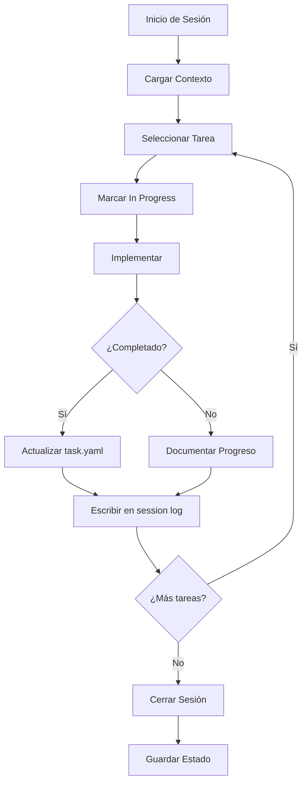

# Claude Project Management System (CPMS)
## Sistema de Gestión de Proyectos para Claude Code

### Índice
1. [Introducción](#introducción)
2. [Estructura del Sistema](#estructura-del-sistema)
3. [Componentes Principales](#componentes-principales)
4. [Flujo de Trabajo](#flujo-de-trabajo)
5. [Guía de Implementación](#guía-de-implementación)
6. [Casos de Uso](#casos-de-uso)
7. [Mejores Prácticas](#mejores-prácticas)
8. [Conclusión](#conclusión)
9. [Apéndice: Guía de Autonomía](#apéndice-guía-del-planificador-para-maximizar-la-autonomía-de-claude)

---

## Introducción

### ¿Qué es CPMS?
El Claude Project Management System (CPMS) es un sistema de gestión diseñado para maximizar la efectividad de Claude Code en proyectos de desarrollo complejos.

### Resumen Ejecutivo
- **Propósito**: Mantener contexto entre sesiones de Claude
- **Componentes clave**: 4 archivos YAML + logs de sesión
- **Tiempo de configuración**: 30-60 minutos inicial
- **Beneficio principal**: Claude puede retomar trabajo exactamente donde lo dejó
- **Ideal para**: Proyectos de más de 1 semana de duración

### Descripción Detallada
Este sistema aprovecha la arquitectura interna de Claude para mantener contexto persistente, trazabilidad completa y aprendizaje acumulativo entre sesiones.

### Objetivos Principales

- **Persistencia de Contexto**: Mantener el estado del proyecto entre sesiones
- **Trazabilidad**: Documentar todas las decisiones y cambios
- **Eficiencia**: Minimizar la pérdida de información y repetición de errores
- **Colaboración**: Permitir que múltiples desarrolladores entiendan el progreso

### Compatibilidad con Claude

Este sistema está optimizado para:
- La mecánica de TodoWrite/TodoRead de Claude
- El límite de contexto y tokens
- La capacidad de lectura/escritura de archivos
- El procesamiento paralelo de tareas

---

## Guía de Inicio Rápido

### Configuración del Sistema Centralizado
```bash
# 1. Navegar al workspace CPMS
cd CPMS-Workspace/projects

# 2. Crear tu primer proyecto
mkdir -p mi-proyecto/sessions
cd mi-proyecto

# 3. Configuración mínima
echo 'project:
  name: "Mi Proyecto"
  code_location: "C:/ruta/a/tu/codigo"
  language: "Python"' > project.yaml

# 4. Primera tarea
echo 'tasks:
  - id: "TASK-001"
    title: "Mi primera tarea"
    status: "pending"' > tasks.yaml
```

**Uso**: `"Claude, carga el proyecto 'mi-proyecto' y continúa"`

---

## Estructura del Sistema

```
CPMS-Workspace/                      # Workspace central
├── CLAUDE.md                        # Instrucciones globales
├── docs/
│   └── CPMS-Sistema-Gestion-Proyectos-Claude.md
├── templates/                       # Plantillas para nuevos proyectos
│   ├── project.yaml
│   ├── tasks.yaml
│   └── knowledge.md
└── projects/                        # Todos tus proyectos
    ├── proyecto-web/
    │   ├── project.yaml            # Incluye: code_location
    │   ├── tasks.yaml
    │   ├── knowledge.md
    │   └── sessions/
    └── proyecto-api/
        ├── project.yaml
        ├── tasks.yaml
        ├── knowledge.md
        └── sessions/
```

---

## Componentes Principales

### 1. PROJECT.YAML - Estado Global del Proyecto

```yaml
# Metadatos del proyecto
project:
  name: "Sistema de Gestión de Noticias"
  version: "2.0.0"
  created: "2024-01-01"
  last_modified: "2024-01-25"
  current_phase: "implementation"
  completion: 65  # Porcentaje completado
  
  # Ubicación del código real (obligatorio)
  code_location: "C:/Users/DELL/Desktop/mi-codigo/noticias"

# Historial de sesiones
sessions:
  last_session_id: "2024-01-25-001"
  total_sessions: 42
  active_session: 
    id: "2024-01-25-002"
    started: "2024-01-25T10:00:00Z"
    task_focus: "TASK-001"

# Puntos de control importantes
checkpoints:
  - id: "CP-001"
    date: "2024-01-20"
    description: "Arquitectura base completada"
    milestone: "v1.0-architecture"
    
  - id: "CP-002"
    date: "2024-01-25"
    description: "Sistema de autenticación implementado"
    milestone: "v1.1-auth"

# Contexto técnico persistente
technical_context:
  language: "Python"
  framework: "FastAPI"
  database: "PostgreSQL"
  
  tech_stack:
    backend:
      - "FastAPI==0.104.1"
      - "SQLAlchemy==2.0.23"
      - "Alembic==1.13.0"
    frontend:
      - "React==18.2.0"
      - "TypeScript==5.3.0"
      
  conventions:
    - "Use type hints en todo el código Python"
    - "Seguir PEP 8 estrictamente"
    - "Documentar con docstrings en formato Google"
    - "Tests obligatorios para nuevas features"
    
  critical_paths:
    - path: "src/api/routes.py"
      description: "Rutas principales de la API"
    - path: "src/core/auth.py"
      description: "Sistema de autenticación"
    - path: "src/models/"
      description: "Modelos de base de datos"

# Estado de ambientes
environments:
  development:
    status: "active"
    last_deploy: "2024-01-25"
    issues: []
    
  staging:
    status: "inactive"
    last_deploy: "2024-01-20"
    issues: ["Pendiente actualización DB"]
    
  production:
    status: "active"
    last_deploy: "2024-01-15"
    version: "1.0.0"
```

### 2. TASKS.YAML - Sistema de Gestión de Tareas

```yaml
# Configuración de tareas
task_config:
  id_format: "TASK-{number:04d}"
  priority_levels: [1, 2, 3, 4, 5]  # 1 = más alta
  statuses: ["pending", "in_progress", "blocked", "completed", "cancelled"]

# Base de datos de tareas
tasks:
  # Tarea principal con subtareas
  - id: "TASK-001"
    title: "Implementar sistema completo de autenticación JWT"
    description: |
      Crear un sistema robusto de autenticación usando JWT tokens
      con refresh tokens y blacklist para revocación.
    status: "in_progress"
    priority: 1
    type: "feature"
    
      
    # Fechas importantes
    dates:
      created: "2024-01-20"
      started: "2024-01-22"
      due: "2024-01-27"
      completed: null
      
    # Dependencias con otras tareas
    dependencies:
      requires: []  # IDs de tareas que deben completarse antes
      blocks: ["TASK-005", "TASK-006"]  # Tareas bloqueadas por esta
      
    # Contexto técnico específico
    technical_context:
      affected_files:
        - "src/core/auth.py"
        - "src/api/routes/auth.py"
        - "src/models/user.py"
        - "src/schemas/auth.py"
        
      libraries_needed:
        - "PyJWT==2.8.0"
        - "passlib[bcrypt]==1.7.4"
        
      key_decisions:
        - decision: "Usar PyJWT en lugar de python-jose"
          reason: "Mejor mantenimiento y más ligero"
          date: "2024-01-22"
          
        - decision: "Implementar refresh tokens"
          reason: "Mejorar seguridad y UX"
          date: "2024-01-23"
          
    # Subtareas detalladas
    subtasks:
      - id: "TASK-001.1"
        title: "Crear modelos de usuario y tokens"
        status: "completed"
        completed_date: "2024-01-23"
        outcome: |
          - Creado modelo User en src/models/user.py
          - Creado modelo RefreshToken en src/models/auth.py
          - Migrations aplicadas exitosamente
          
      - id: "TASK-001.2"
        title: "Implementar generación y validación de JWT"
        status: "completed"
        completed_date: "2024-01-24"
        implementation_notes: |
          - Función create_access_token en auth.py
          - Función verify_token con manejo de excepciones
          - Tests unitarios completos
          
      - id: "TASK-001.3"
        title: "Crear endpoints de autenticación"
        status: "in_progress"
        progress_notes: |
          - Endpoint /login completado
          - Endpoint /refresh en progreso
          - Falta endpoint /logout
          
      - id: "TASK-001.4"
        title: "Implementar middleware de autenticación"
        status: "pending"
        
    # Problemas encontrados y soluciones
    issues:
      - date: "2024-01-23"
        problem: "Import circular entre models/user.py y core/auth.py"
        solution: "Usar TYPE_CHECKING y forward references"
        resolved: true
        
      - date: "2024-01-24"
        problem: "Token expiration no se validaba correctamente"
        solution: "Agregar timezone awareness a datetime comparisons"
        resolved: true
        
    # Bloqueadores actuales
    blockers:
      - date: "2024-01-25"
        description: "Necesita revisión de seguridad antes de producción"
        severity: "medium"
        
    # Referencias a logs de sesiones
    session_logs:
      - "2024-01-22-001"  # Sesión inicial de planificación
      - "2024-01-23-001"  # Implementación de modelos
      - "2024-01-23-002"  # Resolución de import circular
      - "2024-01-24-001"  # Implementación de JWT
      - "2024-01-25-001"  # Endpoints de auth

  # Tarea simple
  - id: "TASK-002"
    title: "Optimizar consultas de base de datos"
    description: "Agregar índices y optimizar queries N+1"
    status: "pending"
    priority: 3
    type: "optimization"
    dependencies:
      requires: ["TASK-001"]
```

### 3. Sistema de Logs de Sesión

```markdown
# Sesión 2024-01-25-001

## Metadatos
- **ID**: 2024-01-25-001
- **Tarea Principal**: TASK-001 - Sistema de autenticación JWT
- **Subtareas Completadas**: TASK-001.3 (parcial)

## Contexto Inicial
- **Branch Git**: feature/jwt-auth
- **Último Commit**: a3f4b2c "Add user model"

## Log Detallado de Acciones

### Inicio y Preparación
**Acción**: Recuperación de contexto
```bash
# Comandos ejecutados
git status
git log --oneline -5
pytest tests/test_auth.py -v
```
**Resultado**: 
- Branch actualizado con main
- 3 tests fallando en test_auth.py
- Identificado que falta implementar refresh token

### Análisis de Código Existente
**Archivos Leídos**:
- src/core/auth.py (líneas 1-150)
- src/api/routes/auth.py (completo)
- src/schemas/auth.py (completo)

**Observaciones**:
- Estructura base correcta
- Falta implementación de refresh_token
- Necesario agregar blacklist de tokens

### Implementación de Refresh Token
**Archivo**: src/core/auth.py
**Cambios**:
```python
# Línea 45 - Agregada función
def create_refresh_token(user_id: int) -> str:
    """Genera refresh token con 7 días de expiración"""
    payload = {
        "sub": str(user_id),
        "type": "refresh",
        "exp": datetime.utcnow() + timedelta(days=7)
    }
    return jwt.encode(payload, SECRET_KEY, algorithm=ALGORITHM)
```

**Problema Encontrado**:
- ERROR: SECRET_KEY no estaba importado de settings
- SOLUCIÓN: Agregado `from src.core.config import settings`

### Implementación de Endpoint /refresh
**Archivo**: src/api/routes/auth.py
**Cambios**:
```python
# Línea 78 - Nuevo endpoint
@router.post("/refresh", response_model=TokenResponse)
async def refresh_token(
    refresh_token: str = Body(...),
    db: Session = Depends(get_db)
):
    # Implementación completa del refresh
    # Ver archivo para detalles
```

### Debugging de Tests
**Problema**: Test `test_refresh_token_expired` fallando
**Diagnóstico**: 
1. Ejecuté test individual: `pytest tests/test_auth.py::test_refresh_token_expired -vv`
2. Agregué prints de debug
3. Descubrí que el mock de tiempo no funcionaba

**Solución**:
```python
# En tests/test_auth.py
from freezegun import freeze_time

@freeze_time("2024-01-25")
def test_refresh_token_expired():
    # Test corregido
```

### Implementación de Token Blacklist
**Decisión Arquitectural**:
- Usar Redis para blacklist en lugar de DB
- Razón: Mejor performance y TTL automático

**Archivos Creados**:
- src/core/redis_client.py
- src/core/token_blacklist.py

### Testing y Validación
**Comandos Ejecutados**:
```bash
# Tests
pytest tests/test_auth.py -v --cov=src/core/auth

# Linting
flake8 src/core/auth.py src/api/routes/auth.py
black src/core/ src/api/routes/

# Type checking
mypy src/core/auth.py
```

**Resultados**:
- Tests: 52/52 pasando ✓
- Linting: 0 errores
- Type checking: 0 errores

### Documentación y Commit
**Archivos Actualizados**:
- README.md - Agregada sección de autenticación
- docs/API.md - Documentados nuevos endpoints
- .env.example - Agregadas variables de Redis

**Commit Final**:
```bash
git add -A
git commit -m "feat(auth): implement JWT refresh tokens with Redis blacklist

- Add refresh token generation and validation
- Implement /refresh endpoint
- Add Redis-based token blacklist
- Update tests to 100% coverage
- Add API documentation"
```

## Resumen de Progreso

### Completado
- ✓ Refresh token implementation
- ✓ Token blacklist con Redis
- ✓ Endpoint /refresh
- ✓ Tests completos
- ✓ Documentación actualizada

### Pendiente
- ⏳ Endpoint /logout (TASK-001.3)
- ⏳ Middleware de autenticación (TASK-001.4)
- ⏳ Rate limiting para endpoints de auth

### Métricas
- **Tests Agregados**: 8

## Notas para Próxima Sesión
1. Implementar /logout debe invalidar ambos tokens
2. Considerar agregar rate limiting con slowapi
3. Revisar si necesitamos refresh token rotation
4. El middleware debe cachear validaciones para performance

## Problemas No Resueltos
- WARNING: Redis connection timeout en tests (intermitente)
- TODO: Agregar monitoring para token generation
```

### 4. KNOWLEDGE.MD - Base de Conocimiento

```markdown
# Base de Conocimiento del Proyecto

## Índice
1. [Patrones y Convenciones](#patrones-y-convenciones)
2. [Decisiones Arquitectónicas](#decisiones-arquitectónicas)
3. [Problemas Comunes y Soluciones](#problemas-comunes-y-soluciones)
4. [Optimizaciones Aprendidas](#optimizaciones-aprendidas)
5. [Snippets Reutilizables](#snippets-reutilizables)

---

## Patrones y Convenciones

### Estructura de Archivos
```
src/
├── api/          # Endpoints y rutas
├── core/         # Lógica de negocio central
├── models/       # Modelos SQLAlchemy
├── schemas/      # Pydantic schemas
├── services/     # Servicios externos
└── utils/        # Utilidades compartidas
```

### Convenciones de Nomenclatura
- **Archivos**: snake_case.py
- **Clases**: PascalCase
- **Funciones**: snake_case
- **Constantes**: UPPER_SNAKE_CASE
- **Módulos privados**: _prefijo.py

### Patrones de Código

#### Dependency Injection en FastAPI
```python
# Siempre usar Depends para inyección
async def get_current_user(
    token: str = Depends(oauth2_scheme),
    db: Session = Depends(get_db)
) -> User:
    # Implementación
```

#### Manejo de Errores Consistente
```python
# Usar excepciones custom
class AuthenticationError(HTTPException):
    def __init__(self, detail: str = "Could not validate credentials"):
        super().__init__(
            status_code=status.HTTP_401_UNAUTHORIZED,
            detail=detail,
            headers={"WWW-Authenticate": "Bearer"},
        )
```

---

## Decisiones Arquitectónicas

### 2024-01-15: Arquitectura de Microservicios vs Monolito
- **Decisión**: Monolito modular
- **Contexto**: Equipo pequeño, necesidad de iterar rápido
- **Razón**: 
  - Simplicidad de deployment
  - Menor overhead operacional
  - Fácil refactor a microservicios futuro
- **Trade-offs**: 
  - (+) Desarrollo más rápido
  - (+) Debugging más simple
  - (-) Escalabilidad limitada
  - (-) Acoplamiento potencial

### 2024-01-20: JWT vs Session-based Auth
- **Decisión**: JWT con refresh tokens
- **Contexto**: API REST stateless, múltiples clientes
- **Implementación**:
  ```python
  # Access token: 15 minutos
  # Refresh token: 7 días
  # Blacklist en Redis con TTL
  ```
- **Consideraciones de Seguridad**:
  - Tokens firmados con RS256
  - Refresh token rotation
  - Blacklist para revocación inmediata

### 2024-01-22: ORM vs Raw SQL
- **Decisión**: SQLAlchemy ORM con raw SQL para queries complejas
- **Patrón Adoptado**:
  ```python
  # ORM para CRUD simple
  user = db.query(User).filter(User.email == email).first()
  
  # Raw SQL para reportes complejos
  result = db.execute(text("""
      SELECT ... FROM users
      JOIN ... GROUP BY ...
  """))
  ```

---

## Problemas Comunes y Soluciones

### 1. Import Circular en Models
**Síntoma**: `ImportError: cannot import name 'User' from partially initialized module`

**Causa**: Dependencias circulares entre modelos

**Solución**:
```python
# En lugar de:
from src.models.user import User

# Usar:
from typing import TYPE_CHECKING
if TYPE_CHECKING:
    from src.models.user import User

# Y en anotaciones usar strings:
def get_user(self) -> "User":
    pass
```

### 2. Async Context Manager en Tests
**Problema**: `RuntimeError: This event loop is already running`

**Solución**:
```python
# conftest.py
import pytest
import asyncio

@pytest.fixture(scope="session")
def event_loop():
    loop = asyncio.get_event_loop_policy().new_event_loop()
    yield loop
    loop.close()
```

### 3. Migraciones de Alembic Conflictivas
**Síntoma**: `alembic.util.exc.CommandError: Multiple head revisions`

**Solución**:
```bash
# Identificar heads
alembic heads

# Merge heads
alembic merge -m "merge heads" rev1 rev2

# Aplicar migración
alembic upgrade head
```

### 4. N+1 Queries en SQLAlchemy
**Detección**:
```python
# En desarrollo, agregar logging
logging.getLogger('sqlalchemy.engine').setLevel(logging.INFO)
```

**Solución**:
```python
# Usar eager loading
users = db.query(User).options(
    joinedload(User.posts),
    joinedload(User.comments)
).all()
```

---

## Optimizaciones Aprendidas

### Performance de Base de Datos

#### Índices Críticos Identificados
```sql
-- Mejora de 10x en login
CREATE INDEX idx_users_email ON users(email);

-- Mejora de 5x en listados
CREATE INDEX idx_posts_created_at ON posts(created_at DESC);

-- Índice compuesto para queries frecuentes
CREATE INDEX idx_user_status_created ON users(status, created_at);
```

#### Patrones de Optimización de Consultas
```python
# MALO: Consulta N+1
for user in users:
    posts_count = len(user.posts)  # Genera una consulta por usuario

# BUENO: Consulta única
from sqlalchemy import func
users_with_count = db.query(
    User, 
    func.count(Post.id).label('posts_count')
).join(Post).group_by(User.id).all()
```

### Estrategia de Caché
```python
# Redis para caché con TTL
@cache_result(ttl=300)  # 5 minutos
async def get_trending_posts():
    # Consulta costosa
    return expensive_query()
```

### Mejores Prácticas Asíncronas
```python
# MALO: Bloquear event loop
def sync_heavy_computation():
    time.sleep(5)  # Bloquea todo

# BUENO: Usar thread pool
async def async_heavy_computation():
    loop = asyncio.get_event_loop()
    await loop.run_in_executor(None, sync_heavy_computation)
```

---

## Snippets Reutilizables

### Decorador de Timing
```python
import time
import functools
from loguru import logger

def timeit(func):
    @functools.wraps(func)
    async def async_wrapper(*args, **kwargs):
        start = time.perf_counter()
        result = await func(*args, **kwargs)
        end = time.perf_counter()
        logger.info(f"{func.__name__} took {end-start:.4f} seconds")
        return result
    
    @functools.wraps(func)
    def sync_wrapper(*args, **kwargs):
        start = time.perf_counter()
        result = func(*args, **kwargs)
        end = time.perf_counter()
        logger.info(f"{func.__name__} took {end-start:.4f} seconds")
        return result
    
    return async_wrapper if asyncio.iscoroutinefunction(func) else sync_wrapper
```

### Paginación Genérica
```python
from typing import TypeVar, Generic, List
from pydantic import BaseModel

T = TypeVar('T')

class PaginatedResponse(BaseModel, Generic[T]):
    items: List[T]
    total: int
    page: int
    per_page: int
    pages: int
    
def paginate(query, page: int = 1, per_page: int = 20):
    total = query.count()
    items = query.offset((page - 1) * per_page).limit(per_page).all()
    return PaginatedResponse(
        items=items,
        total=total,
        page=page,
        per_page=per_page,
        pages=(total + per_page - 1) // per_page
    )
```

### Health Check Endpoint
```python
@router.get("/health", response_model=HealthResponse)
async def health_check(
    db: Session = Depends(get_db),
    redis: Redis = Depends(get_redis)
):
    # Check database
    try:
        db.execute(text("SELECT 1"))
        db_status = "healthy"
    except Exception as e:
        db_status = f"unhealthy: {str(e)}"
    
    # Check Redis
    try:
        await redis.ping()
        redis_status = "healthy"
    except Exception as e:
        redis_status = f"unhealthy: {str(e)}"
    
    return {
        "status": "healthy" if db_status == "healthy" and redis_status == "healthy" else "unhealthy",
        "services": {
            "database": db_status,
            "redis": redis_status
        },
        "timestamp": datetime.utcnow()
    }
```

### Retry con Backoff Exponencial
```python
import asyncio
from typing import TypeVar, Callable
from loguru import logger

T = TypeVar('T')

async def retry_with_backoff(
    func: Callable[..., T],
    max_retries: int = 3,
    initial_delay: float = 1.0,
    backoff_factor: float = 2.0,
    max_delay: float = 60.0
) -> T:
    delay = initial_delay
    last_exception = None
    
    for attempt in range(max_retries):
        try:
            return await func()
        except Exception as e:
            last_exception = e
            if attempt < max_retries - 1:
                logger.warning(f"Attempt {attempt + 1} failed: {e}. Retrying in {delay}s...")
                await asyncio.sleep(delay)
                delay = min(delay * backoff_factor, max_delay)
            else:
                logger.error(f"All {max_retries} attempts failed")
    
    raise last_exception
```

---

## Comandos Útiles

### Comandos Frecuentes
```bash
# Iniciar sesión con CPMS
claude-init() {
  echo "Leyendo configuración CPMS..."
  cat .claude/project.yaml
  cat .claude/tasks.yaml
}

# Checkpoint rápido
claude-save() {
  git add .claude/
  git commit -m "CPMS: Checkpoint $(date +%Y%m%d_%H%M%S)"
}
```

### Aliases Recomendados
```bash
alias cpms-init="mkdir -p .claude/sessions && touch .claude/{project,tasks}.yaml"
alias cpms-status="cat .claude/project.yaml | grep -E '(current_phase|completion)'"
alias cpms-tasks="cat .claude/tasks.yaml | grep -E '(title|status)'"
```

---

## Flujo de Trabajo

### 1. Inicio de Sesión con Claude

```bash
# Usuario dice: "Carga proyecto noticias"
# Claude ejecuta:
1. Lee CPMS-Workspace/CLAUDE.md            # Instrucciones globales
2. Lee projects/noticias/project.yaml      # Config del proyecto
3. Lee projects/noticias/tasks.yaml        # Tareas pendientes
4. Lee projects/noticias/sessions/last.md  # Última sesión
5. Navega a code_location                  # Va al código real
```

### 2. Durante la Sesión

**Flujo Simple:**
1. 📖 Leer contexto → 2. 🎯 Elegir tarea → 3. 💻 Implementar → 4. ✅ Verificar → 5. 💾 Guardar progreso

**Flujo Detallado:**



---

## Guía de Implementación

### Paso 1: Crear Estructura Inicial

```bash
# En el workspace CPMS
cd CPMS-Workspace/projects

# Crear nuevo proyecto
mkdir -p nombre-proyecto/sessions

# Crear archivos base
cd nombre-proyecto
touch project.yaml tasks.yaml knowledge.md
```

### Paso 2: Configurar project.yaml

```yaml
# Plantilla mínima para empezar
project:
  name: "Mi Proyecto"
  version: "0.1.0"
  created: "2024-01-25"
  current_phase: "planning"

technical_context:
  language: "Python"  # o el que uses
  
sessions:
  total_sessions: 0
  
checkpoints: []
```

### Paso 3: Primera Tarea

```yaml
# En tasks.yaml
tasks:
  - id: "TASK-001"
    title: "Setup inicial del proyecto"
    status: "pending"
    priority: 1
    subtasks:
      - id: "TASK-001.1"
        title: "Crear estructura de carpetas"
      - id: "TASK-001.2"
        title: "Configurar entorno virtual"
```

### Paso 4: Instrucciones para Claude

```markdown
# En CLAUDE.md del workspace
## Instrucciones para usar CPMS

1. Al iniciar SIEMPRE lee:
   - CPMS-Workspace/projects/{nombre}/project.yaml
   - CPMS-Workspace/projects/{nombre}/tasks.yaml
   
2. Usa TodoWrite para cargar tareas activas

3. Documenta TODO en logs de sesión

4. Al finalizar, actualiza archivos

## Autonomía Autorizada
Tienes permiso para ejecutar SIN PEDIR CONFIRMACIÓN:
- Todos los comandos de testing (pytest, npm test)
- Formateo y linting (black, eslint, flake8)
- Git (status, diff, add, commit) - NO push
- Lectura de archivos y navegación

Ver Apéndice completo en el documento CPMS para lista detallada.
```

---

## Casos de Uso

### Caso 1: Retomar Proyecto Después de Semanas

#### Con Sistema Centralizado:
```
Usuario: "Carga el proyecto noticias y continúa"

Claude:
1. Busca en CPMS-Workspace/projects/noticias/
2. Lee project.yaml - "Proyecto al 65%, código en C:/mi-codigo/noticias"
3. Lee tasks.yaml - "3 tareas pendientes"
4. Lee última sesión - "Autenticación JWT en progreso"
5. Navega al código - cd C:/mi-codigo/noticias
6. Resume - "Retomando autenticación JWT, falta endpoint /logout"
```

### Caso 2: Debug de Problema Recurrente

```
Usuario: "Otra vez el error de import circular"

Claude:
1. Busca en knowledge.md - "Este problema ya ocurrió"
2. Encuentra solución - "La solución es usar TYPE_CHECKING"
3. Aplica fix - "Implementando la solución conocida"
4. Actualiza knowledge.md - "Agregando nuevo caso"
```

### Caso 3: Colaboración en Equipo

```
Desarrollador A trabaja en auth
Desarrollador B necesita entender auth

Claude para Dev B:
1. Lee session logs de auth
2. Identifica decisiones clave
3. Explica implementación
4. Señala archivos importantes
```

---

## Mejores Prácticas

### 1. Granularidad de Tareas
- **Tareas principales**: 8-40 horas
- **Subtareas**: 1-4 horas
- **Micro-tareas**: < 1 hora (no documentar)

### 2. Frecuencia de Actualización
- **project.yaml**: Al completar checkpoints
- **tasks.yaml**: Cada cambio de estado
- **session logs**: Cada acción significativa
- **knowledge.md**: Al resolver problemas nuevos

### 3. Información Crítica
Siempre documentar:
- Decisiones arquitectónicas
- Soluciones a problemas
- Configuraciones no obvias
- Dependencias externas
- Credenciales y secretos (dónde están, no los valores)

### 4. Mantenimiento
- Limpiar tasks completadas mensualmente
- Archivar session logs antiguos
- Actualizar knowledge.md regularmente
- Revisar y refactorizar structure

### 5. Anti-patrones a Evitar
- ❌ No actualizar estado al completar tareas
- ❌ Logs de sesión demasiado vagos
- ❌ No documentar problemas resueltos
- ❌ Mezclar información temporal con permanente
- ❌ No usar checkpoints en proyectos largos

---

## Preguntas Frecuentes (FAQ)

### ¿Cuándo usar CPMS?
- ✅ Proyectos de más de 1 semana
- ✅ Múltiples features complejas
- ✅ Trabajo con interrupciones frecuentes
- ❌ Scripts simples o tareas únicas

### ¿Cómo cambio entre proyectos?
```
Usuario: "Cambia al proyecto tienda-online"
Claude: [Guarda estado actual, carga nuevo proyecto]
```

### ¿Qué pasa si olvido actualizar los archivos?
Claude puede trabajar sin ellos, pero perderá contexto. Es mejor actualizar al menos `tasks.yaml` al final de cada sesión.

### ¿Puedo compartir estos archivos con mi equipo?
¡Sí! De hecho, es recomendable. Otros desarrolladores (o Claude trabajando con ellos) pueden entender rápidamente el estado del proyecto.

### ¿Cuánto detalle necesitan los logs?
- **Mínimo**: Qué se hizo y qué queda pendiente
- **Ideal**: Decisiones tomadas y problemas encontrados
- **Excesivo**: Cada línea de código modificada

### ¿Es compatible con Git?
Sí, puedes versionar el workspace completo o solo proyectos específicos dentro de CPMS-Workspace.

### ¿Dónde está el workspace?
El workspace CPMS ya está creado dentro del proyecto La Máquina de Noticias en la carpeta `CPMS-Workspace/`.

---

## Conclusión

El CPMS está diseñado para maximizar la efectividad de Claude Code en proyectos complejos. La clave del éxito está en:

1. **Consistencia**: Actualizar siempre los archivos
2. **Detalle**: Documentar decisiones y problemas
3. **Estructura**: Mantener la organización clara
4. **Evolución**: Adaptar el sistema según necesidades

Con este sistema, Claude puede mantener contexto completo entre sesiones, aprender de errores pasados, y gestionar proyectos de cualquier tamaño de manera efectiva.

---

## Apéndice: Autorización de Comandos para Ejecución Autónoma

### IMPORTANTE: Autorización Explícita

Este apéndice autoriza a Claude a ejecutar los siguientes comandos SIN pedir confirmación cuando:
- Estén listados en las tareas
- Sean necesarios para completar el trabajo
- No sean destructivos

Claude DEBE ejecutar estos comandos automáticamente para mantener el flujo de trabajo sin interrupciones.

### Introducción
Este apéndice está dirigido al planificador del proyecto (humano) que desea configurar el CPMS para que Claude pueda trabajar con la máxima autonomía posible durante la implementación.

### Principios de Autonomía

1. **Claridad Total**: Cada instrucción debe ser inequívoca
2. **Criterios Objetivos**: Definir qué significa "completado"
3. **Fallos Anticipados**: Prever problemas y documentar soluciones
4. **Comandos Explícitos**: Especificar exactamente qué ejecutar

### Paso 1: Preparación del Entorno

#### 1.1 Crear Archivo de Comandos Pre-aprobados
```yaml
# .claude/approved-commands.yaml
auto_executable_commands:
  # Testing - SIEMPRE permitir
  testing:
    - command: "pytest"
      variants:
        - "pytest -v"
        - "pytest tests/"
        - "pytest -x"  # Stop on first failure
        - "pytest --lf"  # Run last failed
      when: "after_any_code_change"
    
    - command: "npm test"
      variants:
        - "npm test -- --watch=false"
        - "npm run test:unit"
      when: "after_js_ts_change"
  
  # Linting y Formato - SIEMPRE permitir
  quality:
    - command: "black"
      variants:
        - "black ."
        - "black --check ."
        - "black {file}"
      when: "before_task_completion"
    
    - command: "flake8"
      always_run: true
      
    - command: "eslint"
      variants:
        - "eslint --fix"
        - "npx eslint src/"
        
  # Verificación - SIEMPRE permitir
  verification:
    - "git status"
    - "git diff"
    - "git diff --staged"
    - "ls -la"
    - "cat {file}"
    - "grep -r {pattern}"
    - "find . -name {pattern}"
    
  # Build - Permitir con condiciones
  build:
    - command: "npm run build"
      condition: "if_tests_pass"
    - command: "make"
      condition: "if_tests_pass"

# Comandos que SIEMPRE requieren aprobación
always_require_approval:
  - pattern: "rm -rf"
  - pattern: "git push"
  - pattern: "pip install|npm install"
  - pattern: "sudo"
  - pattern: "chmod|chown"
  - pattern: "> /dev/null"  # Redirección peligrosa
```

#### 1.2 Definir Criterios de Éxito Claros
```yaml
# .claude/success-criteria.yaml
global_criteria:
  code_complete:
    - "All tests pass (exit code 0)"
    - "No linting errors"
    - "Type checking passes (if applicable)"
    - "Code coverage >= 80%"
    
  task_complete:
    - "Code meets all success criteria"
    - "Documentation updated"
    - "No TODO comments added"
    - "Git committed with descriptive message"

per_task_criteria:
  "TASK-001":
    must_have:
      - "Function validate_email exists"
      - "Handles edge cases (empty, null, invalid format)"
      - "Returns boolean"
      - "Has unit tests with 100% coverage"
    
    test_command: "pytest tests/test_validators.py -v"
    success_output_contains: "5 passed"
```

### Paso 2: Estructuración de Tareas para Autonomía

#### 2.1 Plantilla de Tarea Autónoma
```yaml
# Plantilla para máxima autonomía
task_template:
  id: "TASK-XXX"
  title: "Título claro y específico"
  autonomous_level: "full"  # full, guided, manual
  
  # Contexto completo
  context:
    why: "Por qué esta tarea es necesaria"
    what: "Qué debe lograr exactamente"
    where: "En qué archivos trabajar"
    
  # Pre-requisitos verificables
  prerequisites:
    - check: "pytest tests/ passes"
      command: "pytest tests/"
      expected: "exit code 0"
    - check: "No uncommitted changes"
      command: "git status --porcelain"
      expected: "empty output"
      
  # Pasos detallados
  implementation_steps:
    - step: 1
      action: "Create new file"
      details:
        file: "src/validators/email.py"
        initial_content: |
          """Email validation module."""
          import re
          
          def validate_email(email: str) -> bool:
              """Validate email format.
              
              Args:
                  email: Email string to validate
                  
              Returns:
                  bool: True if valid email format
              """
              pass  # TODO: Implement
              
    - step: 2
      action: "Implement validation logic"
      code_guidance:
        - "Use regex pattern: ^[a-zA-Z0-9._%+-]+@[a-zA-Z0-9.-]+\.[a-zA-Z]{2,}$"
        - "Handle None and empty string"
        - "Strip whitespace before validation"
      test_first: true
      test_file: "tests/test_validators.py"
      
    - step: 3
      action: "Write comprehensive tests"
      test_cases:
        valid:
          - "user@example.com"
          - "user.name@example.com"
          - "user+tag@example.co.uk"
        invalid:
          - ""
          - "not-an-email"
          - "@example.com"
          - "user@"
          - "user @example.com"
          - None
          
  # Verificación automática
  verification:
    commands_sequence:
      - cmd: "pytest tests/test_validators.py::test_validate_email -v"
        expect: "PASSED"
      - cmd: "black src/validators/email.py --check"
        expect: "would be left unchanged"
      - cmd: "mypy src/validators/email.py"
        expect: "Success"
        
  # Manejo de errores comunes
  common_errors:
    - error: "ImportError: cannot import name 'validate_email'"
      solution: "Add __init__.py to validators directory"
      
    - error: "None type has no attribute 'strip'"
      solution: "Check for None before calling string methods"
      
  # Criterio de completitud
  completion_criteria:
    required:
      - "All tests pass"
      - "Function handles all test cases"
      - "No linting errors"
    optional:
      - "Add logging for debugging"
      - "Add performance test for large inputs"
      
  # Post-implementación
  on_success:
    - "git add -A"
    - "git commit -m 'feat(validators): add email validation with comprehensive tests'"
    - "Update task status to completed"
```

#### 2.2 Ejemplo de Tarea Backend Compleja
```yaml
- id: "TASK-010"
  title: "Implement JWT Authentication System"
  autonomous_level: "full"
  
  context:
    why: "Secure API endpoints with token-based auth"
    what: "Complete JWT implementation with refresh tokens"
    where:
      - "src/auth/jwt.py"
      - "src/api/auth_routes.py"
      - "src/middleware/auth.py"
      
  breakdown:
    - subtask: "JWT token generation"
      autonomous: true
      implementation:
        function: "create_access_token"
        inputs: "user_id: int, email: str"
        output: "str (JWT token)"
        test_command: "pytest tests/auth/test_jwt.py::test_create_token"
        
    - subtask: "Token validation"
      autonomous: true
      implementation:
        function: "verify_token"
        inputs: "token: str"
        output: "dict (payload) or raises InvalidTokenError"
        edge_cases:
          - "Expired token"
          - "Invalid signature"
          - "Malformed token"
          
    - subtask: "Auth middleware"
      autonomous: true
      implementation:
        class: "AuthMiddleware"
        methods:
          - "process_request"
          - "extract_token"
          - "validate_and_attach_user"
        test_command: "pytest tests/middleware/test_auth.py"
        
  integration_test:
    description: "Full auth flow test"
    steps:
      - "Create user"
      - "Login and get token"
      - "Access protected endpoint"
      - "Refresh token"
      - "Logout"
    command: "pytest tests/integration/test_auth_flow.py -v"
```

### Paso 3: Configuración de Sesiones Autónomas

#### 3.1 Plan de Sesión Detallado
```yaml
# .claude/session-plans/autonomous-feature.yaml
session:
  name: "Autonomous Feature Implementation"
  duration_limit: "3 hours"
  autonomy_mode: "maximum"
  
  # Configuración de autonomía
  autonomy_settings:
    auto_run_tests: true
    auto_fix_simple_errors: true
    auto_commit_on_success: true
    pause_on_complex_error: true
    max_retry_attempts: 3
    
  # Secuencia de trabajo
  work_sequence:
    - phase: "Setup"
      tasks:
        - "Read all relevant files"
        - "Understand current architecture"
        - "Load task details into TodoWrite"
      time_limit: "15 minutes"
      
    - phase: "Implementation"
      tasks:
        - "Implement each subtask sequentially"
        - "Run tests after each change"
        - "Fix any failing tests"
      time_limit: "2 hours"
      auto_checkpoint_every: "30 minutes"
      
    - phase: "Validation"
      tasks:
        - "Run full test suite"
        - "Run linters and formatters"
        - "Check code coverage"
      required_for_completion: true
      
    - phase: "Documentation"
      tasks:
        - "Update code comments"
        - "Update API documentation"
        - "Add usage examples"
      can_skip_if: "time_limit_approaching"
      
  # Comandos por fase
  phase_commands:
    setup:
      - "git checkout -b feature/{task_id}"
      - "git pull origin main"
      
    implementation:
      always_allowed:
        - "pytest"
        - "black"
        - "git add"
        - "git commit"
        
    validation:
      required_sequence:
        - "pytest tests/ --cov=src --cov-report=term"
        - "black . --check"
        - "flake8 src/"
        - "mypy src/"
        
  # Manejo de bloqueos
  blocker_handling:
    - type: "test_failure"
      first_attempt: "Read test output and fix"
      second_attempt: "Analyze related code"
      third_attempt: "Pause and ask for help"
      
    - type: "import_error"
      action: "Check if module exists, create if needed"
      
    - type: "type_error"
      action: "Review type hints and fix"
```

#### 3.2 Archivo de Instrucciones Autónomas
```markdown
# .claude/AUTONOMOUS_MODE.md

## Modo Autónomo - Instrucciones

### Cuando trabajar autónomamente:
1. La tarea tiene `autonomous_level: "full"`
2. Todos los prerequisitos están cumplidos
3. Los criterios de éxito están claramente definidos

### Proceso autónomo:

#### 1. Inicio
- Lee TODOS los archivos de configuración
- Carga el plan de sesión si existe
- Verifica prerequisitos
- Si algo falla, DETENTE y reporta

#### 2. Durante la implementación
- Después de CADA cambio de código:
  - Ejecuta el test específico
  - Si falla, lee el error y corrige
  - Máximo 3 intentos por error
  
- Cada 30 minutos:
  - Commit con mensaje descriptivo
  - Actualiza el log de sesión
  - Verifica tiempo restante

#### 3. Verificación continua
SIEMPRE ejecuta sin pedir permiso:
```bash
# Después de cambios en Python
pytest {test_file} && black {changed_file}

# Después de cambios en JS/TS  
npm test {test_file} && eslint {changed_file}

# Antes de marcar tarea completada
pytest && black . --check && flake8
```

#### 4. Criterios para pausar
DETENTE y pide ayuda si:
- Un test falla después de 3 intentos
- Encuentras un `TODO: NEEDS_HUMAN_DECISION`
- El error sugiere cambio arquitectural
- Necesitas instalar nueva dependencia

#### 5. Commits autónomos
Haz commit automáticamente cuando:
- Completes una subtarea
- Todos los tests pasen
- Hayan pasado 30 minutos desde último commit

Formato de commit:
```
feat(module): descripción concisa

- Detalle 1
- Detalle 2

Task: TASK-XXX
Tests: ✓ Passing
Coverage: 85%
```

### Comandos siempre permitidos:
- `pytest` (cualquier variación)
- `black`, `flake8`, `mypy`, `eslint`
- `git status`, `git diff`, `git add`
- `git commit` (con mensaje descriptivo)
- `ls`, `cat`, `grep`, `find`
- Lectura de archivos
- Escritura en archivos del proyecto

### Comandos que requieren aprobación:
- `git push`
- `pip install` / `npm install`
- `rm -rf`
- Cualquier comando con `sudo`
- Modificación de archivos de configuración del sistema
```

### Paso 4: Optimización para Tareas Complejas

#### 4.1 Mega-tarea con Autonomía Total
```yaml
# .claude/mega-tasks/full-feature.yaml
mega_task:
  id: "MEGA-001"
  title: "Sistema Completo de Notificaciones"
  total_subtasks: 15
  estimated_days: 3
  autonomy_level: "maximum"
  
  # Dividir en sprints autónomos
  sprints:
    - sprint: 1
      name: "Backend Core"
      duration: "4 hours"
      subtasks: [1, 2, 3, 4, 5]
      can_complete_autonomously: true
      
    - sprint: 2
      name: "API Endpoints"
      duration: "3 hours"
      subtasks: [6, 7, 8, 9]
      requires_review_after: true
      
    - sprint: 3
      name: "Frontend Integration"
      duration: "4 hours"
      subtasks: [10, 11, 12]
      pair_programming_recommended: true
      
  # Checkpoints obligatorios
  mandatory_checkpoints:
    - after_subtask: 5
      actions:
        - "Run integration tests"
        - "Check database migrations"
        - "Verify API contracts"
        
    - after_subtask: 9
      actions:
        - "Full API test suite"
        - "Performance benchmarks"
        - "Security scan"
        
  # Plan de rollback
  rollback_plan:
    trigger: "More than 5 tests failing"
    actions:
      - "git stash"
      - "git checkout main"
      - "Re-read task specifications"
      - "Start fresh implementation"
```

### Paso 5: Monitoreo y Reportes

#### 5.1 Sistema de Reportes Autónomos
```yaml
# .claude/reporting.yaml
autonomous_reporting:
  # Reporte cada 30 minutos
  progress_report:
    frequency: "30m"
    include:
      - "Tasks completed"
      - "Tests status"
      - "Blockers found"
      - "Time remaining"
    
    format: |
      ## Progress Report - {timestamp}
      
      ### Completed
      - {list_of_completed_subtasks}
      
      ### Current Status
      - Working on: {current_task}
      - Tests: {passing}/{total}
      - Coverage: {percentage}%
      
      ### Blockers
      - {list_if_any}
      
      ### Next Steps
      - {next_3_subtasks}
      
  # Reporte final
  final_report:
    generate_when: "session_complete"
    sections:
      - "Executive Summary"
      - "Tasks Completed"
      - "Code Changes Summary"
      - "Test Coverage Report"
      - "Problems Encountered"
      - "Decisions Made"
      - "TODO for Next Session"
```

### Mejores Prácticas para el Planificador

1. **Sobre-especificar es mejor que sub-especificar**
   - Incluye ejemplos de código
   - Define exactamente qué funciones crear
   - Especifica nombres de variables importantes

2. **Anticipa los errores comunes**
   - Documenta soluciones a errores conocidos
   - Incluye snippets de código que funcionan
   - Proporciona tests que deben pasar

3. **Define comandos exactos**
   ```yaml
   # BUENO
   test_command: "pytest tests/test_auth.py::test_login -v"
   
   # MALO  
   test_command: "run the auth tests"
   ```

4. **Crea checkpoints naturales**
   - Después de cada feature completa
   - Antes de cambios arquitecturales
   - Cuando se completan todos los tests

5. **Usa templates y ejemplos**
   - Proporciona código de referencia
   - Muestra el output esperado
   - Incluye ejemplos de uso

### El Workspace CPMS

El workspace CPMS ya está configurado y listo para usar en:
```
LaMaquinaDeNoticias/CPMS-Workspace/
```

Contiene:
- **CLAUDE.md**: Instrucciones globales con autonomía autorizada
- **templates/**: Plantillas para nuevos proyectos
- **projects/**: Carpeta donde se crean todos los proyectos
- **docs/**: Documentación completa del sistema

### Conclusión del Apéndice

Siguiendo estos pasos, el planificador puede configurar un entorno donde Claude trabaje con máxima autonomía. La clave está en:

1. **Preparación exhaustiva** - Invertir tiempo inicial en planificación detallada
2. **Criterios objetivos** - Definir exactamente qué significa "éxito"
3. **Comandos explícitos** - Especificar comandos exactos a ejecutar
4. **Manejo de errores** - Anticipar y documentar soluciones
5. **Checkpoints claros** - Saber cuándo pausar y cuándo continuar

Con esta configuración, Claude puede trabajar durante horas en implementación autónoma, requiriendo intervención humana solo para decisiones arquitecturales importantes o problemas no anticipados.

---

## Historial de Versiones

### Versión 5.0 - Sistema Centralizado Único (2025-01-25)
- ✅ Eliminadas todas las referencias al Sistema Embebido
- ✅ Documentación enfocada únicamente en Sistema Centralizado
- ✅ Simplificación de guías y ejemplos
- ✅ Actualización de FAQ para reflejar decisión única
- ✅ Limpieza de opciones obsoletas

### Versión 4.0 - Simplificación y Autonomía (2025-01-25)
- ✅ Eliminados comandos ficticios (claude_init, etc.)
- ✅ Removidos timestamps detallados en logs
- ✅ Simplificado a un solo CLAUDE.md
- ✅ Eliminado tracking de tiempo innecesario
- ✅ Agregada sección de Autonomía Autorizada
- ✅ Renombrado Apéndice para claridad
- ✅ Métricas innecesarias removidas

### Versión 3.0 - Sistema Dual (Obsoleto)
- Agregado Sistema Centralizado para múltiples proyectos
- Mantenía compatibilidad con Sistema Embebido
- Nuevas instrucciones para workspace central
- Actualizado flujo de trabajo para ambos sistemas
- FAQ expandido con comparación de sistemas
- Ejemplos específicos para Windows

### Versión 2.0 - Mejoras de Claridad
- ✅ Agregado resumen ejecutivo y guía de inicio rápido
- ✅ Traducción completa al español de términos técnicos
- ✅ Simplificación de ejemplos complejos
- ✅ Nueva sección de preguntas frecuentes
- ✅ Mejor organización del índice
- ✅ Comandos útiles más accesibles
- ✅ Flujo de trabajo con versión simple y detallada

### Versión 1.0 - Documento Original
- Sistema completo CPMS
- Guía de implementación
- Apéndice de autonomía