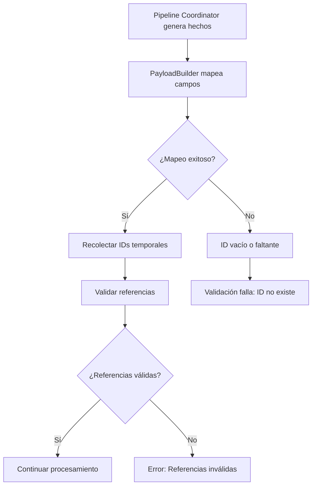

# Problema de Validación de IDs de Hechos - Análisis Detallado

## 🚨 Descripción del Problema

La validación de integridad referencial en el PayloadBuilder puede fallar cuando los IDs de hechos no se mapean correctamente entre el Pipeline Coordinator y el PayloadBuilder. Esto ocurre específicamente cuando:

1. El Pipeline Coordinator genera hechos con cierta estructura
2. El PayloadBuilder espera una estructura diferente
3. La validación busca IDs que no existen porque el mapeo falló

## 🔍 Anatomía del Problema

### Caso 1: Mapeo de IDs de Hechos

**Pipeline Coordinator genera:**
```python
{
    "id_hecho": 1,  # Campo generado por error
    "contenido": "El presidente anunció medidas",
    # ...
}
```

**PayloadBuilder mapea (líneas 419-424):**
```python
# Intenta múltiples campos
id_hecho = str(item.get('id_hecho', item.get('id', item.get('id_temporal', ''))))

hecho_mapeado = {
    'id_temporal': id_hecho,  # Si ningún campo existe, será ""
    # ...
}
```

**Validación busca (línea 88):**
```python
if 'id_temporal' in hecho:
    ids['hechos'].add(hecho['id_temporal'])
```

**Resultado**: Si el mapeo resulta en `id_temporal: ""`, el ID no se recolecta y las validaciones de referencias fallan.

### Caso 2: Referencias a Hechos desde Citas/Datos

**Citas referencian hechos:**
```python
{
    "id_temporal_cita": "1",
    "hecho_principal_relacionado_id_temporal": "1",  # Referencia a hecho
    # ...
}
```

**Validación (líneas 161-163):**
```python
hecho_id = cita.get('hecho_principal_relacionado_id_temporal')
if hecho_id and hecho_id not in ids_existentes['hechos']:
    errores.append(f"Cita '{cita.get('id_temporal_cita', '?')}': hecho relacionado '{hecho_id}' no existe")
```

**Problema**: Si el hecho con ID "1" no se recolectó correctamente, esta validación falla.

### Caso 3: Relaciones entre Hechos

**Relación hecho-hecho:**
```python
{
    "id_hecho_origen": "1",
    "id_hecho_destino": "2",
    "tipo_relacion": "causa"
}
```

**Validación (líneas 132-135):**
```python
if origen_id and origen_id not in ids_existentes['hechos']:
    errores.append(f"Relación hechos: ID origen '{origen_id}' no existe")
```

## 📊 Flujo de Validación Actual



## 🔧 Soluciones Identificadas

### Solución 1: Estandarizar Generación en Pipeline Coordinator

**Actual (problemático):**
```python
# Línea 676 en pipeline_coordinator.py
hechos_data.append({
    "id_temporal": str(hecho.id_hecho),
    "contenido": hecho.texto_original_del_hecho,
    # ...
})
```

**Propuesta (consistente):**
```python
# Asegurar que SIEMPRE se use id_temporal
hechos_data.append({
    "id_temporal": str(hecho.id_hecho),
    "contenido": hecho.texto_original_del_hecho,
    # NO incluir campos como id_hecho, id, etc.
})
```

### Solución 2: Validación Pre-Mapeo

**Agregar en PayloadBuilder:**
```python
def _validar_estructura_hecho(self, hecho: Dict[str, Any]) -> bool:
    """Valida que un hecho tenga al menos un campo de ID válido."""
    campos_id = ['id_temporal', 'id_hecho', 'id']
    for campo in campos_id:
        if campo in hecho and hecho[campo]:
            return True
    
    self.logger.warning(f"Hecho sin ID válido: {hecho}")
    return False
```

### Solución 3: Mapeo Más Robusto

**Mejorar el mapeo para manejar casos edge:**
```python
def _mapear_id_hecho(self, item: Dict[str, Any]) -> str:
    """Mapea el ID del hecho con validación."""
    # Intentar múltiples campos
    for campo in ['id_temporal', 'id_hecho', 'id']:
        if campo in item and item[campo]:
            id_str = str(item[campo])
            if id_str and id_str != "0":  # Validar que no sea vacío o cero
                return id_str
    
    # Si llegamos aquí, no hay ID válido
    raise ValueError(f"Hecho sin ID válido: {item}")
```

### Solución 4: Logging Mejorado

**Agregar logs detallados en puntos críticos:**
```python
# En _recolectar_ids_temporales
self.logger.debug(f"Recolectando IDs de {len(data.get('hechos_extraidos', []))} hechos")
for hecho in data.get('hechos_extraidos', []):
    if 'id_temporal' in hecho:
        self.logger.debug(f"ID hecho recolectado: {hecho['id_temporal']}")
        ids['hechos'].add(hecho['id_temporal'])
    else:
        self.logger.warning(f"Hecho sin id_temporal: {hecho}")
```

## 🎯 Caso de Prueba para Reproducir

```python
def test_validacion_falla_sin_id_temporal():
    """Reproduce el problema de validación cuando falta id_temporal"""
    builder = PayloadBuilder()
    
    # Hecho mal formateado (sin id_temporal)
    hechos_mal = [{
        "id_hecho": 1,  # Campo incorrecto
        "contenido": "Test",
        "tipo_hecho": "SUCESO"
    }]
    
    # Cita que referencia el hecho
    citas = [{
        "id_temporal_cita": "1",
        "cita": "Quote",
        "hecho_principal_relacionado_id_temporal": "1"  # Referencia que fallará
    }]
    
    # Esto debería fallar en validación
    with pytest.raises(ValueError) as exc_info:
        builder.construir_payload_articulo(
            metadatos_articulo_data={...},
            procesamiento_articulo_data={...},
            hechos_extraidos_data=hechos_mal,
            citas_textuales_data=citas
        )
    
    assert "hecho relacionado '1' no existe" in str(exc_info.value)
```

## 📈 Impacto del Problema

1. **Fallos en Producción**: Las validaciones pueden fallar esporádicamente dependiendo del formato de datos
2. **Debugging Difícil**: Los errores aparecen en la validación, no donde se origina el problema
3. **Inconsistencia**: Diferentes partes del código esperan diferentes formatos

## ✅ Recomendaciones Finales

1. **Prioridad Alta**: Estandarizar la generación de IDs en Pipeline Coordinator
2. **Prioridad Media**: Mejorar el mapeo en PayloadBuilder para ser más robusto
3. **Prioridad Media**: Agregar validación de estructura antes del mapeo
4. **Prioridad Baja**: Mejorar logging para facilitar debugging futuro

## 🔄 Patrón Similar en Otros Items

Este mismo problema puede ocurrir con:
- **Entidades**: Si se usa `id_entidad` en lugar de `id_temporal`
- **Citas**: Si se usa `id_cita` en lugar de `id_temporal_cita`
- **Datos**: Si se usa `id_dato_cuantitativo` en lugar de `id_temporal_dato`

La solución debe aplicarse consistentemente a todos los tipos de items.