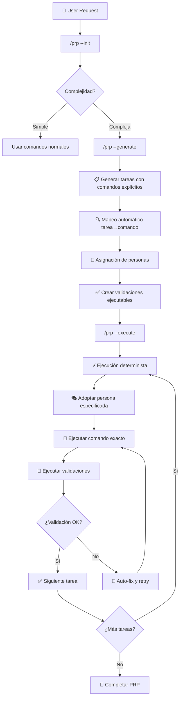

# 🎯 PRP Mode - Product Requirements Prompts para SuperClaude

## 🌟 Nuevo: Comandos Explícitos Deterministas

**REVOLUCIÓN**: Cada tarea en un PRP especifica **exactamente** qué comando SuperClaude ejecutar, con qué persona, sin interpretación.

## 📋 Qué es PRP Mode

PRP (Product Requirements Prompt) Mode es un sistema avanzado de Context Engineering integrado a SuperClaude para features complejas que requieren:

- **Planificación exhaustiva** con comandos deterministas
- **Validación multi-nivel** con loops automáticos
- **Comandos explícitos** sin interpretación o ambigüedad
- **Ejecución predecible** y repetible

## 🔍 Sistema de Decisión Inteligente

### 📊 Matriz de Complejidad

| Factor | Usar PRP | Comando Normal | Razón |
|--------|----------|----------------|-------|
| **Archivos afectados** | ≥3 | 1-2 | Coordinación multi-archivo |
| **Tiempo estimado** | >30 min | <30 min | Justifica planificación |
| **Sistemas integrados** | ≥2 | 1 | Requiere validación cruzada |
| **Criticidad** | Alta | Baja/Media | Zero-downtime requerido |
| **Patrón conocido** | No | Sí | Necesita investigación |

### ✅ Usar PRP Para:
- **Features complejas**: OAuth 2.0, sistemas de pagos, dashboards
- **Integraciones**: APIs externas, WebSockets, microservicios
- **Migraciones**: Cambios arquitectónicos, upgrades críticos
- **Nuevas tecnologías**: Frameworks desconocidos, patrones no probados

### ❌ Usar Comandos Normales Para:
- **Fixes simples**: Typos, bugs menores, hotfixes
- **Documentación**: READMEs, comentarios, guías
- **Configuración**: Variables, settings, ajustes menores
- **Patrones conocidos**: CRUD básico, componentes estándar

## 🚀 Quick Start con Comandos Explícitos

### 1. 🎯 Evaluación Inteligente
```bash
/prp --init "Implementar sistema de notificaciones push"

# Respuesta automática:
# ✅ Feature compleja detectada:
# • Multi-platform (web + mobile)
# • Integración externa (Firebase/APNS)  
# • >5 archivos estimados
# ➡️ PRP recomendado. Continuar con /prp --generate
```

### 2. 🧠 Generación con Comandos Deterministas
```bash
/prp --generate notifications-push --persona-architect --research-deep

# ✅ PRP generado: PRPs/notifications-push.md
# • 12 tareas con comandos SuperClaude explícitos
# • Cada tarea especifica: comando exacto + persona + validación
# • Investigación completa incluida
```

### 3. ⚡ Ejecución Sin Interpretación
```bash
/prp --execute PRPs/notifications-push.md --validation-strict

# ✅ Ejecutando Task 1: /analyze --architecture --push --integrations
# ✅ Adoptando persona: --persona-architect (automático)
# ✅ Ejecutando Task 2: /design --push --multi-platform --security
# ⏳ Ejecutando Task 3: /build --feature --push --firebase...
```

## 🔄 Workflow PRP con Comandos Explícitos



## 🛠️ Comandos PRP con Determinismo

### `/prp --init [description]` - Evaluador Inteligente
**Propósito**: Evalúa automáticamente si una feature necesita PRP basado en complejidad

```bash
# Ejemplos de evaluación
/prp --init "Agregar botón logout"
# → "Feature simple. Usar: /build --ui --component --uc"

/prp --init "Sistema pagos Stripe + webhooks + audit + notificaciones"
# → "Feature compleja detectada. PRP recomendado:"
# → "- 4 sistemas (pagos, webhooks, audit, notif)"
# → "- >8 archivos estimados"
# → "- Lógica crítica de negocio"
# → "Continuar con: /prp --generate payments-system"
```

### `/prp --generate [feature-name]` - Generador Determinista
**Propósito**: Crea PRPs con comandos SuperClaude explícitos para cada tarea

**Flujo interno**:
1. **Análisis de feature** → detecta tipo y complejidad
2. **Mapeo a comandos** → usa tabla Task_Command_Mapping 
3. **Asignación de personas** → basado en especialidad del dominio
4. **Generación de validaciones** → comandos ejecutables específicos
5. **Creación de PRP** → con comandos explícitos sin ambigüedad

```bash
# Diferentes enfoques especializados
/prp --generate oauth-auth --persona-architect --research-deep
# → Enfoque arquitectónico + investigación profunda

/prp --generate payment-flow --persona-security --template=api
# → Enfoque seguridad + plantilla API especializada

/prp --generate user-dashboard --persona-frontend --magic --template=frontend
# → Enfoque UX + componentes IA + plantilla frontend
```

**Nuevo: Mapeo Automático Tarea→Comando**
```yaml
# El sistema mapea automáticamente:
"Analyze auth system" → "/analyze --architecture --code --dependencies src/auth/"
"Design OAuth flow" → "/design --api --oauth --patterns --think-hard"  
"Implement tokens" → "/build --feature --security --token-refresh --tdd"
"Test security" → "/scan --security --owasp --oauth --strict"
```

### `/prp --execute [prp-file]` - Ejecutor Sin Interpretación
**Propósito**: Ejecuta PRPs de forma determinista sin decisiones autónomas

**Comportamiento Garantizado**:
- ✅ Ejecuta EXACTAMENTE el comando especificado en cada tarea
- ✅ Adopta la persona indicada antes de ejecutar
- ✅ Ejecuta validaciones tal como se especifican
- ❌ NUNCA decide qué herramienta usar
- ❌ NUNCA interpreta o modifica comandos
- ❌ NUNCA se salta validaciones

```bash
# Ejecución con diferentes niveles de validación
/prp --execute PRPs/oauth-auth.md --validation-level=strict
# → Todas las validaciones obligatorias + OWASP + coverage

/prp --execute PRPs/quick-fix.md --checkpoint=After_Core
# → Continuar desde checkpoint específico guardado

/prp --execute PRPs/complex-feature.md --interactive
# → Pausar en cada milestone para confirmación manual
```

**Progreso en Tiempo Real**:
```
═══════════════════════════════════════════════════
🚀 PRP: OAuth Authentication Implementation
📊 Status: In Progress (67%) | Persona: --persona-security
⏱️  Started: 14:30 | Estimated: 25 min remaining
═══════════════════════════════════════════════════
✅ Task 1: /analyze --architecture --code src/auth/ [3 min]
✅ Task 2: /design --oauth --security --patterns [8 min]  
⏳ Task 3: /build --feature --security --token-refresh
   Persona: --persona-security (adopted)
   Progress: Token encryption ✅ | Refresh logic 🔄
   
□  Task 4: /test --security --oauth --strict [PENDING]
□  Task 5: /scan --owasp --auth --compliance [PENDING]

🔍 Validations: 2/5 complete | 🚨 Issues: 0 | 📝 Todos: 8
═══════════════════════════════════════════════════
```

### `/prp --status` - Monitor de Progreso
**Propósito**: Monitorea estado actual de ejecución PRP con detalles

```bash
/prp --status
# Muestra: PRP activo, % completado, tarea actual, validaciones, blockers
```

### `/task:prp [task-id]` - Convertidor Inteligente  
**Propósito**: Convierte tareas existentes a formato PRP si la complejidad lo justifica

```bash
/task:prp 20250115-auth-system
# Evalúa complejidad → Convierte a PRP si ≥3 triggers
# Genera PRPs/auth-system.md con comandos explícitos
```

## 📁 Nueva Estructura Organizada

```
PRPs/
├── README.md                   # Esta guía completa
├── templates/                  # Plantillas especializadas
│   ├── prp_base.md            # Plantilla universal
│   ├── prp_api.md             # APIs REST/GraphQL
│   ├── prp_frontend.md        # Componentes UI/UX  
│   └── prp_fullstack.md       # Features end-to-end
├── examples/                   # Ejemplos completos reales
│   └── oauth-authentication.md # OAuth completo con comandos explícitos
└── docs/                       # Documentación técnica
    ├── architecture.md         # Arquitectura del sistema PRP
    └── integration-vision.md   # Visión de integración SuperClaude
```

## 📋 Estructura PRP con Comandos Explícitos

Los PRPs ahora incluyen comandos SuperClaude deterministas:

```yaml
name: "Feature Name - SuperClaude Implementation Spec"
description: |
  Comprehensive description with explicit commands

## Goal
Clear end state definition

## Why  
- Business value
- Problems solved

## What
User-visible behavior and technical requirements

### Success Criteria
- [ ] Measurable outcomes

## All Needed Context
Documentation, examples, gotchas with @include references

## Implementation Blueprint
Task breakdown with EXPLICIT SuperClaude commands:

Task 1: Analyze current system
  Priority: high
  Dependencies: []
  SuperClaude Command: /analyze --architecture --code --dependencies src/
  Persona: --persona-architect
  Files: ["src/auth/*", "src/models/*"]
  Validation: /test --unit --coverage src/
  Expected Output: Architecture analysis report

Task 2: Design new architecture  
  Priority: high
  Dependencies: [Task 1]
  SuperClaude Command: /design --api --patterns --security --think-hard
  Persona: --persona-architect
  Implementation: Follow DDD patterns
  Validation: /scan --security docs/design/
  Expected Output: Complete system design

[Additional tasks with explicit commands...]

## Validation Loop
Multi-level executable validations:
- Syntax: /test --lint --format
- Unit: /test --unit --coverage --strict  
- Integration: /test --integration --e2e
- Security: /scan --security --owasp --strict
- Performance: /test --performance --metrics

## Confidence Score: X/10
```

## Templates

### Available Templates

| Template | Use Case | Command Mappings | Key Sections |
|----------|----------|------------------|--------------|
| `prp_base.md` | General features | Standard mapping | Analysis→Design→Build→Test |
| `prp_api.md` | REST/GraphQL APIs | `/design --api`, `/build --api` | Endpoints, schemas, auth, validation |
| `prp_frontend.md` | UI components | `/build --react --magic`, `/test --e2e` | Components, state, styling, accessibility |
| `prp_fullstack.md` | End-to-end features | Full stack commands | All layers with explicit integration |

### Template Command Specialization

```yaml
API_Template:
  Analysis: "/analyze --api --architecture --dependencies"
  Design: "/design --api --patterns --security --openapi"
  Implementation: "/build --api --tdd --validation"
  Testing: "/test --api --integration --postman"
  
Frontend_Template:
  Analysis: "/analyze --frontend --components --dependencies"  
  Design: "/design --ui --accessibility --responsive"
  Implementation: "/build --react --components --magic"
  Testing: "/test --e2e --pup --accessibility"
  
Fullstack_Template:
  Analysis: "/analyze --fullstack --architecture --flows"
  Design: "/design --system --patterns --microservices"
  Implementation: "/build --fullstack --api --frontend"
  Testing: "/test --e2e --integration --performance"
```

### Using Templates

```bash
# Automatic template selection with command optimization
/prp --generate user-dashboard
# → Detects frontend patterns → Uses prp_frontend.md
# → Maps to: /build --react --magic --persona-frontend

# Force specific template with explicit commands
/prp --generate data-pipeline --template=api
# → Forces API template → Uses specialized API commands
# → Maps to: /design --api --patterns, /build --api --tdd

# Template with persona optimization
/prp --generate security-audit --template=base --persona-security
# → Uses base template + security persona
# → Maps commands: /scan --security --owasp --strict
```

## Integration with SuperClaude

### Command Execution Architecture
```yaml
PRP_Command_Execution:
  Deterministic_Flow:
    1. Parse_YAML_Front_Matter: "Extract explicit commands"
    2. Load_Context: "Required files, documentation"
    3. Execute_Exact_Command: "No interpretation or substitution"
    4. Adopt_Specified_Persona: "Apply persona before execution"
    5. Run_Validation: "Execute specified validation commands"
    6. Generate_Output: "Structured results"
    
  Command_Fidelity:
    ✅ Execute: "EXACTLY as specified in PRP"
    ❌ Never: "Interpret, substitute, or modify commands"
    ❌ Never: "Choose alternative tools"
    ❌ Never: "Skip validation steps"
```

### Task Management Hierarchy
```yaml
Level_0_PRPs:
  Description: "Product Requirements Prompts"
  Scope: "Complete features or major changes"
  Commands: "/prp --generate, /prp --execute"
  Auto_Generate: "Level_1 tasks from PRP breakdown"
  
Level_1_Tasks: 
  Description: "Individual PRP task items"
  Scope: "Single command execution"
  Commands: "Explicit SuperClaude commands"
  Auto_Generate: "Level_2 todos for tracking"
  
Level_2_Todos:
  Description: "TodoWrite tracking items"
  Scope: "Progress monitoring"
  Commands: "Status updates only"
  Sync: "Real-time with task completion"
```

### Persona-Driven Command Enhancement
```yaml
Persona_Command_Mapping:
  architect:
    Enhanced_Commands: ["/design", "/analyze", "/estimate"]
    Auto_Flags: ["--patterns", "--architecture", "--seq"]
    Quality_Focus: "System design and scalability"
    
  security:
    Enhanced_Commands: ["/scan", "/review", "/build"]
    Auto_Flags: ["--security", "--owasp", "--strict"]
    Quality_Focus: "Security validation and compliance"
    
  frontend:
    Enhanced_Commands: ["/build", "/test", "/improve"]
    Auto_Flags: ["--react", "--magic", "--pup", "--accessibility"]
    Quality_Focus: "User experience and accessibility"
    
  backend:
    Enhanced_Commands: ["/build", "/migrate", "/deploy"]
    Auto_Flags: ["--api", "--tdd", "--c7"]
    Quality_Focus: "Server logic and data integrity"
```

### Universal Flag Integration
```yaml
PRP_Compatible_Flags:
  Token_Optimization:
    --uc: "Mandatory for large PRPs (auto-applied)"
    --think-hard: "Design and architecture tasks"
    --ultrathink: "Critical business logic decisions"
    
  Execution_Control:
    --plan: "Show task breakdown before execution"
    --dry-run: "Preview PRP execution without changes"
    --interactive: "Pause at each major milestone"
    --validate: "Extra validation on all tasks"
    
  MCP_Integration:
    --seq: "Complex analysis and reasoning tasks"
    --c7: "Library research and documentation"
    --magic: "UI component generation"
    --pup: "E2E testing and automation"
```

## Best Practices

### DO:
1. **Evaluate First**: Always run `/prp --init` before assuming PRP is needed
2. **Use Explicit Commands**: Specify exact SuperClaude commands in each task
3. **Choose Personas**: Select appropriate persona for domain expertise
4. **Include Context**: Reference all needed files and documentation
5. **Define Validations**: Specify executable validation commands
6. **Track Progress**: Monitor execution with `/prp --status`
7. **Review Generated PRPs**: Check command accuracy before execution
8. **Trust the System**: Let command mapping guide implementation

### DON'T:
1. **Force PRPs**: Don't use for simple tasks (trust `/prp --init` evaluation)
2. **Use Vague Commands**: Avoid "implement feature X" - use explicit commands
3. **Skip Research**: Generated PRPs need comprehensive context
4. **Ignore Validation Failures**: Fix errors before proceeding
5. **Modify Commands During Execution**: PRPs execute exactly as specified
6. **Bypass Triggers**: Trust complexity evaluation metrics
7. **Mix Modes**: Complete PRP before switching to direct commands
8. **Assume Tool Selection**: Each task must specify exact command

## Examples

### Example 1: API Feature with Explicit Commands
```bash
# Evaluate need first
/prp --init "Create subscription management API with billing integration"

# Expected response:
# ✅ Feature compleja detectada:
# • Multi-system (API + billing + webhooks)
# • >5 archivos estimados
# • Lógica crítica de negocio
# ➡️ PRP recomendado. Continuar con /prp --generate

# Generate with API template and architect persona
/prp --generate subscription-api --persona-architect --template=api

# Review generated commands (example content):
/read PRPs/subscription-api.md
# Task 1: SuperClaude Command: /analyze --api --billing --dependencies
# Task 2: SuperClaude Command: /design --api --patterns --webhooks --seq
# Task 3: SuperClaude Command: /build --api --subscription --tdd

# Execute with strict validation
/prp --execute PRPs/subscription-api.md --validation-level=strict
```

### Example 2: Frontend Component with Magic Integration
```bash
# Evaluate component complexity
/prp --init "Build interactive analytics dashboard with real-time charts"

# Generate with frontend template and QA focus
/prp --generate analytics-dashboard --persona-qa --template=frontend

# Generated commands will include:
# Task 1: /analyze --frontend --charts --state-management
# Task 2: /design --ui --realtime --responsive 
# Task 3: /build --react --charts --magic --realtime
# Task 4: /test --e2e --pup --accessibility

# Execute with interactive milestones
/prp --execute PRPs/analytics-dashboard.md --interactive
```

### Example 3: Task Conversion to Deterministic PRP
```bash
# Initially create standard task
/task:create "Implement user permissions and role management system"

# Task becomes complex during analysis, convert to PRP
/task:prp 20250115-permissions-task

# System generates PRP with explicit commands:
# Task 1: /analyze --permissions --rbac --dependencies src/auth/
# Task 2: /design --rbac --patterns --security --seq
# Task 3: /build --permissions --middleware --tdd
# Task 4: /scan --security --rbac --owasp --strict

# Execute deterministic implementation
/prp --execute PRPs/permissions-system.md
```

### Example 4: Security-First Implementation
```bash
# Security-critical feature evaluation
/prp --init "Payment processing with PCI compliance and fraud detection"

# Auto-selects security persona due to keywords
/prp --generate payment-processor --persona-security --template=api

# Generated with security-enhanced commands:
# Task 1: /analyze --payments --pci --security --architecture
# Task 2: /design --payments --encryption --compliance --seq
# Task 3: /build --payments --pci --vault --tdd
# Task 4: /scan --security --pci --owasp --strict --compliance

# Execute with maximum validation
/prp --execute PRPs/payment-processor.md --validation-level=strict --persona-security
```

## Troubleshooting

| Issue | Cause | Solution |
|-------|-------|----------|
| "Feature too simple for PRP" | <3 complexity triggers | Use standard SuperClaude commands: `/build`, `/test` |
| "Context overflow during generation" | Large feature scope | Use `--uc` flag or split into smaller PRPs |
| "Validation keeps failing" | Command/environment mismatch | Check error details, fix incrementally with `/troubleshoot` |
| "Commands seem incorrect" | Template/persona mismatch | Regenerate with appropriate persona and template |
| "PRP execution stalls" | Missing dependencies | Check required files and environment setup |
| "Can't find good patterns" | Insufficient research | Use `--research-deep` flag or include more context |
| "Commands not executing exactly" | Interpretation mode active | Verify PRP has explicit commands, not descriptions |
| "Validation commands fail" | Environment not ready | Run setup commands first: `/dev-setup`, check prerequisites |
| "Performance issues" | Token budget exceeded | Use `--uc` mode, reduce context, or use checkpoints |
| "Mixed command styles" | Legacy PRP format | Update to explicit command format with recent examples |

## Performance Tips

### Command Optimization
1. **Evaluate First**: Use `/prp --init` to avoid unnecessary PRP overhead
2. **Explicit Commands**: Reduce interpretation overhead with exact commands
3. **Batch Validation**: Group related validation commands together
4. **Smart Compression**: Use `--uc` automatically for >15K token PRPs

### Execution Efficiency  
1. **Appropriate Templates**: Choose template matching feature type
2. **Persona Selection**: Use specialized personas for faster, better results
3. **Checkpoint Usage**: Resume from saved states after breaks
4. **Progressive Validation**: Not all features need strict validation
5. **MCP Optimization**: Use MCP servers strategically (`--seq`, `--c7`, `--magic`, `--pup`)

### Context Management
1. **Focused Context**: Include only necessary files and documentation
2. **Reference Pattern**: Use `@include` for shared patterns vs. inline
3. **Token Budgeting**: Monitor token usage with estimated costs
4. **Session Awareness**: Complete PRPs within context limits

### Quality vs Speed
```yaml
Quick_Development:
  Commands: "Basic flags, minimal validation"
  Use_Case: "Prototypes, experiments, non-critical features"
  Template: "prp_base.md"
  
Production_Ready:
  Commands: "Full validation, security scans, comprehensive testing" 
  Use_Case: "Production features, critical business logic"
  Template: "Feature-specific templates with full validation"
  
Security_Critical:
  Commands: "Maximum validation, security persona, OWASP compliance"
  Use_Case: "Payment, auth, data handling systems"
  Template: "Enhanced security validation in all templates"
```

---

*PRP Mode enhances SuperClaude for complex features while maintaining simplicity for everyday tasks.*