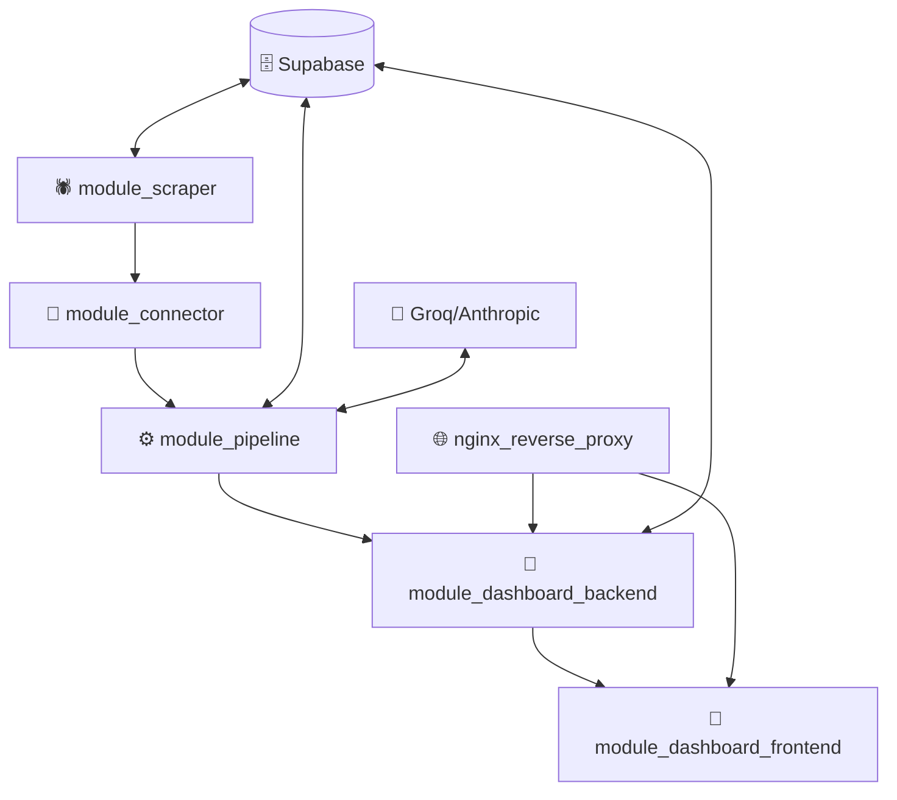

# La Máquina de Noticias

**Sistema modular para recopilación, procesamiento y análisis automatizado de noticias.** Herramienta diseñada para periodistas que permite extracción de conocimiento estructurado desde grandes volúmenes de texto utilizando inteligencia artificial.

## 🎯 **Estado del Proyecto: MVP FUNCIONAL** ✅

**La Máquina de Noticias** ha alcanzado un **Producto Mínimo Viable (MVP)** completamente funcional con **6 módulos implementados** que cubren el flujo completo desde recopilación hasta presentación.

> 📋 **Ver [GOALS.md](GOALS.md)** para objetivos detallados, roadmap y lecciones aprendidas del MVP.

---

## 🏗️ **Arquitectura MVP - Microservicios Docker**

**Cada módulo es un contenedor Docker independiente y autónomo, conectado mediante APIs.**



### **Principios de Diseño MVP**

- **Independencia Total**: Cada contenedor está construido en docker de forma autónoma, por lo que cada uno selecciona sus tecnologías óptimas... sin crear problemas por incompatibilidad entre módulos
- **Comunicación por Red**: Intercambio únicamente por APIs REST/HTTP  
- **Autonomía de Configuración**: Variables de entorno específicas por módulo
- **Seguridad Uniforme**: Prácticas consistentes (usuarios no-root, health checks)

---

## 📋 **Módulos Implementados en el MVP**

| **Módulo** | **Tecnología** | **Puerto** | **Estado** | **Función** |
|------------|----------------|------------|------------|-------------|
| **module_scraper** | Python 3.10 + Scrapy + Playwright | N/A | ✅ **Implementado** | Recopilación automática de noticias |
| **module_connector** | Python 3.9 + AsyncIO | N/A | ✅ **Implementado** | Conector entre scraper y pipeline |
| **module_pipeline** | Python 3.9 + FastAPI + spaCy + ML | 8003 | ✅ **Implementado** | Procesamiento con IA/LLMs |
| **module_dashboard_review_backend** | Python 3.9 + FastAPI | 8004 | ✅ **Implementado** | API backend dashboard editorial |
| **module_dashboard_review_frontend** | React 18 + TypeScript + Vite | 3001→80 | ✅ **Implementado** | UI dashboard para periodistas |
| **nginx_reverse_proxy** | Nginx 1.25 Alpine | 80, 443 | ✅ **Implementado** | Proxy reverso y balanceador |

### **Flujo de Datos MVP**

1. **🕷️ Extracción**: `module_scraper` recopila noticias de fuentes web usando Scrapy + Playwright
2. **🔗 Conectividad**: `module_connector` transfiere datos entre scraper y pipeline  
3. **⚙️ Procesamiento**: `module_pipeline` aplica IA/ML para análisis con LLMs (Groq/Anthropic)
4. **🗄️ Almacenamiento**: Datos estructurados almacenados en Supabase (PostgreSQL + Storage)
5. **📱 Presentación**: Dashboard web para periodistas accesible vía `nginx_reverse_proxy`

---

## 📁 **Estructura del Proyecto MVP**

```
LaMaquinaDeNoticias/
├── 📋 GOALS.md                          # Objetivos y roadmap del proyecto
├── 📋 README.md                         # Este archivo
├── 🐳 docker-compose.yml                # Orquestación de servicios MVP
├── 🔧 .env.example                      # Plantilla configuración
├── 📦 requirements.txt                  # Dependencias globales
│
├── 🗂️ src/                              # Módulos implementados
│   ├── 🕷️ module_scraper/               # Web scraping (Python 3.10)
│   │   ├── 🐳 Dockerfile                # Container scraper optimizado
│   │   ├── ⚙️ scrapy.cfg                # Configuración Scrapy
│   │   ├── 📋 requirements.txt          # Dependencias específicas
│   │   └── 📚 README.md                 # Documentación scraper
│   │
│   ├── 🔗 module_connector/             # Worker service (Python 3.9)
│   │   ├── 🐳 Dockerfile                # Container worker
│   │   ├── ⚙️ src/                      # Código fuente connector
│   │   └── 📋 requirements.txt          # Dependencias AsyncIO
│   │
│   ├── ⚙️ module_pipeline/              # ML processing (Python 3.9)
│   │   ├── 🐳 Dockerfile                # Container FastAPI + ML
│   │   ├── 🌐 src/                      # APIs y lógica ML
│   │   ├── 🧪 tests/                    # Tests comprehensivos
│   │   └── 📋 requirements.txt          # spaCy + LLMs + FastAPI
│   │
│   ├── 🔧 module_dashboard_review_backend/  # API Backend (Python 3.9)
│   │   ├── 🐳 Dockerfile                # Container FastAPI
│   │   ├── 🌐 src/                      # APIs dashboard
│   │   ├── 🧪 tests/                    # Tests API
│   │   └── 📋 requirements.txt          # FastAPI + Supabase
│   │
│   ├── 📱 module_dashboard_review_frontend/ # UI Frontend (React 18)
│   │   ├── 🐳 Dockerfile                # Multi-stage: Node + Nginx
│   │   ├── ⚛️ src/                      # Componentes React + TS
│   │   ├── 📦 package.json              # Dependencias Node
│   │   └── ⚙️ vite.config.ts            # Configuración build
│   │
│   └── 🌐 nginx_reverse_proxy/          # Proxy + Load Balancer
│       ├── 🐳 docker/Dockerfile         # Container Nginx optimizado
│       ├── ⚙️ config/nginx.conf         # Configuración proxy
│       └── 📜 scripts/                  # Scripts deployment
│
├── 🗄️ BaseDeDatos_SUPABASE/             # Configuración BD
│   ├── 📜 migrations/                   # Migraciones SQL
│   ├── 📜 scripts/                      # Scripts utilidad BD
│   └── 📚 GUIA_BD.md                    # Documentación BD
│
└── 🧪 tests/                            # Tests integración global
    └── test_supabase_integration.py     # Tests MVP completo
```

---

### **Endpoints Principales del MVP**

| **Servicio** | **Endpoint Interno** | **Endpoint Externo** | **Documentación** |
|--------------|----------------------|----------------------|-------------------|
| Pipeline API | `module_pipeline:8003` | `localhost:8003` | `/docs` |
| Dashboard API | `module_dashboard_review_backend:8004` | `localhost:8004` | `/docs` |
| Frontend UI | `module_dashboard_review_frontend:80` | `localhost` (via nginx) | N/A |

---

## ⚙️ **Configuración Consolidada**

### **🚀 Setup Rápido (5 minutos)**

```bash
# 1. Clonar y configurar entorno
git clone <repo-url>
cd LaMaquinaDeNoticias

# 2. Configurar variables de entorno
cp .env.example .env
# Editar .env con tus credenciales reales

# 3. Instalar dependencias globales
pip install -r requirements.txt

# 4. Configurar modelos de spaCy
python -m spacy download es_core_news_lg
python -m spacy download en_core_web_sm

# 5. Configurar Playwright
playwright install

# 6. Levantar servicios
docker-compose up -d
```

### **📋 Variables de Entorno Principales**

**⚠️ REQUERIDAS (obligatorias para funcionamiento básico):**
```env
# === SUPABASE (Base de datos) ===
PROJECT_URL="https://tu-proyecto.supabase.co"
SUPABASE_ANON_KEY="eyJhbG..."  # Clave anónima
SUPABASE_SERVICE_ROLE_KEY="eyJhbG..."  # Clave de servicio
SUPABASE_DB_PASSWORD="tu-password-seguro"

# === IA/LLMs (Procesamiento) ===
GROQ_API_KEY="gsk_tu-api-key"  # Requerida para module_pipeline

# === CONFIGURACIÓN BÁSICA ===
SCRAPER_TARGET_URLS="url1,url2,url3"  # URLs objetivo scraping
LOG_LEVEL="INFO"  # DEBUG, INFO, WARNING, ERROR
```

**🔧 OPCIONALES (funcionalidades avanzadas):**
```env
# APIs adicionales de IA
ANTHROPIC_API_KEY=""     # Claude (TaskMaster, funciones avanzadas)
OPENAI_API_KEY=""        # GPT models
PERPLEXITY_API_KEY=""    # Research capabilities

# Monitoreo y alertas
SENTRY_DSN=""            # Error tracking
SLACK_WEBHOOK=""         # Notificaciones

# Configuración de entorno
ENVIRONMENT="development"  # development, staging, production
DEBUG_MODE="false"       # Solo para desarrollo
```

### **🗂️ Configuración por Módulo**

**El proyecto utiliza configuración HÍBRIDA:**

- **🌐 Variables Globales** (`.env` raíz): Compartidas entre módulos
  - Credenciales Supabase
  - APIs de IA (Groq, Anthropic, etc.)
  - Configuración de logging
  - URLs de comunicación inter-servicios

- **⚙️ Variables Específicas** (cada `src/module_*/.env.example`):
  - **module_scraper**: Configuración Playwright, timeouts
  - **module_connector**: Directorios, polling intervals
  - **module_pipeline**: Configuración ML, modelos, límites de contenido
  - **module_dashboard_backend**: CORS, puerto API
  - **module_dashboard_frontend**: Variables VITE_*
  - **nginx_reverse_proxy**: Configuración de proxy

**📁 Jerarquía de Configuración:**
```
1. Variables globales (.env raíz)          ← Compartidas
2. Variables específicas (src/module_*/)   ← Sobrescriben si existe conflicto
3. Variables de Docker Compose             ← Runtime específico
```

### **📦 Dependencias Consolidadas**

**El archivo `requirements.txt` global consolida TODAS las dependencias:**

- **✅ Ventajas**: Versiones sincronizadas, sin conflictos
- **⚙️ Uso**: `pip install -r requirements.txt` instala todo
- **🔄 Sincronización**: Cada módulo mantiene su `requirements.txt` específico

**📊 Categorías de dependencias:**
- Frameworks web (FastAPI, Uvicorn)
- Base de datos (Supabase, PostgreSQL)
- IA/ML (Groq, spaCy, sentence-transformers)
- Web scraping (Scrapy, Playwright, BeautifulSoup)
- Testing (pytest, pytest-asyncio)
- Utilidades (tenacity, loguru, pydantic)

### **🐳 Docker y Entornos**

**Configuración de entornos:**
```bash
# Desarrollo local
ENVIRONMENT=development
DEBUG_MODE=true
LOG_LEVEL=DEBUG

# Staging/Testing  
ENVIRONMENT=staging
DEBUG_MODE=false
LOG_LEVEL=INFO

# Producción
ENVIRONMENT=production
DEBUG_MODE=false
LOG_LEVEL=WARNING
```

**Variables Docker específicas:**
```env
# Comunicación inter-servicios
PIPELINE_API_URL=http://module_pipeline:8003
DASHBOARD_API_URL=http://module_dashboard_review_backend:8004
FRONTEND_URL=http://module_dashboard_review_frontend:80
```

---

### **🔍 Validación de Configuración**

**Verificar configuración básica:**
```bash
# Test conexión Supabase
curl -H "apikey: $SUPABASE_ANON_KEY" "$SUPABASE_URL/rest/v1/"

# Test API Pipeline
curl http://localhost:8003/health

# Test API Dashboard
curl http://localhost:8004/health

# Test Frontend
curl http://localhost/
```

**Logs de verificación:**
```bash
# Ver logs de todos los servicios
docker-compose logs -f

# Ver logs específicos
docker-compose logs -f module_pipeline
docker-compose logs -f module_scraper
```

### **❗ Troubleshooting Común**

| **Problema** | **Causa** | **Solución** |
|--------------|-----------|-------------|
| `ModuleNotFoundError` | Dependencias no instaladas | `pip install -r requirements.txt` |
| `Connection refused Supabase` | Credenciales incorrectas | Verificar `.env` y credenciales |
| `Groq API Error` | API key inválida | Verificar `GROQ_API_KEY` |
| `Port already in use` | Puerto ocupado | Cambiar puertos en `docker-compose.yml` |
| `Permission denied` | Problemas Docker | `sudo docker-compose up` |

---

## 📚 **Documentación MVP**

| **Documento** | **Propósito** | **Audiencia** |
|---------------|---------------|---------------|
| **[GOALS.md](GOALS.md)** | Objetivos, MVP status, roadmap | Product & Development |
| **[README.md](README.md)** | Quick start y overview | Todos los usuarios |
| **src/module_*/README.md** | Documentación técnica específica | Desarrolladores |
| **BaseDeDatos_SUPABASE/GUIA_BD.md** | Schema y configuración BD | Backend developers |
| **src/module_*/.env.example** | Configuración específica por módulo | DevOps/Deployment |
| **.env.example** | Configuración global consolidada | Administradores |