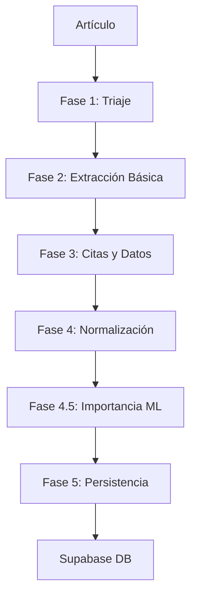

# Module Pipeline - La Máquina de Noticias

Núcleo de procesamiento inteligente para extracción de información estructurada de artículos de noticias y documentos extensos usando LLMs.

## 🎯 Propósito

El `module_pipeline` procesa contenido textual a través de 6 fases secuenciales para extraer:
- **Hechos estructurados** con metadata completa
- **Entidades normalizadas** (personas, organizaciones, lugares)
- **Citas textuales** atribuidas a entidades específicas
- **Datos cuantitativos** estructurados
- **Relaciones** entre elementos extraídos

## 🏗️ Arquitectura

```
Pipeline de 6 Fases:
1️⃣ Preprocesamiento y Triaje
2️⃣ Extracción de Elementos Básicos
3️⃣ Extracción de Citas y Datos Cuantitativos
4️⃣ Normalización, Vinculación y Relaciones
4.5️⃣ Evaluación de Importancia Contextual (ML)
5️⃣ Ensamblaje Final y Persistencia Atómica
```

### Componentes Principales

- **API REST** (FastAPI): Endpoints `/procesar`, `/health`, `/metrics`
- **Procesamiento Asíncrono**: Cola de trabajos con workers concurrentes
- **Integración LLM**: Groq API para procesamiento de lenguaje natural
- **Base de Datos**: Supabase/PostgreSQL con RPCs especializadas
- **Manejo de Errores**: Sistema robusto con fallbacks por fase

## 🚀 Instalación Rápida

### 1. Configurar entorno virtual
```bash
python -m venv venv
source venv/bin/activate  # Windows: venv\\Scripts\\activate
```

### 2. Instalar dependencias
```bash
pip install -r requirements.txt
```

### 3. Configurar variables de entorno
```bash
cp .env.example .env
# Editar .env con tus claves de API
```

### 4. Variables mínimas requeridas
```bash
GROQ_API_KEY="gsk_your_key_here"
SUPABASE_URL="https://tu-proyecto.supabase.co"
SUPABASE_KEY="your_anon_key"
```

### 5. (Opcional) Instalar modelos spaCy
```bash
python -m spacy download es_core_news_lg
python -m spacy download en_core_web_sm
```

## 🔧 Configuración

### Variables de Entorno Clave

| Variable | Requerida | Default | Descripción |
|----------|-----------|---------|-------------|
| `GROQ_API_KEY` | ✅ | - | API key de Groq |
| `SUPABASE_URL` | ✅ | - | URL proyecto Supabase |
| `SUPABASE_KEY` | ✅ | - | Clave anónima Supabase |
| `API_PORT` | ❌ | 8000 | Puerto del servidor |
| `WORKER_COUNT` | ❌ | 3 | Workers concurrentes |
| `LOG_LEVEL` | ❌ | INFO | Nivel de logging |

Ver `.env.example` para configuración completa.

## 🏃 Uso

### Iniciar el servidor
```bash
python main.py
```

### Procesar un artículo
```bash
curl -X POST "http://localhost:8000/procesar" \\
  -H "Content-Type: application/json" \\
  -d '{
    "articulo": {
      "medio": "Ejemplo Noticias",
      "pais_publicacion": "España",
      "tipo_medio": "Diario Digital",
      "titular": "Titular de ejemplo",
      "fecha_publicacion": "2024-01-15T10:00:00Z",
      "contenido_texto": "Contenido del artículo..."
    }
  }'
```

### Verificar estado
```bash
curl http://localhost:8000/health
curl http://localhost:8000/metrics
```

## 📁 Estructura del Proyecto

```
module_pipeline/
├── src/                      # Código fuente
│   ├── models/              # Modelos Pydantic
│   ├── phases/              # Fases del pipeline
│   ├── services/            # Servicios externos
│   ├── utils/               # Utilidades
│   └── api/                 # Endpoints FastAPI
├── prompts/                 # Prompts LLM externos
├── tests/                   # Tests unitarios
├── docs/                    # Documentación técnica
├── logs/                    # Logs del sistema
└── models/                  # Modelos ML
```

## 🔄 Flujo de Procesamiento



## 🧪 Testing

```bash
# Ejecutar tests
pytest

# Tests específicos
pytest tests/test_phases/
pytest tests/test_api/

# Con cobertura
pytest --cov=src tests/
```

## 📊 Monitoreo

### Health Check
- **Estado**: `healthy` | `degraded`
- **Conectividad**: Groq, Supabase
- **Workers**: Activos/Total
- **Cola**: Elementos pendientes

### Métricas
- Artículos procesados (total, exitosos, fallidos)
- Tiempo promedio por fase
- Errores por tipo
- Throughput del sistema

## 🔗 Integración

### Entrada desde module_connector
```json
{
  "articulo": {
    "medio": "string",
    "contenido_texto": "string",
    // ... otros campos
  }
}
```

### Salida a Supabase
- Tablas: `hechos`, `entidades`, `citas_textuales`, `datos_cuantitativos`
- RPCs: `insertar_articulo_completo`, `insertar_fragmento_completo`

## 🛠️ Desarrollo

### Agregar nueva fase
1. Crear módulo en `src/phases/`
2. Implementar función principal
3. Integrar en `controller.py`
4. Añadir tests correspondientes

### Configurar nuevo servicio
1. Crear módulo en `src/services/`
2. Implementar cliente/wrapper
3. Configurar variables de entorno
4. Documentar integración

## 📚 Documentación

- [`docs/`](docs/): Documentación técnica completa
- [API Spec](docs/02-interfaz-api.md): Especificación de endpoints
- [Arquitectura](docs/01-la-maquina-de-noticias.md): Visión general del sistema
- [Configuración](docs/08-configuracion-e-infraestructura.md): Setup detallado

## 🔍 Troubleshooting

### Problemas comunes
- **Error Groq API**: Verificar `GROQ_API_KEY` y conectividad
- **Error Supabase**: Verificar URL y claves, RPCs implementadas
- **Memory issues**: Ajustar `WORKER_COUNT`, verificar modelos spaCy
- **JSON malformado**: Logs en `logs/errors/` con detalles

### Logs útiles
```bash
tail -f logs/pipeline.log
tail -f logs/errors/error.log
```

## 🤝 Contribución

1. Fork del repositorio
2. Crear rama feature (`git checkout -b feature/nueva-funcionalidad`)
3. Commit cambios (`git commit -am 'Añadir nueva funcionalidad'`)
4. Push rama (`git push origin feature/nueva-funcionalidad`)
5. Crear Pull Request

## 📄 Licencia

[Especificar licencia del proyecto]

---

**La Máquina de Noticias** - Transformando información no estructurada en conocimiento conectado.
