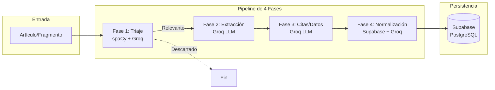

# Module Pipeline - La Máquina de Noticias 🔄

> **Sistema de Procesamiento Inteligente de Noticias con IA**  
> Transforma texto no estructurado en conocimiento estructurado mediante un pipeline de 4 fases con LLMs

## 📋 Tabla de Contenidos

1. [Visión General](#-visión-general)
2. [Arquitectura del Pipeline](#-arquitectura-del-pipeline)
3. [Las 4 Fases en Detalle](#-las-4-fases-en-detalle)
4. [Configuración](#-configuración)
5. [API y Endpoints](#-api-y-endpoints)
6. [Flujo de Datos](#-flujo-de-datos)
7. [Sistema de Prompts](#-sistema-de-prompts)
8. [Integración con Servicios](#-integración-con-servicios)
9. [Monitoreo y Métricas](#-monitoreo-y-métricas)
10. [Desarrollo](#-desarrollo)
11. [Troubleshooting](#-troubleshooting)
12. [Optimización y Performance](#-optimización-y-performance)

## 🎯 Visión General

El **Module Pipeline** es el núcleo de procesamiento inteligente de La Máquina de Noticias. Recibe artículos periodísticos y los procesa a través de 4 fases secuenciales, extrayendo información estructurada mediante LLMs (principalmente Groq) y persistiéndola en Supabase.

### Características Principales

- ✅ **Pipeline de 4 Fases**: Triaje → Extracción → Citas/Datos → Normalización
- ✅ **Procesamiento con IA**: Groq API (LLAMA 3.1 8B) para análisis profundo
- ✅ **Extracción Estructurada**: Hechos, entidades, citas, datos cuantitativos y relaciones
- ✅ **Normalización Inteligente**: Deduplicación y enriquecimiento de entidades
- ✅ **API REST**: FastAPI con documentación automática
- ✅ **Procesamiento Asíncrono**: Para artículos largos
- ✅ **Monitoreo Completo**: Métricas Prometheus, alertas, dashboards

### Stack Tecnológico

| Componente | Tecnología | Versión | Propósito |
|------------|------------|---------|-----------|
| **API Framework** | FastAPI | 0.115.6 | API REST async de alto rendimiento |
| **LLM Provider** | Groq | - | Procesamiento con LLAMA 3.1 8B |
| **NLP** | spaCy | 3.7+ | Preprocesamiento y análisis lingüístico |
| **Base de Datos** | Supabase | - | PostgreSQL + pgvector + RPCs |
| **Validación** | Pydantic | 2.11.5 | Modelos de datos con validación estricta |
| **Logging** | Loguru | 0.7.3 | Logging estructurado y contextual |
| **HTTP Client** | httpx | 0.28.1 | Cliente HTTP async para APIs |

## 🏗️ Arquitectura del Pipeline


```mermaid
graph LR
    subgraph "Entrada"
        A[Artículo/Fragmento]
    end
    
    subgraph "Pipeline de 4 Fases"
        B[Fase 1: Triaje<br/>spaCy + Groq]
        C[Fase 2: Extracción<br/>Groq LLM]
        D[Fase 3: Citas/Datos<br/>Groq LLM]
        E[Fase 4: Normalización<br/>Supabase + Groq]
    end
    
    subgraph "Persistencia"
        F[(Supabase<br/>PostgreSQL)]
    end
    
    A --> B
    B -->|Relevante| C
    B -.->|Descartado| X[Fin]
    C --> D
    D --> E
    E --> F
```

### Flujo de Procesamiento

1. **Recepción**: API recibe artículo completo o fragmento
2. **Validación**: Pydantic valida estructura de entrada
3. **Procesamiento**: Ejecución secuencial de las 4 fases
4. **Persistencia**: Almacenamiento atómico en Supabase
5. **Respuesta**: Retorna IDs de elementos persistidos

## 🔄 Las 4 Fases en Detalle

### Fase 1: Triaje y Preprocesamiento 🔍

**Objetivo**: Filtrar contenido relevante y preparar el texto para procesamiento

```python
# Entrada
FragmentoProcesableItem(
    id_fragmento="doc_001",
    texto_original="Texto del artículo...",
    metadata_adicional={...}
)

# Salida
ResultadoFase1Triaje(
    es_relevante=True,
    decision_triaje="PROCESAR",
    justificacion_triaje="Alta relevancia política y densidad factual",
    texto_para_siguiente_fase="Texto limpio y normalizado...",
    puntuacion_triaje=22
)
```

**Procesos**:
- 🧹 **Limpieza de texto**: Elimina caracteres especiales, normaliza espacios
- 🌐 **Detección de idioma**: Identifica idioma con spaCy # ¿El spacy que estamos utilizando puede detectar otros idiomas que no sea el español?
- 📊 **Evaluación de relevancia**: 5 criterios con escala 1-5
- 🔤 **Traducción**: Si no está en español, traduce con Groq

**Criterios de Evaluación**:
1. **Relevancia Geográfica** [1-5]: Países hispanohablantes
2. **Relevancia Temática** [1-5]: Política, economía, conflictos, etc.
3. **Densidad Factual** [1-5]: Cantidad de hechos verificables
4. **Complejidad Relacional** [1-5]: Conexiones entre elementos
5. **Valor Informativo** [1-5]: Importancia para análisis

**Decisión**: 
- **PROCESAR** (17-25 puntos)
- **CONSIDERAR** (12-16 puntos)
- **DESCARTAR** (<12 puntos)

### Fase 2: Extracción de Elementos Básicos 📝

**Objetivo**: Extraer hechos principales y entidades mencionadas

```python
# Entrada: ResultadoFase1Triaje
# Salida
ResultadoFase2Extraccion(
    hechos_extraidos=[
        HechoProcesado(
            id_secuencial=1,
            texto_original_del_hecho="Pedro Sánchez anunció medidas económicas",
            tipo="ANUNCIO",
            metadata_hecho=MetadatosHecho(
                pais=["España"],
                precision_temporal="dia"
            )
        )
    ],
    entidades_extraidas=[
        EntidadProcesada(
            id_secuencial=1,
            nombre="Pedro Sánchez",
            tipo="PERSONA",
            descripcion="Presidente del Gobierno español"
        )
    ]
)
```

**Tipos de Entidades**:
- 👤 **PERSONA**: Individuos mencionados
- 🏢 **ORGANIZACION**: Empresas, partidos, ONGs
- 🏛️ **INSTITUCION**: Entidades gubernamentales
- 📍 **LUGAR**: Ubicaciones geográficas
- 📅 **EVENTO**: Eventos con nombre propio
- 📜 **NORMATIVA**: Leyes, decretos, normas
- 💡 **CONCEPTO**: Ideas o fenómenos definidos

**Tipos de Hechos**:
- 📰 **SUCESO**: Eventos que ocurrieron
- 📢 **ANUNCIO**: Comunicaciones oficiales
- 💬 **DECLARACION**: Afirmaciones de personas
- 👥 **BIOGRAFIA**: Información biográfica
- 💭 **CONCEPTO**: Definiciones o explicaciones
- ⚖️ **NORMATIVA**: Información legal
- 🎯 **EVENTO**: Eventos planificados

### Fase 3: Extracción de Citas y Datos 💬

**Objetivo**: Extraer citas textuales y datos cuantitativos

```python
# Entrada: ResultadoFase2Extraccion + contexto original
# Salida
ResultadoFase3CitasDatos(
    citas_textuales_extraidas=[
        CitaTextual(
            id_secuencial=1,
            texto_de_cita="Estas medidas son fundamentales para las familias",
            persona_que_cita="Pedro Sánchez",
            entidad_id_vinculada=1,  # ID de Pedro Sánchez
            contexto_de_cita="Durante rueda de prensa"
        )
    ],
    datos_cuantitativos_extraidos=[
        DatosCuantitativos(
            id_secuencial=1,
            valor=15000,
            unidad="millones de euros",
            indicador_asociado="inversión en energías renovables",
            categoria="económico"
        )
    ]
)
```

**Extracción de Citas**:
- Texto exacto entrecomillado
- Identificación del emisor
- Contexto de la declaración
- Vinculación con entidad correspondiente

**Extracción de Datos**:
- Valores numéricos con unidades
- Categorización (económico, demográfico, etc.)
- Periodo temporal asociado
- Tendencias (aumento/disminución/estable)

### Fase 4: Normalización, Vinculación y Relaciones 🔗

**Objetivo**: Normalizar entidades y detectar relaciones entre elementos

```python
# Entrada: Resultados de fases anteriores
# Salida
ResultadoFase4Normalizacion(
    entidades_normalizadas=[
        EntidadProcesada(
            # ... campos anteriores ...
            entidad_id_normalizada=UUID("..."),
            nombre_canonico="Sánchez Pérez-Castejón, Pedro",
            uri_wikidata="Q6083139",
            score_similitud=0.95
        )
    ],
    metadata_normalizacion={
        "relaciones": {
            "hecho_entidad": [...],
            "hecho_hecho": [...],
            "entidad_entidad": [...],
            "contradicciones": [...]
        }
    }
)
```

**Procesos de Normalización**:
1. **Búsqueda de Similares**: Compara con entidades en BD
2. **Deduplicación**: Agrupa variantes del mismo elemento
3. **Enriquecimiento**: Añade URIs de Wikidata
4. **Canonización**: Establece nombre estándar

**Tipos de Relaciones**:

**Hecho-Entidad**:
- `protagonista`, `afectado`, `declarante`, `ubicacion`

**Hecho-Hecho**:
- `causa`, `consecuencia`, `contexto_historico`, `respuesta_a`

**Entidad-Entidad**:
- `miembro_de`, `aliado_con`, `empleado_de`, `familiar_de`

## ⚙️ Configuración

### Variables de Entorno Requeridas

```bash
# === OBLIGATORIAS (3 mínimas) ===
GROQ_API_KEY="gsk_..."                    # API key de Groq
SUPABASE_URL="https://....supabase.co"    # URL del proyecto
SUPABASE_ANON_KEY="eyJ..."               # Clave anónima

# === CONFIGURACIÓN DE GROQ ===
MODEL_ID="llama-3.1-8b-instant"          # Modelo LLM (default)
API_TEMPERATURE="0.1"                     # Temperatura (0.1 = determinístico)
API_MAX_TOKENS="6000"                     # Límite de tokens
API_TIMEOUT="60"                          # Timeout en segundos

# === CONFIGURACIÓN DEL SERVIDOR ===
API_HOST="0.0.0.0"                        # Host de la API
API_PORT="8003"                           # Puerto de la API
DEBUG_MODE="false"                        # Modo debug

# === LÍMITES DE PROCESAMIENTO ===
MIN_CONTENT_LENGTH="100"                  # Mínimo de caracteres
MAX_CONTENT_LENGTH="50000"                # Máximo de caracteres
ASYNC_PROCESSING_THRESHOLD="50"           # Umbral para async

# === LOGGING ===
LOG_LEVEL="INFO"                          # Nivel de logging
ENABLE_DETAILED_LOGGING="false"           # Logs detallados

# === MONITOREO (Opcional) ===
ENABLE_ALERTS="true"                      # Sistema de alertas
ALERT_ERROR_RATE_THRESHOLD="0.10"         # Umbral de error (10%)
SENTRY_ENABLED="false"                    # Integración Sentry
```

### Configuración de spaCy

```bash
# Descargar modelos requeridos
python -m spacy download es_core_news_lg  # Español (principal)
python -m spacy download en_core_web_sm   # Inglés (respaldo)
```

## 🌐 API y Endpoints

### Endpoints Principales

#### POST `/procesar_articulo`
Procesa un artículo completo

**Request**:
```json
{
  "medio": "El País",
  "area_geografica": "España",
  "tipo_medio": "Diario Digital",
  "titular": "Gobierno anuncia nuevas medidas económicas",
  "fecha_publicacion": "2024-01-15T10:00:00Z",
  "contenido_texto": "El presidente del Gobierno...",
  "autor": "Juan Pérez",
  "url": "https://elpais.com/...",
  "idioma": "es"
}
```

**Response**:
```json
{
  "success": true,
  "request_id": "ART-a1b2c3d4",
  "timestamp": "2024-01-15T10:05:23Z",
  "data": {
    "fragmento_id": 12345,
    "tiempo_procesamiento_articulo": 15.234,
    "metricas": {
      "conteos_elementos": {
        "hechos_extraidos": 5,
        "entidades_extraidas": 8,
        "citas_extraidas": 3,
        "datos_cuantitativos": 2
      }
    }
  }
}
```

#### POST `/procesar_fragmento`
Procesa un fragmento de documento

**Request**:
```json
{
  "id_fragmento": "doc_001_frag_01",
  "texto_original": "Contenido del fragmento...",
  "id_articulo_fuente": "doc_001",
  "orden_en_articulo": 0,
  "metadata_adicional": {
    "seccion": "Política",
    "pagina": 1
  }
}
```

#### GET `/status/{job_id}`
Consulta estado de procesamiento asíncrono

**Response**:
```json
{
  "job_id": "ART-a1b2c3d4",
  "status": "completed",
  "created_at": "2024-01-15T10:00:00Z",
  "updated_at": "2024-01-15T10:05:23Z",
  "progress": {
    "percentage": 100,
    "message": "Procesamiento completado exitosamente"
  },
  "result": {
    "fragmento_id": 12345,
    "elementos_extraidos": {...}
  }
}
```

### Endpoints de Observabilidad

#### GET `/health`
Health check básico

#### GET `/health/detailed`
Health check con estado de dependencias

**Response**:
```json
{
  "status": "healthy",
  "checks": {
    "groq_api": {
      "status": "pass",
      "response_time_ms": 45.2
    },
    "supabase": {
      "status": "pass",
      "response_time_ms": 12.8
    },
    "pipeline_controller": {
      "status": "pass"
    }
  }
}
```

#### GET `/metrics`
Métricas en formato Prometheus

```prometheus
# HELP pipeline_articles_processed_total Total number of articles processed
# TYPE pipeline_articles_processed_total counter
pipeline_articles_processed_total 1523

# HELP pipeline_processing_time_seconds_total Total processing time
# TYPE pipeline_processing_time_seconds_total counter
pipeline_processing_time_seconds_total 18234.567
```

#### GET `/monitoring/dashboard`
Dashboard JSON para Grafana

#### GET `/monitoring/pipeline-status`
Estado detallado de las 4 fases

## 📊 Flujo de Datos

### Modelos de Datos (Pydantic)

```
┌─────────────────────┐
│     ENTRADA         │
├─────────────────────┤
│ ArticuloInItem      │ ──┐
│ FragmentoProcesable │   │
└─────────────────────┘   │
                          ▼
┌─────────────────────────────────────┐
│         PROCESAMIENTO               │
├─────────────────────────────────────┤
│ ResultadoFase1Triaje                │
│   ├── MetadatosFase1Triaje          │
│                                     │
│ ResultadoFase2Extraccion            │
│   ├── HechoProcesado[]              │
│   │     └── MetadatosHecho          │
│   ├── EntidadProcesada[]            │
│   │     └── MetadatosEntidad        │
│                                     │
│ ResultadoFase3CitasDatos            │
│   ├── CitaTextual[]                 │
│   │     └── MetadatosCita           │
│   ├── DatosCuantitativos[]          │
│   │     └── MetadatosDato           │
│                                     │
│ ResultadoFase4Normalizacion         │
│   └── EntidadProcesada[] (enriquecidas)│
└─────────────────────────────────────┘
                          │
                          ▼
┌─────────────────────┐
│    PERSISTENCIA     │
├─────────────────────┤
│ ArticuloPersistencia│
│ FragmentoPersistencia│
└─────────────────────┘
```

### Sistema de IDs

El pipeline utiliza un sistema dual de IDs:

1. **IDs Secuenciales** (1, 2, 3...): Para optimización con LLMs
2. **UUIDs**: Para persistencia en base de datos

```python
# FragmentProcessor gestiona la coherencia
processor = FragmentProcessor(fragment_uuid)
hecho_id = processor.get_next_hecho_id()  # Retorna 1, 2, 3...
```

## 📝 Sistema de Prompts

### Estructura de Prompts

Los prompts están organizados por fase en el directorio `prompts/`:

```
prompts/
├── Prompt_1_filtrado.md      # Evaluación de relevancia
├── Prompt_2_elementos_basicos.md  # Extracción de hechos/entidades
├── Prompt_3_citas_datos.md   # Extracción de citas/datos
└── Prompt_4_relaciones.md     # Análisis de relaciones
```

### Características de los Prompts

1. **Estructurados**: Formato consistente con secciones claras
2. **Con Ejemplos**: Incluyen ejemplos de entrada/salida
3. **Contextualizados**: Reciben información contextual del documento
4. **Validables**: Salida en JSON con estructura predefinida

### Ejemplo de Uso de Prompt

```python
# En fase_2_extraccion.py
prompt = prompt_template.replace("{{CONTENIDO}}", texto)
prompt = prompt.replace("{{TITULO_O_DOCUMENTO}}", titulo)
prompt = prompt.replace("{{FECHA_FUENTE}}", fecha)

response = groq_service.completar(prompt)
resultado = json.loads(response)
```

## 🔌 Integración con Servicios

### Groq API

**Configuración**:
```python
{
    'model_id': 'llama-3.1-8b-instant',
    'temperature': 0.1,  # Respuestas determinísticas
    'max_tokens': 6000,  # Límite ajustado
    'timeout': 60,
    'max_retries': 3
}
```

**Manejo de Errores**:
- Retry automático con backoff exponencial
- Fallback a procesamiento parcial
- Logging detallado de errores

### Supabase

**RPCs Principales**:
- `insertar_articulo_completo`: Persiste artículo procesado
- `insertar_fragmento_completo`: Persiste fragmento procesado
- `buscar_entidad_similar`: Normalización de entidades

**Patrón Singleton**:
```python
supabase_service = get_supabase_service()  # Siempre retorna misma instancia
```

### spaCy

**Modelos Utilizados**:
- `es_core_news_lg`: Procesamiento de español
- `en_core_web_sm`: Respaldo para otros idiomas

**Cache de Modelos**:
```python
# Los modelos se cargan una sola vez
if modelo_nombre not in _spacy_models_cache:
    _spacy_models_cache[modelo_nombre] = spacy.load(modelo_nombre)
```

## 📈 Monitoreo y Métricas

### Sistema de Métricas

**MetricsCollector** (Singleton):
- Ventana deslizante de 24 horas
- Agregación automática
- Thread-safe

**Métricas Disponibles**:
```python
{
    "requests_per_minute": 12.5,
    "average_latency_seconds": 2.3,
    "error_rate_percent": 1.2,
    "pipeline_throughput_per_hour": 150,
    "phase_success_rates": {
        "fase1": 0.99,
        "fase2": 0.96,
        "fase3": 0.94,
        "fase4": 0.92
    }
}
```

### Sistema de Alertas

**AlertManager**:
- Detección automática de patrones críticos
- Throttling (1 alerta/minuto por tipo)
- Persistencia en JSON

**Tipos de Alertas**:
- `ERROR_RATE`: Tasa de error > 10%
- `HIGH_LATENCY`: Latencia > 30s
- `GROQ_API_FAILURE`: Fallos en LLM
- `SUPABASE_FAILURE`: Fallos en BD

### Dashboards

**Grafana Integration**:
```json
GET /monitoring/dashboard

{
  "throughput": {
    "articles_per_hour": 42,
    "fragments_per_hour": 156
  },
  "latencies": {
    "average_seconds": 2.3,
    "p95_seconds": 4.5,
    "p99_seconds": 5.9
  },
  "business_metrics": {
    "facts_extracted_per_hour": 546,
    "entities_normalized_per_hour": 437
  }
}
```

## 🛠️ Desarrollo

### Estructura del Proyecto

```
module_pipeline/
├── src/
│   ├── main.py              # FastAPI app principal
│   ├── controller.py        # Orquestador del pipeline
│   ├── config.py           # Configuración centralizada
│   ├── models/             # Modelos Pydantic
│   ├── pipeline/           # Las 4 fases
│   ├── services/           # Integraciones externas
│   ├── utils/              # Utilidades
│   └── monitoring/         # Sistema de monitoreo
├── prompts/                # Prompts para LLM
├── tests/                  # Suite de tests
├── Dockerfile             # Imagen Docker
├── docker-compose.yml     # Orquestación
├── Makefile              # Comandos de desarrollo
└── requirements.txt       # Dependencias
```

### Comandos de Desarrollo

```bash
# Setup inicial
make setup

# Desarrollo local
make dev

# Tests
make test
make test-cov

# Linting y formato
make lint
make format

# Docker
make build
make deploy

# Logs y monitoreo
make logs
make health
make metrics
```

### Flujo de Desarrollo

1. **Crear rama**: `git checkout -b feature/nueva-funcionalidad`
2. **Desarrollar**: Implementar cambios
3. **Tests**: `make test` (cobertura mínima 70%)
4. **Linting**: `make lint` y `make format`
5. **Commit**: Con mensaje descriptivo
6. **PR**: Crear pull request

### Guías de Estilo

**Python**:
- Black para formato
- Type hints obligatorios
- Docstrings en formato Google
- Máximo 100 caracteres por línea

**Logging**:
```python
# Usar loguru con contexto
logger = get_logger("MiComponente", request_id)
logger.info("Mensaje", campo1=valor1, campo2=valor2)
```

**Manejo de Errores**:
```python
# Usar excepciones personalizadas
raise ValidationError(
    message="Descripción clara",
    validation_errors=[...],
    phase=ErrorPhase.FASE2
)
```

## 🔧 Troubleshooting

### Problemas Comunes

#### 1. Respuestas LLM Truncadas

**Síntoma**: 
```
GroqAPIError: Error al parsear respuesta LLM: ** El artículo reporta...
```

**Solución**:
- Reducir `API_MAX_TOKENS` a 4000
- Implementar chunking para textos largos
- Simplificar prompts complejos

#### 2. Timeout en Procesamiento

**Síntoma**:
```
TimeoutError: Pipeline processing exceeded 30s
```

**Solución**:
- Aumentar `API_TIMEOUT` a 90
- Verificar latencia de Groq API
- Considerar procesamiento asíncrono

#### 3. Error de Normalización

**Síntoma**:
```
SupabaseRPCError: buscar_entidad_similar failed
```

**Solución**:
- Verificar conexión a Supabase
- Revisar logs de la RPC
- Comprobar índices de similitud

#### 4. Modelos spaCy No Encontrados

**Síntoma**:
```
OSError: [E050] Can't find model 'es_core_news_lg'
```

**Solución**:
```bash
python -m spacy download es_core_news_lg
python -m spacy download en_core_web_sm
```

### Logs de Diagnóstico

```bash
# Ver logs en tiempo real
docker-compose logs -f module-pipeline

# Filtrar por nivel
docker-compose logs module-pipeline | grep ERROR

# Logs específicos de fase
grep "Fase2_Extraccion" logs/pipeline_*.log
```

### Verificación de Dependencias

```python
# Script de verificación
python scripts/test_connections.py

# Verificará:
# - Conexión a Groq API
# - Conexión a Supabase
# - Modelos spaCy cargados
# - Directorio de prompts accesible
```

## 🚀 Optimización y Performance

### Configuración de Performance

```env
# Workers y concurrencia
WORKER_COUNT=3
QUEUE_MAX_SIZE=100
LLM_CONCURRENT_REQUESTS=3

# Pool de conexiones BD
DB_POOL_SIZE=10
DB_MAX_OVERFLOW=20

# Cache
ENABLE_ENTITY_CACHE=true
CACHE_TTL_MINUTES=60
```

### Optimizaciones Implementadas

1. **Cache de Modelos spaCy**
   - Se cargan una vez y reutilizan
   - Ahorra ~2s por procesamiento

2. **Normalización con Cache**
   - Cache temporal de entidades normalizadas
   - Reduce llamadas a Supabase en 40%

3. **Procesamiento Asíncrono**
   - Background tasks para artículos largos
   - No bloquea la API

4. **Batching de Embeddings**
   - Procesa múltiples textos juntos
   - Reduce latencia total

### Métricas de Referencia

| Métrica | Valor Esperado | Límite Crítico |
|---------|----------------|----------------|
| Tiempo por artículo | 2-5 segundos | >30 segundos |
| Throughput | 150 arts/hora | <50 arts/hora |
| Latencia P95 | 4.5 segundos | >10 segundos |
| Tasa de error | <2% | >10% |
| Uso de memoria | <500MB | >1GB |

### Recomendaciones de Escalado

1. **Horizontal**: Múltiples instancias con load balancer
2. **Vertical**: Aumentar workers y pool de conexiones
3. **Cache Distribuido**: Redis para cache compartido
4. **Queue System**: RabbitMQ/Celery para procesamiento pesado

## 📚 Referencias

### Documentación Externa
- [FastAPI Docs](https://fastapi.tiangolo.com/)
- [Groq API Reference](https://console.groq.com/docs)
- [Supabase Python Client](https://supabase.com/docs/reference/python/introduction)
- [spaCy Models](https://spacy.io/models/es)

### Documentación Interna
- [GOALS.md](../../docs/GOALS.md) - Objetivos del proyecto
- [GUIA_BD.md](../../BaseDeDatos_SUPABASE/GUIA_BD.md) - Esquema de BD
- [CONCURRENCY_ANALYSIS.md](src/docs/CONCURRENCY_ANALYSIS.md) - Análisis de concurrencia

---

**La Máquina de Noticias** - Transformando información no estructurada en conocimiento conectado 🚀

*Versión: 1.0.0 | Puerto: 8003 | Docker: ✅ | CI/CD: ✅ | Monitoreo: ✅*