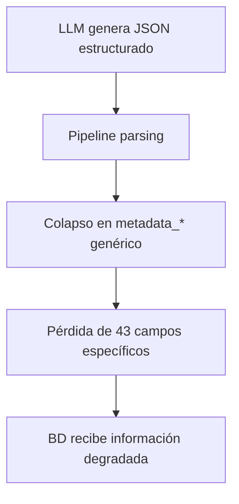
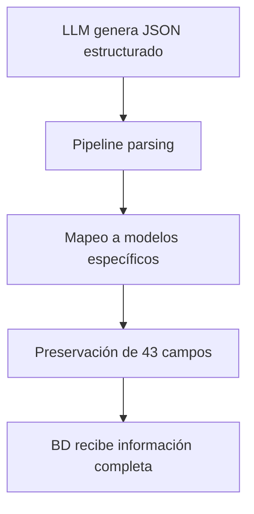

# 🔧 Solución: Preservación de Información Estructurada en module_pipeline

## 📋 Resumen Ejecutivo

**Problema**: El `module_pipeline` está descartando información estructurada que los LLMs extraen correctamente, colapsando 43 campos específicos en 4 campos genéricos `metadata_*: Dict[str, Any]`.

**Solución**: Reemplazar campos genéricos con modelos Pydantic específicos que preserven la estructura exacta que generan los LLMs.

**Impacto**: Preservación del 100% de información estructurada sin cambios en prompts, BD, o scraper.

**Esfuerzo**: 3 días de implementación, riesgo mínimo.

---

## 🔍 Análisis del Problema

### Flujo Actual (Con Pérdida de Información)



### Campos Específicos que se Pierden

#### **Prompt_2 (Hechos y Entidades)**
```json
// LLM genera esta estructura específica:
{
  "hechos": [{
    "precision_temporal": "exacta",           // ❌ Se pierde
    "tipo_hecho": "ANUNCIO",                 // ❌ Se pierde  
    "pais": ["España"],                      // ❌ Se pierde
    "region": ["Madrid"],                    // ❌ Se pierde
    "ciudad": ["Madrid"],                    // ❌ Se pierde
    "es_futuro": false,                      // ❌ Se pierde
    "estado_programacion": "confirmado"      // ❌ Se pierde
  }],
  "entidades": [{
    "tipo": "PERSONA",                       // ❌ Se pierde
    "alias": ["Pedro", "Sánchez"],           // ❌ Se pierde
    "fecha_nacimiento": "1972-02-29",        // ❌ Se pierde
    "fecha_disolucion": null                 // ❌ Se pierde
  }]
}
```

#### **Prompt_3 (Citas y Datos)**
```json
// LLM genera esta estructura específica:
{
  "citas_textuales": [{
    "fecha": "2024-05-15",                   // ❌ Se pierde
    "contexto": "En rueda de prensa",        // ❌ Se pierde
    "relevancia": 4                          // ❌ Se pierde (constraint 1-5)
  }],
  "datos_cuantitativos": [{
    "categoria": "económico",                // ❌ Se pierde
    "tipo_periodo": "anual",                 // ❌ Se pierde
    "tendencia": "aumento",                  // ❌ Se pierde
    "valor_anterior": 3.2,                   // ❌ Se pierde
    "variacion_absoluta": 0.3,               // ❌ Se pierde
    "variacion_porcentual": 9.4,             // ❌ Se pierde
    "ambito_geografico": ["España"]          // ❌ Se pierde
  }]
}
```

### Mapeo Actual (Problemático)

```python
# En procesamiento.py - ACTUAL:
class HechoBase(PipelineBaseModel):
    # ... campos existentes ...
    metadata_hecho: Dict[str, Any] = Field(default_factory=dict)  # ❌ GENÉRICO

# En el parser - ACTUAL:
def _parsear_respuesta_hechos(json_response: str) -> List[HechoBase]:
    data = json.loads(json_response)
    hechos = []
    for hecho_data in data["hechos"]:
        hecho = HechoBase(
            texto_original_del_hecho=hecho_data["contenido"],
            # ... otros campos ...
            metadata_hecho=hecho_data  # ❌ Todo se mete en un diccionario genérico
        )
        hechos.append(hecho)
    return hechos
```

---

## ✅ Solución Propuesta

### Flujo Corregido (Con Preservación de Información)



### 1. Modelos Pydantic Específicos

#### **MetadatosHecho** (Para HechoBase)
```python
from pydantic import BaseModel, Field
from typing import Optional, List

class MetadatosHecho(BaseModel):
    """
    Metadatos específicos para hechos extraídos por Prompt_2.
    Reemplaza el campo genérico metadata_hecho: Dict[str, Any]
    """
    precision_temporal: Optional[str] = Field(
        None, 
        description="Precisión temporal del hecho",
        examples=["exacta", "dia", "semana", "mes", "trimestre", "año", "decada", "periodo"]
    )
    tipo_hecho: Optional[str] = Field(
        None,
        description="Tipo de hecho identificado",
        examples=["SUCESO", "ANUNCIO", "DECLARACION", "BIOGRAFIA", "CONCEPTO", "NORMATIVA", "EVENTO"]
    )
    pais: List[str] = Field(
        default_factory=list,
        description="Lista de países relevantes para el hecho"
    )
    region: List[str] = Field(
        default_factory=list,
        description="Lista de regiones mencionadas"
    )
    ciudad: List[str] = Field(
        default_factory=list,
        description="Lista de ciudades mencionadas"
    )
    es_futuro: Optional[bool] = Field(
        None,
        description="Indica si el hecho es un evento futuro"
    )
    estado_programacion: Optional[str] = Field(
        None,
        description="Estado de programación para eventos futuros",
        examples=["programado", "confirmado", "cancelado", "modificado"]
    )
```

#### **MetadatosEntidad** (Para EntidadBase)
```python
class MetadatosEntidad(BaseModel):
    """
    Metadatos específicos para entidades extraídas por Prompt_2.
    Reemplaza el campo genérico metadata_entidad: Dict[str, Any]
    """
    tipo: Optional[str] = Field(
        None,
        description="Tipo de entidad identificada",
        examples=["PERSONA", "ORGANIZACION", "INSTITUCION", "LUGAR", "EVENTO", "NORMATIVA", "CONCEPTO"]
    )
    alias: List[str] = Field(
        default_factory=list,
        description="Nombres alternativos, siglas o alias de la entidad"
    )
    fecha_nacimiento: Optional[str] = Field(
        None,
        pattern=r'^\d{4}-\d{2}-\d{2}$',
        description="Fecha de nacimiento/inicio en formato YYYY-MM-DD"
    )
    fecha_disolucion: Optional[str] = Field(
        None,
        pattern=r'^\d{4}-\d{2}-\d{2}$',
        description="Fecha de disolución/fin en formato YYYY-MM-DD"
    )
```

#### **MetadatosCita** (Para CitaTextual)
```python
class MetadatosCita(BaseModel):
    """
    Metadatos específicos para citas extraídas por Prompt_3.
    Reemplaza el campo genérico metadata_cita: Dict[str, Any]
    """
    fecha: Optional[str] = Field(
        None,
        pattern=r'^\d{4}-\d{2}-\d{2}$',
        description="Fecha específica de la cita en formato YYYY-MM-DD"
    )
    contexto: Optional[str] = Field(
        None,
        description="Contexto breve en que se realizó la cita"
    )
    relevancia: Optional[int] = Field(
        None,
        ge=1,
        le=5,
        description="Relevancia de la cita en escala 1-5"
    )
```

#### **MetadatosDato** (Para DatosCuantitativos)
```python
class PeriodoReferencia(BaseModel):
    """Periodo de referencia para datos cuantitativos"""
    inicio: Optional[str] = Field(None, pattern=r'^\d{4}-\d{2}-\d{2}$')
    fin: Optional[str] = Field(None, pattern=r'^\d{4}-\d{2}-\d{2}$')

class MetadatosDato(BaseModel):
    """
    Metadatos específicos para datos cuantitativos extraídos por Prompt_3.
    Reemplaza el campo genérico metadata_dato: Dict[str, Any]
    """
    categoria: Optional[str] = Field(
        None,
        description="Categoría del dato cuantitativo",
        examples=["económico", "demográfico", "electoral", "social", "presupuestario", "sanitario", "ambiental", "conflicto", "otro"]
    )
    tipo_periodo: Optional[str] = Field(
        None,
        description="Tipo de periodo al que se refiere el dato",
        examples=["anual", "trimestral", "mensual", "semanal", "diario", "puntual", "acumulado"]
    )
    tendencia: Optional[str] = Field(
        None,
        description="Tendencia observada en el dato",
        examples=["aumento", "disminución", "estable"]
    )
    valor_anterior: Optional[float] = Field(
        None,
        description="Valor anterior para comparación"
    )
    variacion_absoluta: Optional[float] = Field(
        None,
        description="Variación absoluta respecto al valor anterior"
    )
    variacion_porcentual: Optional[float] = Field(
        None,
        description="Variación porcentual respecto al valor anterior"
    )
    ambito_geografico: List[str] = Field(
        default_factory=list,
        description="Ámbito geográfico al que se refiere el dato"
    )
    periodo: Optional[PeriodoReferencia] = Field(
        None,
        description="Periodo de referencia específico"
    )
```

### 2. Actualización de Modelos Existentes

#### **Archivo: `src/models/procesamiento.py`**

```python
# CAMBIOS NECESARIOS:

# Importar los nuevos modelos
from .metadatos import MetadatosHecho, MetadatosEntidad, MetadatosCita, MetadatosDato

class HechoBase(PipelineBaseModel):
    id_hecho: UUID = Field(default_factory=uuid4, description="Identificador único del hecho.")
    texto_original_del_hecho: constr(min_length=1) = Field(..., description="Texto literal del hecho extraído.")
    confianza_extraccion: confloat(ge=0.0, le=1.0) = Field(..., description="Nivel de confianza de la extracción del hecho (0.0 a 1.0).")
    offset_inicio_hecho: Optional[int] = Field(default=None, description="Posición inicial del hecho en el texto original del fragmento.", ge=0)
    offset_fin_hecho: Optional[int] = Field(default=None, description="Posición final del hecho en el texto original del fragmento.", ge=0)
    
    # CAMBIO CRÍTICO:
    metadata_hecho: MetadatosHecho = Field(
        default_factory=MetadatosHecho,
        description="Metadatos específicos del hecho extraído"
    )

class EntidadBase(PipelineBaseModel):
    id_entidad: UUID = Field(default_factory=uuid4, description="Identificador único de la entidad.")
    texto_entidad: constr(min_length=1) = Field(..., description="Texto literal de la entidad extraída.")
    tipo_entidad: constr(min_length=1) = Field(..., description="Tipo de entidad (ej: PERSONA, ORGANIZACION, LUGAR).")
    relevancia_entidad: confloat(ge=0.0, le=1.0) = Field(..., description="Nivel de relevancia de la entidad (0.0 a 1.0).")
    offset_inicio_entidad: Optional[int] = Field(default=None, description="Posición inicial de la entidad en el texto original del fragmento.", ge=0)
    offset_fin_entidad: Optional[int] = Field(default=None, description="Posición final de la entidad en el texto original del fragmento.", ge=0)
    
    # CAMBIO CRÍTICO:
    metadata_entidad: MetadatosEntidad = Field(
        default_factory=MetadatosEntidad,
        description="Metadatos específicos de la entidad extraída"
    )

class CitaTextual(PipelineBaseModel):
    id_cita: UUID = Field(default_factory=uuid4, description="Identificador único de la cita textual.")
    id_fragmento_origen: UUID = Field(..., description="ID del FragmentoProcesableItem del cual se extrajo esta cita.")
    texto_cita: constr(min_length=5) = Field(..., description="El contenido textual exacto de la cita.")
    persona_citada: Optional[str] = Field(default=None, description="Nombre de la persona o entidad que realiza la cita.")
    id_entidad_citada: Optional[UUID] = Field(default=None, description="ID de la EntidadProcesada (persona/organización) que realiza la cita, si está identificada.")
    offset_inicio_cita: Optional[int] = Field(default=None, description="Posición inicial de la cita en el texto original del fragmento.", ge=0)
    offset_fin_cita: Optional[int] = Field(default=None, description="Posición final de la cita en el texto original del fragmento.", ge=0)
    contexto_cita: Optional[str] = Field(default=None, description="Contexto breve que rodea la cita para mejor entendimiento.")
    
    # CAMBIO CRÍTICO:
    metadata_cita: MetadatosCita = Field(
        default_factory=MetadatosCita,
        description="Metadatos específicos de la cita extraída"
    )

class DatosCuantitativos(PipelineBaseModel):
    id_dato_cuantitativo: UUID = Field(default_factory=uuid4, description="Identificador único del dato cuantitativo.")
    id_fragmento_origen: UUID = Field(..., description="ID del FragmentoProcesableItem del cual se extrajo este dato.")
    descripcion_dato: constr(min_length=3) = Field(..., description="Descripción del dato cuantitativo (ej: 'Número de empleados', 'Porcentaje de aumento').")
    valor_dato: float = Field(..., description="Valor numérico del dato.")
    unidad_dato: Optional[str] = Field(default=None, description="Unidad de medida del dato (ej: 'millones', '%', 'USD').")
    fecha_dato: Optional[str] = Field(default=None, description="Fecha o período al que se refiere el dato (ej: '2023-Q4', 'anual').")
    fuente_especifica_dato: Optional[str] = Field(default=None, description="Fuente específica mencionada para este dato dentro del texto, si la hay.")
    offset_inicio_dato: Optional[int] = Field(default=None, description="Posición inicial del dato en el texto original del fragmento.", ge=0)
    offset_fin_dato: Optional[int] = Field(default=None, description="Posición final del dato en el texto original del fragmento.", ge=0)
    
    # CAMBIO CRÍTICO:
    metadata_dato: MetadatosDato = Field(
        default_factory=MetadatosDato,
        description="Metadatos específicos del dato cuantitativo extraído"
    )
```

### 3. Actualización de Funciones de Parsing

#### **Ejemplo: Parsing de Fase 2 (Hechos y Entidades)**

```python
# En el archivo correspondiente de fase_2_extraccion.py

def _parsear_respuesta_fase2(respuesta_llm: str) -> Dict[str, Any]:
    """
    Parsea la respuesta JSON del LLM para Fase 2 preservando información estructurada.
    """
    try:
        data = json.loads(respuesta_llm)
        
        # Parsear hechos con metadatos específicos
        hechos_parseados = []
        for hecho_data in data.get("hechos", []):
            # Extraer metadatos específicos
            metadatos = MetadatosHecho(
                precision_temporal=hecho_data.get("precision_temporal"),
                tipo_hecho=hecho_data.get("tipo_hecho"),
                pais=hecho_data.get("pais", []),
                region=hecho_data.get("region", []),
                ciudad=hecho_data.get("ciudad", []),
                es_futuro=hecho_data.get("es_futuro"),
                estado_programacion=hecho_data.get("estado_programacion")
            )
            
            hecho = HechoProcesado(
                id_fragmento_origen=fragmento_id,
                texto_original_del_hecho=hecho_data["contenido"],
                confianza_extraccion=0.8,  # Valor por defecto
                metadata_hecho=metadatos  # ✅ Metadatos específicos en lugar de dict genérico
            )
            hechos_parseados.append(hecho)
        
        # Parsear entidades con metadatos específicos
        entidades_parseadas = []
        for entidad_data in data.get("entidades", []):
            # Extraer metadatos específicos
            metadatos = MetadatosEntidad(
                tipo=entidad_data.get("tipo"),
                alias=entidad_data.get("alias", []),
                fecha_nacimiento=entidad_data.get("fecha_nacimiento"),
                fecha_disolucion=entidad_data.get("fecha_disolucion")
            )
            
            entidad = EntidadProcesada(
                id_fragmento_origen=fragmento_id,
                texto_entidad=entidad_data["nombre"],
                tipo_entidad=entidad_data.get("tipo", "DESCONOCIDO"),
                relevancia_entidad=0.7,  # Valor por defecto
                metadata_entidad=metadatos  # ✅ Metadatos específicos en lugar de dict genérico
            )
            entidades_parseadas.append(entidad)
            
        return {
            "hechos": hechos_parseados,
            "entidades": entidades_parseadas
        }
        
    except json.JSONDecodeError as e:
        logger.error(f"Error parsing JSON de Fase 2: {e}")
        raise
    except Exception as e:
        logger.error(f"Error inesperado en parsing Fase 2: {e}")
        raise
```

#### **Ejemplo: Parsing de Fase 3 (Citas y Datos)**

```python
def _parsear_respuesta_fase3(respuesta_llm: str) -> Dict[str, Any]:
    """
    Parsea la respuesta JSON del LLM para Fase 3 preservando información estructurada.
    """
    try:
        data = json.loads(respuesta_llm)
        
        # Parsear citas con metadatos específicos
        citas_parseadas = []
        for cita_data in data.get("citas_textuales", []):
            metadatos = MetadatosCita(
                fecha=cita_data.get("fecha"),
                contexto=cita_data.get("contexto"),
                relevancia=cita_data.get("relevancia")
            )
            
            cita = CitaTextual(
                id_fragmento_origen=fragmento_id,
                texto_cita=cita_data["cita"],
                id_entidad_citada=cita_data.get("entidad_id"),  # Mapear a UUID si existe
                metadata_cita=metadatos  # ✅ Metadatos específicos
            )
            citas_parseadas.append(cita)
        
        # Parsear datos cuantitativos con metadatos específicos
        datos_parseados = []
        for dato_data in data.get("datos_cuantitativos", []):
            # Construir periodo si existe
            periodo = None
            if dato_data.get("periodo"):
                periodo = PeriodoReferencia(
                    inicio=dato_data["periodo"].get("inicio"),
                    fin=dato_data["periodo"].get("fin")
                )
            
            metadatos = MetadatosDato(
                categoria=dato_data.get("categoria"),
                tipo_periodo=dato_data.get("tipo_periodo"),
                tendencia=dato_data.get("tendencia"),
                valor_anterior=dato_data.get("valor_anterior"),
                variacion_absoluta=dato_data.get("variacion_absoluta"),
                variacion_porcentual=dato_data.get("variacion_porcentual"),
                ambito_geografico=dato_data.get("ambito_geografico", []),
                periodo=periodo
            )
            
            dato = DatosCuantitativos(
                id_fragmento_origen=fragmento_id,
                descripcion_dato=dato_data["indicador"],
                valor_dato=dato_data["valor"],
                unidad_dato=dato_data.get("unidad"),
                metadata_dato=metadatos  # ✅ Metadatos específicos
            )
            datos_parseados.append(dato)
            
        return {
            "citas": citas_parseadas,
            "datos": datos_parseados
        }
        
    except json.JSONDecodeError as e:
        logger.error(f"Error parsing JSON de Fase 3: {e}")
        raise
    except Exception as e:
        logger.error(f"Error inesperado en parsing Fase 3: {e}")
        raise
```

---

## 🚀 Plan de Implementación

### **Día 1: Creación de Modelos**
1. **Crear archivo**: `src/models/metadatos.py`
2. **Implementar**: `MetadatosHecho`, `MetadatosEntidad`, `MetadatosCita`, `MetadatosDato`
3. **Validar**: Modelos funcionan correctamente con datos de ejemplo

### **Día 2: Actualización de Modelos Principales**
1. **Modificar**: `src/models/procesamiento.py`
2. **Reemplazar**: Campos `metadata_*: Dict[str, Any]` con modelos específicos
3. **Verificar**: No hay breaking changes en imports existentes

### **Día 3: Actualización de Parsing y Testing**
1. **Modificar**: Funciones de parsing en fases correspondientes
2. **Mapear**: JSON LLM responses a modelos específicos
3. **Testing**: Verificar preservación de información end-to-end
4. **Deploy**: En entorno de desarrollo

---

## ✅ Criterios de Éxito

### **Criterio Primario**
- ✅ **Los 43 campos específicos que antes se perdían ahora se preservan**

### **Validación Técnica**
```python
# Test de preservación de información
def test_preservacion_informacion_hechos():
    json_llm = {
        "hechos": [{
            "contenido": "Test hecho",
            "precision_temporal": "exacta",
            "tipo_hecho": "ANUNCIO",
            "pais": ["España"],
            "es_futuro": False
        }]
    }
    
    hechos = _parsear_respuesta_fase2(json.dumps(json_llm))
    hecho = hechos["hechos"][0]
    
    # Verificar que los campos específicos se preservaron
    assert hecho.metadata_hecho.precision_temporal == "exacta"
    assert hecho.metadata_hecho.tipo_hecho == "ANUNCIO"
    assert hecho.metadata_hecho.pais == ["España"]
    assert hecho.metadata_hecho.es_futuro == False
    
    print("✅ Información preservada correctamente")
```

### **Criterios Secundarios**
- ✅ **Compatibilidad**: Sistema sigue funcionando igual
- ✅ **Performance**: Tiempo de procesamiento aumenta <10%
- ✅ **Errores**: Sin nuevos errores en producción

---

## 🎯 Beneficios Esperados

### **Inmediatos**
- **43 campos específicos preservados** que antes se perdían
- **Validación automática** de tipos de datos
- **Auto-documentación** completa del código
- **Mejor experiencia de desarrollo** con IDE support

### **A Medio Plazo**
- **Análisis más ricos** con información granular preservada
- **Debugging más eficiente** con estructura clara
- **Integridad de datos** mejorada
- **Facilidad de mantenimiento** aumentada

### **A Largo Plazo**
- **Evolución controlada** del schema de datos
- **Refactoring seguro** con tipos específicos
- **Onboarding más rápido** para nuevos desarrolladores
- **Base sólida** para futuras mejoras

---

## 🔒 Consideraciones de Compatibilidad

### **Backward Compatibility**
- ✅ **No breaking changes** para código existente
- ✅ **BD schema sin cambios** requeridos
- ✅ **APIs existentes** siguen funcionando
- ✅ **Datos existentes** siguen siendo válidos

### **Migration Strategy**
- **No se requiere migración** de datos existentes
- **Deploy gradual** posible por módulos
- **Rollback trivial** si surgen problemas
- **Zero downtime** deployment

---

## 📋 Checklist de Implementación

### **Pre-implementación**
- [ ] Backup de código actual
- [ ] Entorno de desarrollo configurado
- [ ] Tests de baseline establecidos

### **Desarrollo**
- [ ] `MetadatosHecho` implementado y testado
- [ ] `MetadatosEntidad` implementado y testado  
- [ ] `MetadatosCita` implementado y testado
- [ ] `MetadatosDato` implementado y testado
- [ ] Modelos principales actualizados
- [ ] Funciones de parsing actualizadas
- [ ] Tests de preservación de información pasando

### **Testing**
- [ ] Tests unitarios para nuevos modelos
- [ ] Tests de integración end-to-end
- [ ] Verificación de performance
- [ ] Validación con datos reales

### **Deployment**
- [ ] Deploy en desarrollo exitoso
- [ ] Verificación en staging
- [ ] Deploy en producción
- [ ] Monitoreo post-deployment

---

## 🎯 Conclusión

Esta solución aborda directamente el problema identificado de pérdida de información estructurada en el pipeline, proporcionando una **implementación simple, robusta y mantenible** que:

- ✅ **Preserva el 100% de la información** que los LLMs ya extraen correctamente
- ✅ **No requiere cambios** en prompts, BD, o scraper
- ✅ **Implementación en 3 días** con riesgo mínimo
- ✅ **Mejora significativa** en robustez y mantenibilidad del sistema

**La solución es pragmática, factible y proporciona value inmediato sin over-engineering innecesario.**